# ciq - Project Plan

> **ciq** (CSV Interactive Query): an interactive terminal UI that gives CSV files what `jiq` gives JSON - type a DuckDB-SQL query and watch an aligned result grid update live as you type, querying an in-memory columnar table parsed once at startup.
>
> Status: **planning**. Engine decided via benchmark spike (embedded DuckDB). Sibling project to [`jiq`](../jiq); code copied, not shared. Authored 2026-06-07.

---

## 0. Canonical Decisions (single source of truth)

> **Read this first; it overrides the body.** The sections below (§1–§8) were drafted before five cross-section contradictions were found and resolved. Each contradiction is now settled **once, here**, by the matching entry in [`DECISIONS.md`](DECISIONS.md). Where any later section's prose disagrees with this block, **this block wins** and that prose is stale (it is being swept section-by-section; until a sweep lands, defer here).
>
> **Convention going forward — *cite, don't re-declare*.** A decided fact lives in exactly one place (this block, or its `DECISIONS.md` entry). Every other mention must *link* to it, never restate it. The plan's original "every section declares itself canonical" habit is what produced the contradictions below; do not reintroduce it.
>
> **Guiding principle — jiq is inspiration, not law.** ciq starts from jiq's shell, but its domain (tabular CSV, in-process DuckDB, SQL) differs fundamentally. Justify every reuse on ciq's own merits, not "jiq does it this way." jiq file/line citations throughout this plan are **illustrative** — grep the live jiq source to confirm; several are already known stale (see [`ASSUMPTIONS.md`](ASSUMPTIONS.md) A4).

| # | Decision (canonical) | Supersedes the stale wording in |
|---|---|---|
| **D1** | **Engine trait is `QueryEngine`** (not `CsvEngine`), method **`query(&self, sql: &str) -> QueryOutcome`** (no cancel arg; not `run`/`execute`), with `load(&mut, path, opts) -> Result<Schema, EngineError>`, `distinct(col, limit) -> QueryOutcome`, `schema() -> &Schema`, `interrupt_handle() -> InterruptHandle`. **`enum QueryOutcome { Rows(Table), Error{message, sql}, Cancelled }`**. **`Table` is COLUMNAR** (`Vec<Column>` + cheap row-view). **`InterruptHandle` is a newtype over `Arc<duckdb::InterruptHandle>`** (verified `Send+Sync`); **there is no `Connection::interrupt()` method** — you call `.interrupt()` on the handle from `Connection::interrupt_handle()`. Impl: `DuckdbEngine` + `FakeEngine`. | §2.4, §2.6, §3.3, §3.4, §4.1, §7.0, §7.2, §8.2-preamble (every `CsvEngine`, `run()`, `execute()`, cancel-arg, `Result<…,EngineError>` hot-path, `Connection::interrupt()`). |
| **D2** | **`Schema`/`ColumnMeta`/`ColumnType` live in top-level `src/schema/`** (sibling of `engine/`), imported as `crate::schema::Schema`. The engine *produces* it; everyone else only *reads* `&Schema`. **Type name is `ColumnType`** everywhere (not `SqlType`); the value cache is **`ValueCache`** (not `ValueIndex`). | §7.2 ("under engine/"); §6.3/§6.6/§6.8 ("home settled in §7.1" — §7.1 is the spike, decides nothing); all `SqlType`/`ValueIndex` spellings. |
| **D3** | **Column palette owns a ciq-generated query state** and emits a canonical `SELECT … FROM t …`; it is **disabled when the user has hand-typed SQL** (offer "replace with generated query?"), detected by byte-comparing the bar against the last emitted string. **It never parses or splices user SQL.** Emitter module is **`palette/query_emit.rs`** (not `emit.rs` — collides with `output/emit.rs`). | §6.2's `select_writer`/`parse_shape`/`apply_projection`/`parse_selected`/`ProjectionShape` (deleted); §6.1's "round-trip parse" test row. |
| **D4** | **The dispatcher (App) thread calls `.interrupt()` directly** on its `InterruptHandle` clone when a newer `request_id` arrives. The worker only blocks in `query()` and returns `Cancelled`. **No interrupt-watcher thread** (2 threads, not 3). Invariant: `interrupt()` is *not* request-scoped (cancels whatever runs) — dispatcher interrupts only while a specific request is in-flight; worker drains `Cancelled` before the next dequeue. Reuse-after-interrupt fallback: `Connection::try_clone()` (keeps the in-memory table; trait/topology unchanged). | §3.1's interrupt-watcher (deleted), its mermaid, §3.2/§3.3/§3.4 references to it. |
| **D5** | **Coverage is tiered:** HARD floor (blocks build) on an explicit pure-core module allowlist using **branch** coverage; project-wide **95% is WARN-only** (build passes); the `// ciq:shell-exempt` marker-containment gate stays HARD. CI gate set is **4 jobs** (test / tarpaulin / fmt / clippy); `disallowed-methods` rides the clippy gate — **no separate "7th gate", no build job, no binary gate.** | §4.0/§4.6 ("no fixed percentage"); §4.4's "7th CI gate alongside the 6 in §7.2 / build / binary". |

**Gating spike (blocks `DuckdbEngine`):** reuse-after-interrupt + interrupt latency + `SET threads=<bounded>` — see [`ASSUMPTIONS.md`](ASSUMPTIONS.md) A1/A2. The trait surface (D1) and threading topology (D4) are unchanged whether the spike passes or its `try_clone()` fallback applies, so D1/D4 are locked now.

**Deferred to ingest impl (Phases 2/4, with defaults + fixtures — NOT decided here):** Q3 column-name normalization, Q7 ragged-row policy, Q12 empty-vs-NULL semantics, and the `CsvOpts` ↔ CLI-flag inventory (add `--types`/`--all-varchar`/`--date-format`, unify `--sniff-rows` with `sample_size`). See §8.2 and `DECISIONS.md`.

---

## Table of Contents

- [0. Canonical Decisions (single source of truth)](#0-canonical-decisions-single-source-of-truth)

- [1. Vision, Goals & Non-Goals](#1-vision-goals--non-goals)
- [2. Query Engine: Embedded DuckDB](#2-query-engine-embedded-duckdb)
- [3. Architecture & Module Structure](#3-architecture--module-structure)
- [4. Testability & AI Self-Correction (load-bearing)](#4-testability--ai-self-correction-load-bearing)
- [5. Schema-Aware Autocomplete](#5-schema-aware-autocomplete)
- [6. CSV-Native Features & Results Grid](#6-csv-native-features--results-grid)
- [7. Phased Roadmap](#7-phased-roadmap)
- [8. Risks, Open Questions & Deferred Decisions](#8-risks-open-questions--deferred-decisions)

---

## 1. Vision, Goals & Non-Goals

**ciq is an interactive terminal UI that gives CSV files what `fzf` gives files and what `jiq` gives JSON: you type a DuckDB-SQL query in a bar and an aligned result grid updates live as you type (debounced at 150ms, never per literal keystroke) against a columnar table parsed once into memory.**

### 1.1 Elevator pitch (the JSON->CSV analogy)

jiq took the "type-as-you-go, results-update-live" interaction model that `fzf` made canonical for fuzzy file/line search and applied it to JSON: a query bar wired to a live results pane, a fixed 150ms debouncer, and an autocomplete popup that reads candidates out of the loaded data. ciq is the same interaction model, rotated onto the relational/tabular world:

| Axis | `fzf` | `jiq` (sibling) | **`ciq` (this project)** |
|---|---|---|---|
| Input domain | lines / files | one JSON document | one CSV file (tabular) |
| Query language | fuzzy substring | jq expression | **DuckDB SQL dialect** |
| Live feedback | filtered line list | pretty-printed JSON | **aligned columnar result grid** |
| Update cadence | per keystroke | 150ms-debounced (`src/query/debouncer.rs`) | **150ms-debounced (inherited, see §3.4)** |
| Autocomplete source | n/a | live JSON paths + jq builtins | **schema columns + distinct cell values + SQL keywords/functions** |
| Engine model | in-proc matcher | spawn external `jq`, re-pipe whole doc per query | **parse CSV once -> in-memory columnar table -> re-query in-process per query (see §2)** |

The user-felt promise is identical to jiq's: *no edit/run/inspect cycle.* You see the shape of your data and the effect of every clause within one debounce tick of typing it. Throughout this plan, "live as you type" and "on every keystroke" are shorthand for "once per 150ms debounce window after typing settles" — the cadence is debounced, not literally per character, exactly as in jiq. The departure from jiq is the engine: where jiq re-streams the entire JSON document into a fresh `jq` child process on every debounced query (`src/query/executor.rs::run_jq` pipes the full doc to `jq`'s stdin each time), ciq pays the parse cost exactly once at startup and then answers each query as an in-memory query against a columnar table. That single architectural inversion is what makes "live SQL on a multi-million-row CSV" feel instant instead of laggy. The full engine design lives in **§2**; the reuse/replace/drop breakdown is in **§3.2**.

### 1.2 The two hard north stars

These are not aspirations; they are constraints that gate every downstream design decision. Every other section of this plan must show how it honors both.


**North Star 1 - Most performant in-memory CSV processing CLI tool.** The whole point of a live query bar is that the loop between "I changed a character" and "I see the new result" is imperceptible. jiq achieves this for JSON documents that fit comfortably in a `jq` re-pipe; it does *not* generalize to large tabular data, because re-parsing and re-streaming a 300+ MB CSV on every debounced edit would be hopeless. ciq's answer is **parse-once, query-many**: the CSV is parsed a single time at session start into an in-memory columnar table, and every subsequent debounced edit runs a query against that already-parsed, already-typed table. The benchmark spike (`/local/home/chahcha/RustProjects/ciq-spike/RESULTS.md`, embedded DuckDB on a 5,000,000-row / 368 MB CSV) confirms the resulting interactive queries land at roughly 1-20ms — filter+limit ~1ms, group-by ~15ms, distinct-for-autocomplete ~10ms, sort top-1000 ~3.5ms — i.e. an order of magnitude under jiq's fixed 150ms debounce window (`src/query/debouncer.rs`). The accepted trade-off is a one-time ~0.8-1.4s parse-once load; load happens once per session, queries are what the user feels on every edit, so we optimize for the query. This north star is *why* the engine box is the single biggest replacement vs jiq (engine design in **§2**) and why DuckDB (not Polars) was chosen: Polars cannot cancel an in-flight query, which breaks the stale-result-cancellation model jiq relies on, whereas DuckDB's `Connection::interrupt()` preserves it. In jiq that model is the `cancel_token: CancellationToken` + `request_id: u64` fields on `QueryRequest` (`src/query/worker/types.rs:14-20`); jiq's executor implements cancel by `child.kill()` after `try_wait()` polling (`src/query/executor.rs`), and ciq replaces that process-kill with `Connection::interrupt()`. The exact thread that issues the interrupt is specified in **§2.4 / §3.1** and must be read as the single source of truth.

**North Star 2 - AI-testable / self-correcting by construction.** ciq is built so that an AI agent can develop and maintain it in a closed `build -> test -> fix` loop with deterministic pass/fail, *without a human in the loop for the overwhelming majority of the code*. This is a first-class design constraint that shapes module boundaries everywhere, not a testing chore bolted on at the end. Quantitatively, the plan commits to a **~95% headless-testable / ~5% human-validated split** (the budget defined and policed in **§4.0**): the headless majority is exercised by `cargo test --all-features -- --test-threads=1` (the CI invocation in `.github/workflows/ci.yml:40`, never `--lib` — the jiq convention applies, see jiq `CLAUDE.md`), coverage measured with `cargo tarpaulin` (`.github/workflows/ci.yml:71`). Concretely the budget means: the engine, the query/result model, the schema/type-sniffing layer, the autocomplete context-grammar and candidate generation/ranking, and even the result *renderer* (which produces styled lines as data — jiq's `ProcessedResult` already pre-renders its styled lines into the `rendered_lines: Vec<RenderedLine>` field off the UI thread, `src/query/worker/types.rs:38`) must all be exercisable headlessly — pure functions and message-passing components that take inputs and return inspectable outputs, asserted with unit tests, `insta` snapshots, `ratatui` `TestBackend`, and `proptest` (all three already in jiq's toolbox). Only a **small, explicitly enumerated** surface is allowed to require human validation, and that closed list is owned canonically by **§4.7** (other sections defer to it):

| Requires human validation (the small ~5% surface — canonical list in §4.7) | Headless-testable (the vast ~95% majority) |
|---|---|
| Real-terminal rendering fidelity on a true TTY | CSV parsing + columnar table construction |
| True keyboard / mouse input via crossterm against a real terminal | Schema inference / type sniffing |
| Clipboard / OSC 52 escape sequences | DuckDB query execution + cancellation semantics |
| Terminal color polarity (light/dark adaptation) | Result model + render-to-styled-lines (snapshot-tested) |
| | Autocomplete context detection, candidate generation, ranking, insertion |
| | Debounce timing, worker channel protocol, stale-request discard |
| | Scroll math, search, history, config parsing |

The payoff is that the same property that makes jiq's subsystems decoupled (they talk to the engine only through the worker channel — the engine is effectively a swappable box) becomes ciq's *primary correctness mechanism*: an agent can swap inputs, run the test suite, read deterministic failures, and self-correct. The human is asked to validate rendering and input on a real terminal only, and only against the §4.7 checklist.

### 1.3 Differentiators a user feels

Beyond the core "live SQL as you type," ciq leans into CSV-native conveniences that a plain SQL prompt does not give you. Each is something the user perceives directly in the loop (all on the 150ms-debounced cadence of §1.1):

- **Live SQL as you type.** A DuckDB-dialect query bar where the aligned result grid updates within one debounce tick of typing settling. No "press enter to run." This is the headline, inherited structurally from jiq's bar+results+debouncer+worker pipeline.
- **Schema-aware autocomplete.** Because the table is parsed once and its schema is known, completion is *typed and grounded in the actual file*: column names, their sniffed types (DuckDB's date/numeric sniffing is the best of the three engines benchmarked), and SQL keywords/functions — replacing jiq's JSON-path + jq-builtins candidate sources with schema + SQL sources, while reusing jiq's popup/ranking/insertion *framework* (`src/autocomplete/` machinery minus the jq-specific grammar; jiq's grammar classifies into `SuggestionContext::{FunctionContext, FieldContext, ObjectKeyContext, VariableContext}` at `src/autocomplete/context.rs:351-355`, which ciq replaces with SQL-clause contexts — see §5).
- **Value autocomplete.** When the cursor is in a value position (e.g. `WHERE status = `), ciq completes against the *distinct actual values* in that column — the direct analog of jiq sampling string values from live data, made cheap by DuckDB `DISTINCT` (~10ms in the spike vs ~250ms for Polars, which is part of why DuckDB won).
- **Column palette (quick filter/select).** A CSV-native shortcut for the most common operation — "show me these columns" / "find that column" — without hand-writing a `SELECT` list. A palette over the known schema lets the user pick/reorder/hide columns directly, generating the underlying SQL (the SQL-generation mechanism and its constraints are specified in §6).
- **Instant facets.** Because `DISTINCT` and `GROUP BY ... COUNT(*)` are single-digit-to-~15ms on the in-memory table, ciq can surface the distribution of a column (top values and counts) on demand — an "instant facet" view that would be unusably slow if it required re-parsing per request, and is only practical *because* of North Star 1's parse-once model.

### 1.4 Target users and workflows

- **The data-spelunking engineer / analyst at the terminal.** Has a CSV (an export, a log dump, a query result) and wants to *interrogate its shape* — what columns, what types, what distinct values, what the distribution looks like, which rows match a predicate — without loading it into a notebook, a spreadsheet, or a database. The jiq user who reaches for jiq instead of writing a throwaway script, but whose data is tabular.
- **The "I just need to slice this CSV" workflow.** Filter to matching rows, project a few columns, sort, peek at the top N, count by category. Today this is `csvkit`/`awk`/`xsv` pipelines or pasting into a spreadsheet; ciq makes it a live, exploratory loop with full SQL expressiveness and immediate feedback.
- **The schema-discovery workflow.** "I was handed this file and don't know what's in it." Schema-aware autocomplete and instant facets turn ciq into a way to *learn* an unfamiliar CSV interactively, which a blank SQL prompt does not.
- **The AI agent itself** (a consequence of North Star 2). Because the ~95% headless budget (§1.2, §4.0) makes nearly everything deterministic and terminal-free, an agent can drive ciq's core programmatically — and, more importantly, develop and self-correct it — which is an explicit first-class audience, not an afterthought.

### 1.5 Non-goals (explicit, at launch)

ciq is deliberately scoped. The following are **out of scope for launch** and are listed so the boundary is unambiguous:

| Non-goal | Why it's excluded |
|---|---|
| **A full database / persistence layer.** | ciq is an ephemeral, in-memory query surface over a CSV for the duration of a session. No durable storage, no schemas-on-disk, no transactions, no concurrent writers. DuckDB is used as an embedded query engine, not as a managed database. |
| **A spreadsheet editor.** | ciq is read-and-query, not edit-the-cells. There is no in-grid cell editing, no formulas-per-cell, no write-back to the source CSV. The query bar is the only way you transform data. |
| **Multi-file, JOIN-heavy ETL.** | Launch targets a *single* CSV parsed into one in-memory table. Cross-file joins, multi-table pipelines, and ETL orchestration are out. (DuckDB could do this later; it is not a launch promise.) |
| **Out-of-core / larger-than-memory inputs at launch.** | The launch model is parse-once *into memory*. Files that exceed available memory are out of scope for the first release. This is a **deferred** decision, not a flat rejection: DuckDB's disk-spill is identified in **§8 (Q11 / R3)** as a pressure-valve fallback if the in-memory ceiling proves limiting, and that section is the authoritative stance. The overview defers to §8 here rather than asserting a harder line. |
| **Streaming / `tail -f` / live-reload of a *changing* input.** | The parse-once-then-query model is fundamentally at odds with an input that keeps mutating mid-session. jiq evaluated watch/reload and live-tail and rejected them; ciq inherits that stance for *re-reading a moving file*. (This is distinct from the larger-than-memory question above, which is merely deferred.) |
| **Natural-language -> SQL (AI) at launch.** | Deliberately deferred to a later phase. jiq's entire provider/worker AI layer ports cleanly when we get there; shipping it on day one is not required to prove either north star. |
| **Non-CSV tabular inputs (Parquet, TSV-as-first-class, JSON-lines-as-table, Excel) at launch.** | The first release proves the model on CSV, the format named in the goal. The engine (DuckDB) can read several of these, so they are natural *future* extensions, not launch scope. |

### 1.6 Relationship to jiq

ciq is jiq's **sibling, not its dependency.** It lives in a new standalone repo at `/local/home/chahcha/RustProjects/ciq` (next to `/local/home/chahcha/RustProjects/jiq`) and **copies useful code from jiq rather than sharing a crate.** The rationale for copy-not-share: the two tools diverge precisely at the engine and the domain-specific autocomplete/render layers, and a shared crate would force premature abstraction over a boundary (jq-vs-SQL, JSON-vs-tabular) that is still settling; copying lets each tool evolve its hot paths independently while ciq starts from jiq's battle-tested shell.

What ciq inherits from jiq is summarized below; this is an overview only — **the authoritative, file-by-file reuse map is §3.2, and the engine swap is detailed in §2.** Where this summary and a later section appear to disagree, the later section wins.

- **Reuse ~verbatim:** the TUI shell / crossterm event loop / Focus+mode model / render layout (`src/app/`), the 150ms debouncer (`src/query/debouncer.rs`, which uses a time-as-parameter design — `should_execute_at(current_time_ms: u64)` with a `system_time_ms()` default, *not* an injected Clock trait; any test-clock divergence is called out in §3.4), the worker-thread + mpsc channel interface (`QueryRequest`/`QueryResponse` in `src/query/worker/types.rs`), the autocomplete popup / ranking / insertion *framework* (`src/autocomplete/` machinery), and the decoupled subsystems (results scroll/search, history, clipboard, config, theme).
- **Replace:** the engine box (embedded DuckDB + parse-once columnar table, in place of spawning `jq` and re-piping the document — see §2), the autocomplete *context-grammar and candidate sources* (schema-aware SQL contexts instead of the `SuggestionContext` jq grammar — see §5), and the results *renderer* (aligned tabular grid instead of pretty-printed JSON — see §6).
- **Drop:** jq path autocomplete, the jq builtins list, and the JSON tree renderer.

ciq also inherits jiq's engineering conventions wholesale (from jiq's `CLAUDE.md`): Rust 2024; `{name}.rs` module files (never `mod.rs`); tests in separate `{name}_tests.rs` files, never co-located; split files over 1000 lines; all colors centralized in `theme.rs`; everything re-exported via `lib.rs` so it is reachable from tests — the last point being directly in service of North Star 2.


---

## 2. Query Engine: Embedded DuckDB

The engine is the single component where ciq deliberately departs from jiq. jiq's engine (`src/query/executor.rs::run_jq`, invoked through `execute_with_cancel` at `executor.rs:177`) spawns an external `jq` process per debounced keystroke and pipes the **entire** JSON document to its stdin every time — an O(document) cost on every keystroke that jiq pays because `jq` is fundamentally a streaming filter with no persistent parsed state. ciq cannot afford that: North Star 1 is to be the *most performant in-memory CSV query CLI*, which means **parse the CSV once into a columnar table and re-query that resident table per keystroke**. The engine choice below was made by a benchmark spike and is now **DECIDED**.

### 2.1 Decision: embedded DuckDB (in-process, via the `duckdb` crate)

ciq embeds DuckDB **in-process** (Rust `duckdb` crate, bundled build) rather than shelling out to any binary. There is no child process, no stdin pipe, no stdout/stderr reader threads, and no `try_wait()` polling loop — all of which exist in jiq's `run_jq` (`executor.rs:273-293`) purely to manage an external process. The engine becomes a pure in-process library call, which (see [2.6](#26-headless-testability-the-biggest-single-win-over-jiq)) is the single biggest headless-testability win over jiq.

### 2.2 The spike that decided it

Benchmarked on a 5,000,000-row / 368 MB CSV (8 columns: 3x int, 1x float, 2x low-cardinality string, 1x date, 1x free-text string), medians of 5-7 runs, stable across 3 full rounds, on a 96-core / 371 GB box. Stripped binary sizes (jiq ships stripped, so ciq will too). Spike artifacts: `/local/home/chahcha/RustProjects/ciq-spike/` (`RESULTS.md` + three bench crates `duckdb-bench`, `datafusion-bench`, `polars-bench`).

| metric | **DuckDB (CHOSEN)** | DataFusion | Polars |
|---|---|---|---|
| load (parse-once) | 0.8-1.4 s | **0.15-0.19 s** | 0.30 s |
| filter (WHERE + LIMIT) | **~1.0 ms** | 2.2 ms | 27 ms |
| group-by aggregate | 15 ms | **12 ms** | 60 ms |
| distinct (low-card, autocomplete values) | 10 ms | 10 ms | 250 ms |
| distinct (high-card) | 18 ms | 30 ms | 59 ms |
| sort top-1000 | **3.5 ms** | 38 ms | 195 ms |
| schema introspect | 0.35 ms | 0.04 ms | 0.007 ms |
| mid-query cancel | **YES (`Connection::interrupt`)** | yes (abort) | **NO** |
| peak RSS | 1.2 GB | **1.0 GB** | 1.2 GB |
| stripped binary | 31 MB | 49 MB | 34 MB |
| clean build time | **65 s** | 161 s | 317 s |
| SQL dialect | **DuckDB (exact)** | ANSI-ish | own subset |
| CSV type sniffing | **best (`created_at` -> DATE)** | basic | good |

The latency that matters is the **per-keystroke interactive query**, not load. Every interactive operation DuckDB performs (filter ~1 ms, sort top-1000 3.5 ms, distinct 10-18 ms, group-by 15 ms) is an order of magnitude under the 150 ms debounce inherited from jiq (`src/query/debouncer.rs`, `DEBOUNCE_MS = 150`). Live-as-you-type is trivially met, with enormous headroom.

#### Why DuckDB

- **Interactive latency is a non-issue.** 1-20 ms per query vs a 150 ms debounce. The user never waits on the engine.
- **Exactly the requested dialect.** The product requirement is "DuckDB-style SQL." DuckDB *is* the DuckDB dialect — window functions, `QUALIFY`, `LIST`/`STRUCT`, `SAMPLE`, friendly `GROUP BY ALL`, `SELECT * EXCLUDE/REPLACE`, etc. No dialect-translation layer to build or get subtly wrong.
- **Best-in-class CSV type/date sniffing.** `read_csv_auto` inferred `id`/`user_id`/`quantity` as `BIGINT`, `amount` as `DOUBLE`, and crucially `created_at` as `DATE` — not a string. Typed columns are what make date/range filters and numeric comparisons work correctly in user queries *and* what feed precise typed autocomplete hints ([2.5](#25-schema-introspection-for-autocomplete)).
- **Cancellation that preserves jiq's stale-query model.** `Connection::interrupt()` aborts an in-flight query from another thread. This is the direct functional replacement for jiq's `child.kill()` in `run_jq` (`executor.rs:281`), and it is what lets us keep jiq's "newer keystroke supersedes the older query" behavior ([2.4](#24-threading-and-cancellation-carried-over-from-jiq)) — *contingent on the R4 interrupt-reliability spike (see [2.7](#27-open-verification-items-r4)).*

#### Why not Polars

**Disqualified for live typing: Polars cannot cancel an in-flight query.** In a type-as-you-go TUI, every keystroke supersedes the previous query; without mid-query cancellation a slow query (e.g. a wide sort) blocks the worker and the UI falls behind the user's typing. Polars also showed the worst interactive numbers on the SQL path (distinct 250 ms, sort 195 ms, filter 27 ms) — its fastest-CSV-parser reputation did not carry over to the interactive query path measured here. Cancellation alone rules it out.

#### Why not DataFusion (the runner-up / pure-Rust fallback)

DataFusion is genuinely attractive: pure Rust (no C++ toolchain), fastest load (0.15 s), comparable interactive latency, and it *can* cancel (drop/abort the stream). It is the documented fallback if the embedded-C++ dependency ever becomes untenable. It loses on the things the product actually requires:

- **Non-DuckDB dialect** (ANSI-ish) — building a translation/compat shim to honor "DuckDB-style SQL" is exactly the work DuckDB makes unnecessary.
- **Weaker CSV type sniffing** (basic; would not reliably give us typed `DATE` columns).
- **Biggest stripped binary** (49 MB vs DuckDB's 31 MB).
- **~2.5x clean build time** (161 s vs 65 s) — a real tax on the build->test->fix loop that North Star 2 depends on.

#### Trade-offs accepted

| trade-off | why acceptable |
|---|---|
| ~0.8-1.4 s one-time load | Paid **once per session**, off the keystroke path. Queries — what the user feels continuously — are 1-20 ms. Surfaced as a one-time "Loading" state (the load state machine of section 4), not per-query latency. |
| Heavy C++ dependency (bundled DuckDB) | Bundled build keeps it self-contained (no system DuckDB required); DataFusion remains the pure-Rust escape hatch if the toolchain dependency ever bites. |
| 31 MB stripped binary | Largest interactive concern is latency, not binary size; 31 MB is the *smallest* of the three candidates and acceptable for a developer CLI. |
| 65 s clean build | Smallest of the three; incremental rebuilds (the common case in the AI test loop) are far cheaper. |

### 2.3 The parse-once-then-re-query model

This is the architectural core and the departure from jiq. On startup, ciq loads the CSV **exactly once** into a resident, in-memory DuckDB table; every subsequent debounced keystroke runs SQL against that already-parsed columnar table.

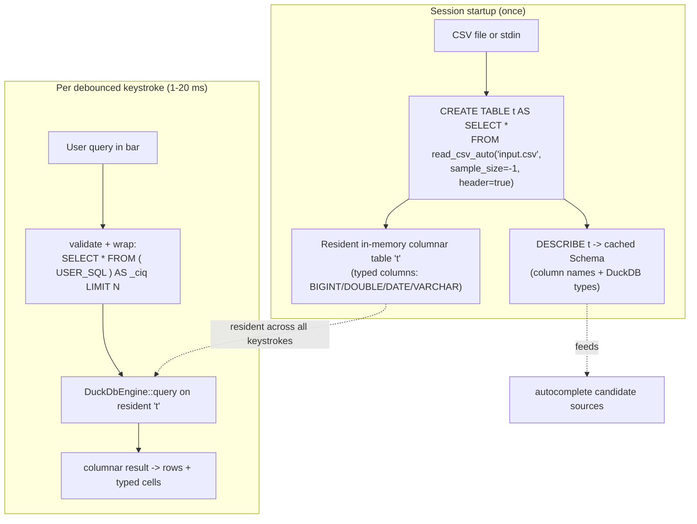

Concretely:

- **Load.** `CREATE TABLE t AS SELECT * FROM read_csv_auto('<path>', sample_size = -1, header = true)`. `sample_size = -1` makes DuckDB scan the whole file for type inference (correctness over a fast guess — we pay this once). For stdin input, the bytes are buffered to a temp file (or `read_csv` over a stream) so the same path is used; the table is materialized in memory either way.
- **Re-query.** Each keystroke runs the user's SQL against table `t` via the same long-lived `Connection`. The table is never reparsed. This is what makes ciq O(result) per keystroke instead of jiq's O(document).
- **Result shaping.** Interactive output is always bounded (see the wrapping rules below) so a `SELECT *` on 5M rows returns a screenful, not 5M rows, keeping latency at the ~1 ms filter number rather than materializing the world. The full unbounded query is reserved for the explicit "Output Result" deliverable path — the ciq analog of jiq's `execute_for_output` (`executor.rs:197`), which takes a separate code path with no viewport `LIMIT`.

#### Interactive-query validation and LIMIT-wrapping rules

Blindly wrapping arbitrary text as `SELECT * FROM ( <user_sql> ) LIMIT N` is unsafe: a trailing semicolon, multiple statements, a non-`SELECT` statement, or the user's own `ORDER BY`/`LIMIT` each break the naive wrap (semantically or syntactically). ciq therefore admits only a **restricted interactive grammar** before wrapping. This grammar is the same read-only single-statement contract specified in §8/Q1, and is enforced by the lightweight tokenizer described in §5.3 (a *tokenizer*, not a full SQL parser — it inspects statement shape, not full clause structure):

| user input shape | accepted? | wrapping behavior |
|---|---|---|
| single read-only `SELECT` / `WITH … SELECT` (CTE) | yes | wrap as `SELECT * FROM ( <user_sql> ) AS _ciq LIMIT N` — the subquery preserves the user's own `ORDER BY` ordering, and the outer `LIMIT N` caps rows to the viewport budget. |
| `SELECT …` that already ends in `LIMIT k` | yes | wrap with outer `LIMIT min(k, N)` so the user's intent is honored but the viewport is never exceeded; the inner `ORDER BY` still drives ordering inside the subquery. |
| trailing `;` (single statement) | yes | the trailing semicolon and any whitespace are stripped by the tokenizer *before* wrapping, so the subquery stays syntactically valid. |
| multiple statements (`;`-separated) | **no** | rejected by the read-only single-statement check (§8/Q1); surfaced as a non-fatal "single statement only" message in the status line, no engine call issued. |
| non-`SELECT` (DDL/DML: `INSERT`/`UPDATE`/`DELETE`/`COPY`/`ATTACH`/`PRAGMA`/etc.) | **no** | rejected by the read-only check; the resident table `t` is never mutated by interactive queries, which is what keeps every keystroke idempotent and re-runnable. |

The outer-`LIMIT`-over-subquery form is correct for DuckDB: an `ORDER BY` inside a subquery is preserved through to the outer `LIMIT`, so "sort top-1000 then show a screenful" works without ciq parsing the user's `ORDER BY` clause itself. The validation rule is **load-bearing for the ~1 ms latency claim** (it is what prevents an unbounded `SELECT *` from materializing 5M rows) and for the idempotence the headless test loop relies on (rejecting DML means a test fixture's table is identical before and after any sequence of interactive queries). The "Output Result" path bypasses only the outer `LIMIT`; it still goes through the same single-read-only-statement validation, so it can never mutate `t` either.

The DuckDB equivalents of jiq's lazily-cached, `OnceLock`-backed autocomplete sources in `JqExecutor` (the frequency-capped global string set built around `MAX_GLOBAL_STRING_VALUES`, `executor.rs:38`) are **not** recomputed Rust walks — they become cheap SQL against the resident table (`DESCRIBE`, `SELECT … GROUP BY … LIMIT`), so the same "compute once / cache" intent is served by the engine itself ([2.5](#25-schema-introspection-for-autocomplete)).

### 2.4 Threading and cancellation, carried over from jiq

The concurrency design is reused **almost verbatim** from jiq. jiq's worker (`src/query/worker/thread.rs::spawn_worker`) is a dedicated background thread that owns a `JqExecutor`, blocks on `recv()` over an `mpsc::Receiver<QueryRequest>` (`thread.rs:95`, `worker_loop`), and sends `QueryResponse` back on an `mpsc::Sender`. ciq keeps this skeleton exactly; only the box inside changes — `JqExecutor` becomes a `DuckdbEngine` implementing the `QueryEngine` trait ([§0/D1](#0-canonical-decisions-single-source-of-truth)) that owns a long-lived `duckdb::Connection` to the resident table.

#### Canonical threading model (decided)

This is the one cancellation model used throughout the plan; §3.1, §3.4, §6.5, §7.2, and §8/R4 all defer to it.

The worker thread **blocks** inside `DuckDbEngine::query` while DuckDB executes (a blocking call returning a result set directly — there is no `try_wait()` poll loop, because there is no child process to poll). A blocked thread cannot interrupt itself, so the interrupt **cannot** be issued by the worker loop. Instead, ciq splits the connection into two cheaply-shareable halves:

- the **worker thread** owns the `Connection` and is the *only* thread that ever issues queries on it (DuckDB connections are not concurrent-query-safe);
- a separate, `Send`-able **interrupt handle** derived from that connection is held by the **App/dispatcher thread**. When a newer keystroke produces a higher `request_id`, the dispatcher calls `interrupt()` on this handle, which aborts the query the worker is currently blocked in. The worker's `query` call then returns an interrupted error, which `worker_loop` maps to `QueryResponse::Cancelled { request_id }` (the same arm jiq uses at `thread.rs:110`/`:135`/`:149`).

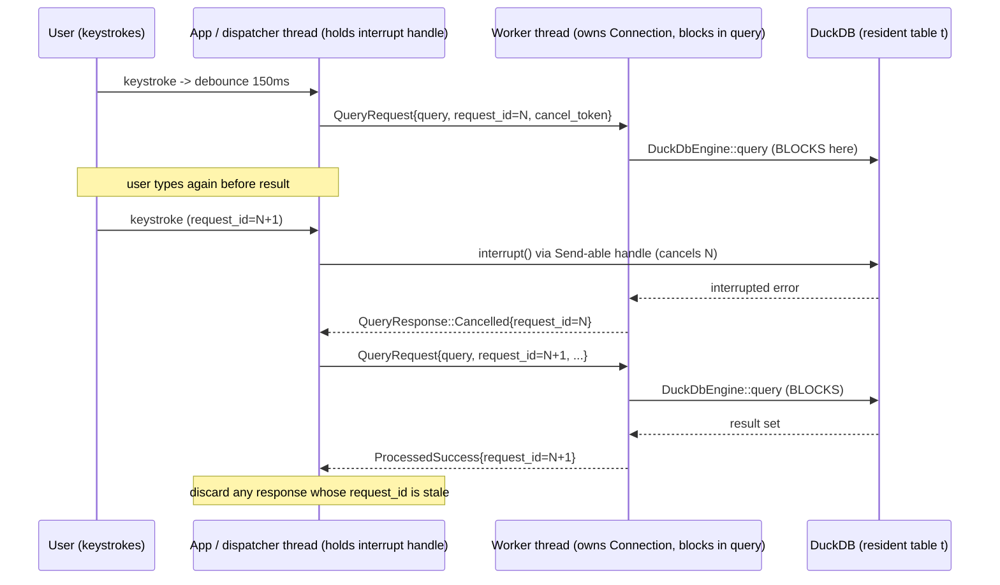

Why the handle lives on the dispatcher, not the worker: the worker is, by definition, occupied (blocked) at the exact moment a cancel is needed, so only *another* thread can act. This resolves the contradiction the earlier draft introduced (it had claimed the cancel was issued "from the dispatcher" in prose but a worker-loop interrupt elsewhere) — the dispatcher owns the interrupt handle, the worker owns query issuance, and the two never touch the connection concurrently for *queries*. Whether `interrupt()` is genuinely safe to call cross-thread against a blocked DuckDB connection, and whether the connection is immediately reusable for the next query afterward, is the open question tracked in [2.7](#27-open-verification-items-r4)/§8 R4 — the model above is the *intended* design, to be confirmed by that spike before the engine is locked.

#### Reused unchanged

- **Dedicated worker thread + `mpsc` channels.** Same `spawn_worker(...)` shape, same blocking `recv()` loop in `worker_loop` (`thread.rs:95`).
- **`request_id` staleness.** `QueryRequest { query, request_id, cancel_token }` is reused as-is; the App discards any `QueryResponse` whose `request_id` is older than the latest dispatched query. This is what makes fast typing correct — late results from superseded keystrokes are dropped.
- **Panic isolation.** jiq wraps the worker in `panic::catch_unwind` with a panic hook that emits `QueryResponse::Error` (`thread.rs:38-55`) so the TUI never corrupts. Kept verbatim — a malformed SQL query or a DuckDB edge case can never take down the terminal.
- **Response variants.** `QueryResponse::ProcessedSuccess | Error | Cancelled` (each carrying a `request_id`) are reused. `ProcessedResult`'s shape is adapted for tabular data (typed rows/columns, pre-rendered aligned grid lines, `line_count`, `max_width`, `line_widths`, `result_type`, `execution_time_ms`) but the enum and the worker contract are identical.

#### Changed — the cancellation mechanism

| jiq (external `jq`) | ciq (embedded DuckDB) |
|---|---|
| `Command::new("jq")` + pipe whole doc to stdin | long-lived `Connection` to resident table `t`, owned by the worker |
| separate stdin-writer + stdout/stderr reader threads (deadlock avoidance) | none — in-process call returns a result set directly |
| `try_wait()` poll loop at 10 ms for completion (`executor.rs:273-293`) | `DuckdbEngine::query` returns directly (blocks the dedicated worker thread, which is fine — it is dedicated) |
| cancel via `child.kill()` when `cancel_token.is_cancelled()` (`executor.rs:279-281`) | cancel via **`.interrupt()` on an `InterruptHandle`** (newtype over `Arc<duckdb::InterruptHandle>` from `Connection::interrupt_handle()`; **no `Connection::interrupt()` method exists**) held by the **dispatcher** thread, called when a newer keystroke arrives ([§0/D4](#0-canonical-decisions-single-source-of-truth)) |

The cancellation contract the rest of the app sees is settled in [§0/D4](#0-canonical-decisions-single-source-of-truth): a newer query supersedes the older one; the dispatcher issues the interrupt directly; there is **no `cancel_token` on `QueryRequest`** (out-of-band model). The 10 ms `try_wait()` polling loop in `run_jq` disappears entirely — there is no child to poll.

### 2.5 Schema introspection for autocomplete

jiq's autocomplete candidate sources are JSON-shaped: the executor walks the parsed `serde_json::Value` for object keys, and for distinct string *values* (frequency-sorted, capped). DuckDB gives ciq strictly *better* equivalents directly from the engine — the autocomplete **framework** (popup, fuzzy ranking, insertion in `src/autocomplete/`) is reused; only the candidate **sources** change from JSON-path walks to SQL introspection. The framework's classification grammar (`SuggestionContext` with its `FieldContext`/`FunctionContext`/`ObjectKeyContext`/`VariableContext` variants in `src/autocomplete/context.rs`) is replaced by a SQL-shaped grammar in §5; the table below covers only where the *candidate data* comes from.

| autocomplete need | jiq source (JSON walk) | ciq source (SQL on resident `t`) |
|---|---|---|
| column names (= jiq object keys) | recursive walk for object keys | `DESCRIBE t` / `SELECT column_name FROM information_schema.columns WHERE table_name='t'` — cached once at load |
| typed hints in popup (jiq `JsonFieldType`) | inferred from sampled JSON values | exact DuckDB column type per column (`BIGINT`/`DOUBLE`/`DATE`/`VARCHAR`) from `DESCRIBE t` |
| value candidates (= jiq string values) | per-path distinct strings, freq-sorted, capped at `MAX_VALUES_PER_PATH` (10_000, `value_collector.rs:14`) | `SELECT <col>, COUNT(*) c FROM t GROUP BY 1 ORDER BY c DESC LIMIT <cap>` — DuckDB distinct measured at 10-18 ms |
| keyword/function candidates (= jiq jq builtins) | static jq builtins list | static **DuckDB SQL keyword + function** list (replaces the jq builtins list) |

**Caps — match the right jiq constant.** jiq has *two* distinct caps, and the per-column value query must mirror the per-column one, not the global one:

- `MAX_GLOBAL_STRING_VALUES` (10_000, `executor.rs:38`) is jiq's **global** last-resort fallback — every string value in the document, used when no path context is available.
- `MAX_VALUES_PER_PATH` (10_000, `value_collector.rs:14`) is jiq's **per-path** cap — distinct values scoped to one JSON path.

ciq's per-column value autocomplete is the direct analog of the *per-path* case, so its `LIMIT <cap>` mirrors **`MAX_VALUES_PER_PATH`** (this is consistent with §5.5). A global, column-agnostic value fallback — should ciq ever offer one — would instead mirror `MAX_GLOBAL_STRING_VALUES`.

Column names and types are introspected **once** at load (`DESCRIBE t` measured at 0.35 ms) and cached — the analog of jiq's `OnceLock`-cached field-name set. Value candidates are fetched lazily and per-column via the bounded `GROUP BY … ORDER BY COUNT(*) DESC LIMIT` above, which is both faster and more correct than jiq's whole-document walk (it gets true distinct values with real frequencies, scoped to the relevant column, not every string in the file).

This is also where DuckDB's superior type sniffing pays off twice: typed columns make user queries correct *and* let the popup show accurate typed hints (the ciq analog of jiq's `JsonFieldType`), e.g. offering date-range completions on a `DATE` column rather than string completions.

### 2.6 Headless testability: the biggest single win over jiq

North Star 2 requires the vast majority of code to be exercisable headlessly with deterministic pass/fail. The engine is where ciq comes out **strictly ahead** of jiq, because moving from an external process to an in-process library removes the least-testable seam in the whole design.

- **No external dependency to stub.** jiq's engine cannot run without a real `jq` binary on `PATH` (the jiq `CLAUDE.md` even pins jq v1.8.1+ for snapshot tests, because tests depend on `jq`'s exact error-message text). ciq's engine is statically linked; tests need nothing on the machine but the compiled crate. This eliminates an entire class of environment-dependent, version-sensitive test flakiness.
- **Pure in-process function under test.** The engine's single entry point — `QueryEngine::query(&self, sql: &str) -> QueryOutcome` ([§0/D1](#0-canonical-decisions-single-source-of-truth), implemented by `DuckdbEngine`) — is a deterministic Rust call over an in-memory table. Unit and integration tests construct an engine from a small tempfile CSV fixture, run SQL, and assert on the returned typed columnar rows — **no terminal, no PTY, no spawned process, no stdin/stdout plumbing.** Compare to jiq, where testing `run_jq` means reasoning about process spawn, stdin-writer threads, and stdout/stderr reader threads.
- **Deterministic outputs for snapshots.** Bounded, ordered queries (`ORDER BY` + `LIMIT`) over a fixed fixture produce byte-stable row content, so the engine slots straight into jiq's existing `insta` snapshot harness. The one nondeterministic field on the result — `execution_time_ms` — is redacted from snapshots (consistent with §4.4), exactly as it must be excluded in jiq.
- **Cancellation is unit-testable in mechanism, pending R4 in behavior.** Because `Connection::interrupt()` is an in-process call, a test can dispatch a deliberately heavy query and interrupt it from the dispatcher side, then assert the worker emits `QueryResponse::Cancelled { request_id }` — verifying the stale-query wiring end-to-end without a terminal. Whether the interrupt *reliably* aborts and leaves the connection reusable is the R4 spike item ([2.7](#27-open-verification-items-r4)); the test harness for it is headless either way.
- **Schema/autocomplete sources are pure queries.** `DESCRIBE t` and the `SELECT … GROUP BY … ORDER BY COUNT(*) DESC LIMIT` candidate queries are ordinary SQL returning data structures, so the autocomplete candidate layer is fully assertable in headless tests against a known fixture schema.

#### What is *not* asserted headlessly: load timing

The engine's *query* path is 100% headless and deterministic. The engine's **load** path (`read_csv_auto` over a real file or buffered stdin, ~0.8-1.4 s) touches the filesystem and is **nondeterministic in timing**, so the test strategy asserts its **correctness** (the resulting schema and row content are exact and snapshot-stable) but **not its wall-clock duration**. Load timing is therefore handled the way §4 and §7/R2 prescribe: the load *state machine* is driven by a fake/slow engine in tests, and load behavior is asserted structurally — e.g. by counting that the engine's load is invoked exactly once per session (§7.2) — rather than by timing it. This is the single, narrow caveat to "the engine is headless": every *behavioral* property of the engine is headless-testable; only the *latency* of the one-time load is excluded from the deterministic suite, by design.

With that caveat stated, the engine layer remains the cleanest example in the whole project of code that lives entirely in the AI-self-correctable majority — there is **no** part of the engine itself in the small human-validated surface (which is confined to the downstream TUI rendering/keyboard/clipboard items enumerated canonically in §8/R7; the rendering and shell sections defer to that single list).

### 2.7 Open verification items (R4)

The cancellation model ([§0/D4](#0-canonical-decisions-single-source-of-truth)) is decided, and its one unobserved engine behavior is now **CLOSED — A1 PASS** (spike at `../ciq-spike/interrupt-spike/`, real `duckdb 1.10503.1`, 5M-row fixture; [`ASSUMPTIONS.md`](ASSUMPTIONS.md) A1):

1. **Cross-thread interrupt is safe** — `Connection::interrupt_handle()` returns `Arc<duckdb::InterruptHandle>` (`Send + Sync`); a blocked query interrupts from another thread in **~0.8 ms**.
2. **The same connection IS immediately reusable** after an interrupt — re-query returns correct rows (5,000,000, baseline match), across 2 cycles. **Decision: `DuckdbEngine` keeps one long-lived connection per session.** The `Connection::try_clone()` fallback (shares the opened DB, no re-parse — also validated) is documented for a future-version regression only; it is **not needed** and leaves the D1 trait / D4 topology unchanged regardless. `SET threads=<bounded>` is applied at load (spike: `threads=4` → ~18 ms interactive). DataFusion remains the engine-level fallback only if a future bump regresses interrupt entirely.


---

## 3. Architecture & Module Structure

ciq inherits jiq's proven shape — a thin terminal shell wrapped around a debounced, cancelable, request-id'd worker that owns a swappable query engine — and changes exactly three boxes: the engine (embedded DuckDB over a parse-once columnar table instead of `Command::new("jq")` piping the whole document), the autocomplete grammar + candidate sources (schema-aware SQL instead of JSON paths), and the results renderer (aligned tabular grid instead of pretty-printed JSON). Everything else is structurally identical, which is what lets us copy jiq's harness almost verbatim and keep the same headless-testability story.

The organizing principle, identical to jiq's, is: **subsystems never touch the terminal and never touch the engine directly.** They communicate only through narrow, owned data types — `QueryRequest` / `QueryResponse` over an `mpsc` channel pair, and pure structs like `ProcessedResult`, `Schema`, and `GridLayout`. The terminal (`ratatui` + `crossterm`) is reached only at the outermost edge (`app_render.rs`, the `crossterm` event loop). This boundary is the entire reason the core is AI-testable: an agent constructs an `App`, feeds it synthetic `KeyEvent`s, drives the worker with an in-memory CSV, and asserts on the resulting `GridLayout` / `ProcessedResult` — no PTY, no real keyboard, deterministic pass/fail.

### 3.1 Data flow: keystroke to rendered grid

The cancellation model is settled canonically in [§0/D4](#0-canonical-decisions-single-source-of-truth) (dispatcher calls `.interrupt()` directly; worker only runs queries; no watcher thread). It diverges deliberately from jiq's cooperative model: jiq's `run_jq` polls `child.try_wait()` and checks `cancel_token.is_cancelled()`, taking the `child.kill()` action *on the thread that owns execution*. ciq cannot do that — its worker is blocked inside an in-process DuckDB call and cannot also watch a token — so the interrupt is issued from the **dispatcher** thread instead (the supported usage of DuckDB's interrupt handle). This is a case where jiq's mechanism does **not** carry over and ciq diverges on its own merits.

There is one mechanical difference forced by DuckDB: `query()` blocks until the query finishes or is interrupted; ciq cannot poll a `try_wait()` between rows the way jiq polls a child process. Per [§0/D4](#0-canonical-decisions-single-source-of-truth), the **dispatcher thread holds a clone of the engine's `InterruptHandle`** (a newtype over `Arc<duckdb::InterruptHandle>`, verified `Send + Sync`) and calls `.interrupt()` on it directly the moment a newer `request_id` supersedes the in-flight query. The worker thread does nothing but block in `query()` and return `QueryOutcome::Cancelled` when interrupted — there is **no** worker-side interrupt-watcher thread (the earlier draft's watcher is removed by D4). Two threads total. A1 in [`ASSUMPTIONS.md`](ASSUMPTIONS.md) tracks the one open engine behavior this leaves: confirming the connection is reusable after an interrupt (fallback: `Connection::try_clone()`, which keeps the in-memory table).

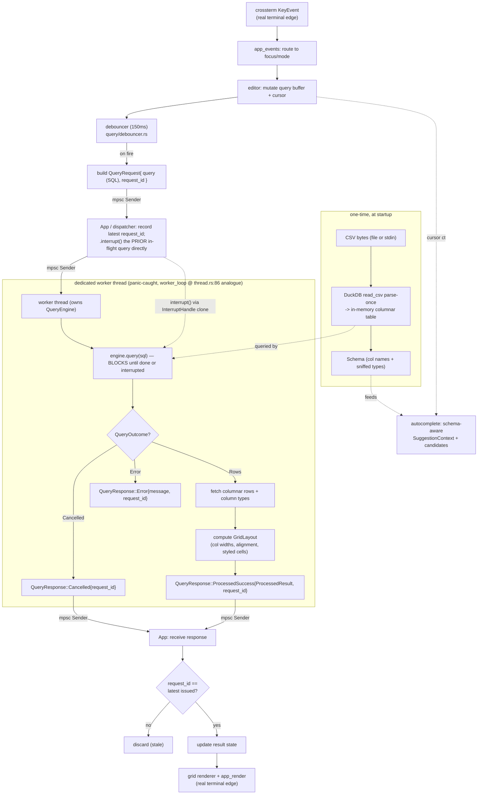

**Who does what (the resolved threading model):**

*(Threading model per [§0/D4](#0-canonical-decisions-single-source-of-truth): dispatcher interrupts directly; no watcher thread.)*

| Step | Thread | Action | jiq analogue |
|---|---|---|---|
| Supersede + interrupt the prior query | App / dispatcher | call `.interrupt()` directly on the dispatcher's `InterruptHandle` clone (only while a request is known in-flight) | jiq: dispatcher tracks latest `request_id`; here it also issues the interrupt itself |
| Send new request | App / dispatcher | `mpsc` `send(QueryRequest)` | identical |
| Run the query (blocking) | worker thread | `engine.query(sql)` — returns `QueryOutcome::Cancelled` if interrupted | jiq `run_jq` runs the `jq` child |
| Discard stale result | App / dispatcher | drop any `QueryResponse` whose `request_id` != latest | identical |

The flow mirrors jiq exactly through the channel layer. The differences are confined to the worker subgraph: jiq's worker re-pipes the entire JSON document to a fresh `jq` child per keystroke (`executor.rs` `run_jq`, `try_wait()` polling); ciq's worker holds a persistent DuckDB connection over a table parsed **once** at startup, so each debounced query is a 1-20ms re-query of resident columnar data rather than a re-parse. The cancellation *contract* is unchanged: a superseded query is interrupted and its eventual `QueryResponse` is discarded by `request_id`.

#### Stale-result discard and supersede (unchanged contract from jiq)

- Each `QueryRequest` carries a monotonic `u64 request_id` and a `tokio_util` `CancellationToken`, exactly as jiq's `QueryRequest { query, request_id, cancel_token }` (`src/query/worker/types.rs:14`).
- The dispatcher (App side) records the latest issued `request_id`. When a `QueryResponse` arrives, any response whose `request_id` is not the latest is dropped before it can touch result state — identical to jiq's stale-discard.
- When a new request supersedes an in-flight one, the **dispatcher calls `.interrupt()` directly** on its `InterruptHandle` clone (per [§0/D4](#0-canonical-decisions-single-source-of-truth) — replacing jiq's `child.kill()`; no watcher thread). The interrupted query returns `QueryOutcome::Cancelled` → `QueryResponse::Cancelled { request_id }`, which the App ignores. Because `interrupt()` is not request-scoped, the dispatcher only fires it while a specific request is known in-flight, and the worker drains the `Cancelled` before dequeuing the next request.
- The worker is a single dedicated thread doing a blocking `recv()` loop (jiq `worker_loop`, `thread.rs:86`), wrapped in `panic::catch_unwind` with a panic hook (`set_hook`, `thread.rs:38`) so the TUI never corrupts. The App side never blocks on the engine.

### 3.2 Reuse-from-jiq map

Legend: **Reuse** = copy with mechanical renames only (jq->SQL/CSV naming, theme constants). **Adapt** = same shape and tests, swap the domain-specific guts. **Replace** = new implementation behind the same channel/data boundary. **Drop** = JSON/jq-specific, no CSV analogue.

| jiq source | Disposition | ciq target | Notes / headless-testability |
|---|---|---|---|
| `src/app/` (App state, `app_events.rs`, focus/mode model) | **Reuse** | `src/app/` | Crossterm loop is the only terminal edge. Event routing tested by feeding synthetic `KeyEvent`s and asserting state. |
| `src/app/app_render.rs` + TestBackend snapshots | **Adapt** | `src/app/app_render.rs` | Layout (query bar / results / status / popups) reused; results pane now renders a `GridLayout`. Snapshots re-baselined for tabular output. `ratatui::TestBackend` keeps this headless. |
| `src/query/debouncer.rs` (`DEBOUNCE_MS = 150`) | **Reuse verbatim** | `src/query/debouncer.rs` | Time-as-parameter struct: `should_execute_at(current_time_ms: u64)` / `schedule_execution_at(current_time_ms)`, with a default `system_time_ms()` reading a static `Instant`. No engine coupling and no Clock trait — tests pass explicit `u64` timestamps for determinism. |
| `src/query/worker/thread.rs` (`spawn_worker`, `worker_loop` @ thread.rs:86, blocking `recv()`, `catch_unwind` + `set_hook` @ thread.rs:38) | **Adapt** | `src/query/worker/thread.rs` | Same `Receiver<QueryRequest>` / `Sender<QueryResponse>` signature and panic-catch wrapper; loop body now runs SQL on the owned `QueryEngine` ([§0/D1](#0-canonical-decisions-single-source-of-truth)) instead of constructing a jq executor. No interrupt watcher — the dispatcher interrupts directly ([§0/D4](#0-canonical-decisions-single-source-of-truth)). |
| `src/query/worker/types.rs` (`QueryRequest` @ :14, `QueryResponse`, `ProcessedResult` @ :38) | **Adapt** | `src/query/worker/types.rs` | Channel enums (`QueryResponse::ProcessedSuccess` / `Error` / `Cancelled`) reused exactly. jiq's `ProcessedResult` fields are `output`, `rendered_lines`, `parsed: Option<Arc<Value>>`, `line_count`, `max_width`, `line_widths`, `result_type`, `query`, `execution_time_ms`. ciq drops `parsed` (JSON-only) and reinterprets `rendered_lines` as the grid's styled lines; adds `rows` + `schema` + `grid: GridLayout`; keeps `output`, `request_id` (on the response variant), `line_count`, `max_width`, `line_widths`, `result_type`, `execution_time_ms`. |
| `src/query/executor.rs` (`run_jq`, child process, `try_wait` poll @ :293, `cancel_token.is_cancelled()` @ :279 -> `child.kill()` @ :281) | **Replace** | `src/engine/` | The engine box. Persistent DuckDB connection over a parse-once table; cancel via `.interrupt()` on the dispatcher's `InterruptHandle` clone ([§0/D4](#0-canonical-decisions-single-source-of-truth)) instead of `child.kill()`. Engine sits behind `trait QueryEngine` ([§0/D1](#0-canonical-decisions-single-source-of-truth)) so a `FakeEngine` backs unit tests with zero DuckDB dependency. |
| `src/query/worker/preprocess.rs` (jiq's jq query-text preprocessing) | **Adapt** | `src/query/worker/preprocess.rs` | jiq preprocesses jq query text; ciq normalizes/expands the SQL shorthand (bare column filters -> a single restricted `SELECT * FROM t WHERE ...`, plus the LIMIT-wrapping of §2.3). Pure `String -> String` over the restricted grammar of §5.3 (tokenize-only, no full SQL parse), trivially table-driven testable. (Note: `ProcessedResult` lives in `worker/types.rs`, not here — see §7.3, which discusses it; its canonical added fields are `rows` + `schema` + `grid: GridLayout` per §3.2, not a flat `column_widths`.) |
| `src/query/error_enhance.rs` | **Adapt** | `src/query/error_enhance.rs` | jq error -> friendly message becomes DuckDB error -> friendly message. Pure mapping, table-driven tests. |
| `src/query/query_state.rs` | **Reuse** | `src/query/query_state.rs` | Latest-`request_id` tracking + stale-discard + in-flight bookkeeping. Pure state machine, headless. |
| `src/autocomplete/` popup, ranking, insertion **framework** (`autocomplete_render.rs`, `autocomplete_state.rs` with `Suggestion`/`SuggestionType`, `insertion.rs`, fuzzy ranking via `fuzzy-matcher`) | **Reuse** | `src/autocomplete/` | Engine-agnostic per the brief. Popup scroll/selection, type labels, cursor-aware insertion all carry over. Insertion tested for UTF-8, mid-query, cursor positioning. |
| `src/autocomplete/context.rs` (`analyze_context` -> `SuggestionContext` with `FunctionContext` / `FieldContext` / `ObjectKeyContext` / `VariableContext`, context.rs:351) | **Replace** | `src/autocomplete/context.rs` | New SQL grammar: contexts become `TableRef` / `ColumnRef` / `Keyword` / `Function` / `ValueLiteral`. Same shape (`fn(&str) -> (SuggestionContext, partial)`) and same split `context_tests/` harness pattern — pure `&str` -> classification. |
| `src/autocomplete/json_navigator.rs`, `result_analyzer.rs`, `value_collector.rs`, `all_field_names` | **Replace** | `src/schema/` + `src/autocomplete/candidates.rs` | Candidate sources now come from the parsed `Schema` (column names + types) and `SELECT DISTINCT col` for value autocomplete (the spike's ~10ms distinct). Pure data-in / candidates-out. |
| jiq's static jq builtins list | **Replace** | `src/autocomplete/sql_keywords.rs` | Static DuckDB keyword/function list instead of jq builtins. Pure const data + tests. |
| jiq path-parser / brace-tracker / variable-extractor / `with_entries` / `$var` contexts | **Drop** | -- | jq path / brace / `$var` / `with_entries` syntax has no CSV-SQL analogue. |
| jiq JSON document model + path-at-cursor + JSON tree renderer | **Drop** | -- | JSON-only. Replaced conceptually by `src/schema/` + `src/grid/`. |
| `src/results.rs`, `src/scroll.rs`, `src/search.rs` | **Reuse** | same | Scroll viewport math and in-results search operate on rendered lines / `line_widths`; reused over the grid's line model. Pure index math, headless. |
| `src/clipboard.rs` | **Reuse (logic) / human-test (OS round-trip)** | `src/clipboard.rs` | OSC52 / system clipboard round-trip is one of the human-validation items (§4.7, canonical). The logic that *decides what text to copy* (a cell, a row, the result) stays headless-testable. |
| `src/history.rs`, `src/config.rs`, `src/theme.rs`, `src/notification.rs`, `src/help.rs`, `src/save.rs`, `src/stats.rs`, `src/widgets.rs` | **Reuse** | same | Decoupled subsystems. `theme.rs` centralization rule carries over verbatim. |
| jiq AI provider/worker layer | **Defer (port later)** | `src/ai/` (phase 2) | NL->SQL ports cleanly onto the same worker channel exactly as jiq's NL->jq does; out of scope now. |
| `src/lib.rs` (re-export everything for testing) | **Reuse** | `src/lib.rs` | The convention that *makes* the core testable: every module is `pub`-reachable so tests construct internals directly. |

### 3.3 Proposed ciq crate module layout

Follows jiq conventions exactly: Rust 2024; `{name}.rs` (never `mod.rs`); tests in separate `{name}_tests.rs` (or `{name}_tests/` directories when large); files <1000 lines; all colors in `theme.rs`; `lib.rs` re-exports everything so tests reach internals directly. The schema module is **top-level `src/schema/`** ([§0/D2](#0-canonical-decisions-single-source-of-truth)) — it is consumed by both `engine/` (to build the resident table) and `autocomplete/` (for candidates), so it sits above both rather than inside `engine/`. (The type is `ColumnType`, the value cache is `ValueCache` — see §0/D2; `SqlType`/`ValueIndex` spellings elsewhere are stale.)

```
src/
├── lib.rs                       # pub re-export of every module (testing seam)
├── main.rs                      # CLI arg parse, ingest, build App, run loop
├── error.rs                     # ciq error types
│
├── csv/                         # CSV INGEST — parse-once (HEADLESS)
│   ├── ingest.rs                # read file/stdin bytes -> DuckDB read_csv -> resident table
│   ├── ingest_tests.rs
│   ├── source.rs                # File vs stdin source abstraction (in-memory bytes for tests)
│   └── source_tests.rs
│
├── schema/                      # SCHEMA — sniffed columns + types (HEADLESS, canonical home)
│   ├── schema.rs                # Schema { columns: Vec<Column{name, ty}> }; built once at ingest
│   ├── schema_tests.rs
│   ├── types.rs                 # ColumnType (Text/Int/Float/Date/Bool/...) mirroring DuckDB sniffing
│   └── types_tests.rs
│
├── engine/                      # ENGINE BOX — swappable (HEADLESS via trait + fake)
│   ├── engine.rs                # trait QueryEngine (see §0/D1: query(&self,sql)->QueryOutcome; load; distinct; schema; interrupt_handle)
│   ├── engine_tests.rs
│   ├── duckdb_engine.rs         # real impl: persistent Connection over parse-once table; interrupt() on clone handle
│   ├── duckdb_engine_tests.rs   # exercised headlessly with tiny in-memory CSVs
│   └── fake_engine.rs           # deterministic in-memory QueryEngine impl for fast worker/app tests (no DuckDB dep)
│
├── query/                       # WORKER + DEBOUNCE — copied shape from jiq (HEADLESS)
│   ├── debouncer.rs             # reused verbatim (150ms; should_execute_at(current_time_ms: u64))
│   ├── debouncer_tests.rs
│   ├── preprocess.rs            # SQL shorthand normalization + LIMIT-wrapping (restricted grammar)
│   ├── preprocess_tests.rs
│   ├── error_enhance.rs         # DuckDB error -> friendly message
│   ├── error_enhance_tests.rs
│   ├── query_state.rs           # latest request_id, in-flight tracking, stale discard
│   ├── query_state_tests.rs
│   └── worker/
│       ├── thread.rs            # spawn_worker, blocking recv loop, panic catch + interrupt watcher
│       ├── thread_tests.rs
│       ├── types.rs             # QueryRequest, QueryResponse, ProcessedResult  (ProcessedResult lives HERE)
│       └── types_tests.rs
│
├── grid/                        # RESULTS RENDERER — aligned tabular grid (HEADLESS layout)
│   ├── layout.rs                # GridLayout: per-column width, alignment, header; pure fn(rows,schema)->GridLayout
│   ├── layout_tests.rs
│   ├── render.rs                # GridLayout -> styled ratatui lines (uses theme::*); TestBackend-snapshotted
│   ├── render_tests.rs
│   └── render_tests/snapshots/  # insta + ratatui TestBackend
│
├── autocomplete/                # popup/ranking/insertion FRAMEWORK reused; grammar+sources replaced
│   ├── autocomplete_render.rs   # reused (popup, scrollbar, type labels)
│   ├── autocomplete_state.rs    # reused (Suggestion, SuggestionType)
│   ├── context.rs               # REPLACED: SQL context grammar (TableRef|ColumnRef|Keyword|Function|ValueLiteral)
│   ├── context_tests/           # mirrors jiq's split context_tests dir
│   ├── candidates.rs            # REPLACED: candidates from Schema + DISTINCT values
│   ├── candidates_tests.rs
│   ├── sql_keywords.rs          # REPLACED: static DuckDB keyword/function list
│   ├── sql_keywords_tests.rs
│   ├── insertion.rs             # reused (cursor-aware insertion)
│   └── insertion_tests/
│
├── app/                         # SHELL — reused; only terminal edge
│   ├── app_events.rs            # event routing (HEADLESS: synthetic KeyEvents)
│   ├── app_events_tests.rs
│   ├── app_render.rs            # layout + render routing (terminal edge; TestBackend headless)
│   └── app_render_tests/
│
├── editor.rs                    # query buffer + cursor (HEADLESS)  + editor_tests.rs
├── results.rs / scroll.rs / search.rs   # reused viewport/scroll/search math (HEADLESS) + *_tests.rs
├── clipboard.rs                 # copy-target logic headless; OS clipboard = human-test surface  + clipboard_tests.rs
├── history.rs / config.rs / notification.rs / help.rs / save.rs / stats.rs / widgets.rs  (+ *_tests.rs)
└── theme.rs                     # ALL colors centralized (grid header/cell/null/type-badge colors live here)
```

### 3.4 The engine-as-swappable-box boundary

In jiq the engine is *already* a box: subsystems only ever see `QueryRequest` going out and `QueryResponse` / `ProcessedResult` coming back over the worker channel (`spawn_worker` in `thread.rs`); nobody outside `executor.rs` knows `jq` is a child process. ciq preserves this and tightens it into one explicit trait — **`QueryEngine`** (see [§0/D1](#0-canonical-decisions-single-source-of-truth) for the canonical name and full signature) — with the single hot-path method `query(&self, sql: &str) -> QueryOutcome` (cancellation is out-of-band per [§0/D4](#0-canonical-decisions-single-source-of-truth), so there is **no** cancel argument on `query()`), plus `interrupt_handle() -> InterruptHandle` (a newtype over `Arc<duckdb::InterruptHandle>`) that the dispatcher holds to interrupt the in-flight query. *(This paragraph originally named `CsvEngine`/`query(sql, cancel) -> Result<RawRows>` and a worker-side interrupt watcher — both superseded by §0; corrected here.)*

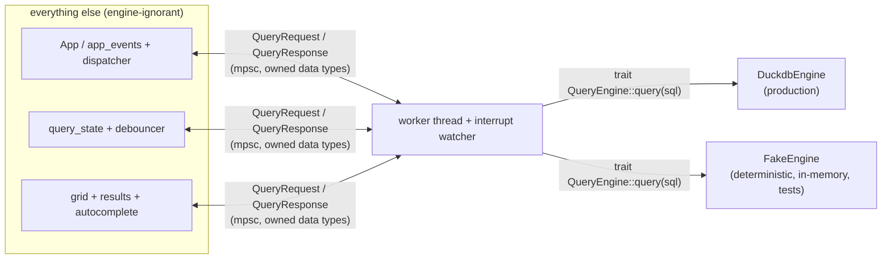

Two consequences that directly serve the hard north stars:

1. **Performance north star is localized.** "Parse once, re-query resident columnar data" lives entirely inside `csv/ingest.rs` + `engine/duckdb_engine.rs`. The rest of the codebase only sees fast `QueryResponse`s. If DuckDB ever needs swapping for the DataFusion fallback, only the `engine/` directory changes — the `QueryEngine` contract ([§0/D1](#0-canonical-decisions-single-source-of-truth)), `query_state`, grid, and app are untouched.

2. **AI-testability north star is structural, not bolted on.** Because the worker speaks `trait QueryEngine`, the vast majority of the system — event routing, debounce, stale-discard, SQL preprocessing, schema-aware autocomplete, grid layout — is tested against a `FakeEngine` or pure functions with **zero** DuckDB/terminal dependency and fully deterministic output. `GridLayout` is a pure `fn(rows, schema) -> GridLayout` (assert on widths/alignment), `analyze_context` is a pure `fn(&str) -> (SuggestionContext, partial)`, and the debouncer is driven by **passing explicit `u64` timestamps to `should_execute_at(current_time_ms)`** — jiq's actual time-as-parameter design, not a Clock abstraction — so timing tests are deterministic without faking a clock. An AI agent runs the CI test command and gets binary pass/fail with no human in the loop.

The **small, explicitly-enumerated human-test surface is owned canonically by §4.7**; this section only points at it. Every item on that list is reachable only through the leaf edges of the diagram above — `app_render.rs`, the `crossterm` loop, and `clipboard.rs` (three files) — covering real-terminal rendering fidelity (true colors / Unicode width as a physical terminal draws them, beyond what `TestBackend` snapshots verify), genuine keyboard/mouse/paste via a PTY, system clipboard / OSC52 round-trips, color-polarity/theme legibility, and terminal resize. The layout *decisions* feeding them (`GridLayout`, copy-target selection, event routing) remain on the headless side and are asserted there. This keeps the human-validated fraction minimal and bounded by construction, exactly as the design constraint requires.


---

## 4. Testability & AI Self-Correction (load-bearing)

> This is not a testing chapter. It is an **architectural constraint** that ranks alongside North Star #1 (in-memory performance). Every module boundary in ciq is drawn so that the behavior on each side of it can be exercised headlessly, with deterministic pass/fail, by an AI agent in a `build -> test -> fix` loop with no human in the path. The small set of behaviors that genuinely *cannot* be auto-validated is enumerated, frozen, and pushed to the thinnest possible shell. Everything else is agent-testable by construction.

### 4.0 The principle, stated as an enforceable budget

We treat "fraction of behavior that an AI agent can validate without a human" as a first-class, *measured* property of the codebase — not an aspiration. The three tiers below are defined by an objective, gateable rule, not a self-estimated percentage:

| Tier | What lives here | Who validates | How the tier is *defined* (not estimated) |
|---|---|---|---|
| **Shell (terminal)** | crossterm raw-mode setup, real `Terminal<CrosstermBackend>` flush, OSC sequences, system clipboard | **Human** (frozen list, §4.7) | The shell is **exactly the enumerated set of files** carrying a `// ciq:shell-exempt` marker (the same files listed in §4.7). The CI coverage gate ignores precisely these files and **fails if any *other* file carries the marker** — so the shell cannot silently grow. |
| **Seam (deterministic I/O)** | DuckDB engine wrapper (returns plain data), worker channel, debouncer, file loader | AI agent, headless with fixtures + fixed time input | Everything not marked shell-exempt and not pure; covered by integration + E2E session tests over fixtures. |
| **Core (pure)** | SQL-context detection, autocomplete candidate generation + ranking, grid layout computation, schema modeling, CSV/type inference, scroll/search math, config parsing, theme resolution | AI agent, fully headless | The default. Functions take inputs, return values, touch nothing ambient. |

We deliberately **do not assert a fixed LOC percentage** (the earlier "~70/25/5%" was false precision with no basis). The load-bearing guarantee is the *containment rule*, not a number: the human surface is the closed, marker-enforced file list in §4.7, and the gate's job is to prevent that list from growing. If a feature wants to add to the shell, the reviewing agent's job is to find the pure core hiding inside it and extract it (the pattern jiq already follows — `src/app/paste_recovery_render.rs` is exactly this kind of extraction; see §4.1 and §4.7).

### 4.1 Layering for testability

The governing rule, inherited from jiq's actual structure: **a function either computes a value from inputs (pure, trivially testable) or touches a terminal/process/clock (impure, quarantined to a named seam).** Nothing in the middle.

jiq already proves this is achievable. Its renderers are pure functions of `App` state — `src/app/app_render_tests.rs` drives the *entire* UI through `render_to_string` (verified at `src/app/app_render_tests.rs:10`), which builds a `TestBackend` terminal via `create_test_terminal` (`:5`) with no real TTY:

```rust
// src/app/app_render_tests.rs
pub fn create_test_terminal(width: u16, height: u16) -> Terminal<TestBackend> {
    let backend = TestBackend::new(width, height);
    Terminal::new(backend).unwrap()
}

pub fn render_to_string(app: &mut App, width: u16, height: u16) -> String {
    let mut terminal = create_test_terminal(width, height);
    terminal.draw(|f| app.render(f)).unwrap();
    terminal.backend().to_string()
}
```

Even paste handling — which *looks* like a terminal concern — is largely pure in jiq: `src/app/paste_recovery_render.rs` is a render/state module with its own `paste_recovery_render_tests.rs`, and paste insertion is property-tested in `src/app/app_events_tests.rs` (`prop_paste_text_insertion_integrity`, `prop_paste_appends_at_cursor_position`). Only the *framing* a real terminal emits stays in the shell (§4.7). ciq carries this discipline forward and tightens it.

The table below maps every CSV-specific subsystem to its pure core and the exact thing that makes it headless-testable. Signatures are **illustrative** (ciq is greenfield); the jiq-symbol citations are illustrative too (grep the live source — see [`ASSUMPTIONS.md`](ASSUMPTIONS.md) A4). **Canonical-name note:** the cells below predate §0 and use stale spellings — read `SqlType` as **`ColumnType`** and `ValueIndex` as **`ValueCache`** ([§0/D2](#0-canonical-decisions-single-source-of-truth)); read the context enum as **`CursorContext`** with the variants defined canonically in §5.3 (not the `SqlContext`/`{SelectList, WhereColumn, WhereValue, FuncArg, …}` sketch shown here). The pure/headless *intent* of each row stands; only the names defer to §0/§5.3.

| Subsystem | Pure function signature (illustrative) | Why it needs no terminal | Replaces in jiq |
|---|---|---|---|
| **CSV / type inference** | `infer_schema(sample: &[ByteRecord], opts) -> Schema` | Operates on bytes -> `Schema { columns: Vec<ColumnMeta{name, SqlType, nullable}> }`. Deterministic given sample + opts. | (new — no jq analog) |
| **Schema model** | `Schema::column(&str) -> Option<&ColumnMeta>`, `Schema::sql_typed_names() -> Vec<(String, SqlType)>` | Plain data structure; fully comparable. | `ResultAnalyzer` over live JSON |
| **SQL context detection** | `analyze_sql_context(before_cursor: &str) -> (SqlContext, partial)` where `SqlContext ∈ {SelectList, FromTable, WhereColumn, WhereValue(col), FuncArg, Keyword}` | String-in -> enum-out; the grammar classifier is the single hardest-to-get-right piece and is 100% pure. | `autocomplete/context.rs::analyze_context` -> `(SuggestionContext, String)` (variants `FieldContext`/`FunctionContext`/`ObjectKeyContext`/`VariableContext`, `context.rs:351`) |
| **Candidate generation** | `suggest(ctx: &SqlContext, schema: &Schema, value_index: &ValueIndex) -> Vec<Suggestion>` | Candidates come from `Schema` (column names + types) and a precomputed `ValueIndex` (distinct values per column, supplied **as data** — *not* fetched live inside the function). | `get_suggestions` + the live `value_collector` sampling |
| **Ranking** | `rank(candidates, partial) -> Vec<Suggestion>` (fuzzy) | Identical to jiq's fuzzy-matcher ranking; engine-agnostic, ported ~verbatim. | jiq autocomplete ranking (reused) |
| **Insertion** | `insert_at_cursor(buf, cursor, suggestion) -> (new_buf, new_cursor)` | Pure text edit. | `autocomplete/insertion.rs` (reused) |
| **Grid layout** | `compute_grid(rows: &[Row], schema, viewport: Rect, scroll) -> GridLayout` | Column widths, truncation, alignment, visible-row slice — all arithmetic over data + a `Rect`. No drawing. | JSON pretty-print/styled-line builder |
| **Grid render** | `render_grid(layout: &GridLayout, frame)` | Thin: turns the already-computed `GridLayout` into ratatui cells. Tested via `TestBackend`, not a real TTY. | JSON tree renderer (dropped) |

The critical move for autocomplete: **the value source is an argument, not an ambient effect.** jiq's `value_collector` samples the live JSON `Value` inside the suggestion path. In ciq, the DuckDB `SELECT DISTINCT col` (the ~10 ms operation from the engine benchmark) is performed *outside* the pure function by the engine seam and handed in as a `ValueIndex`. This makes candidate generation a pure function of `(SqlContext, Schema, ValueIndex)` — no engine, no I/O, fully snapshotable.

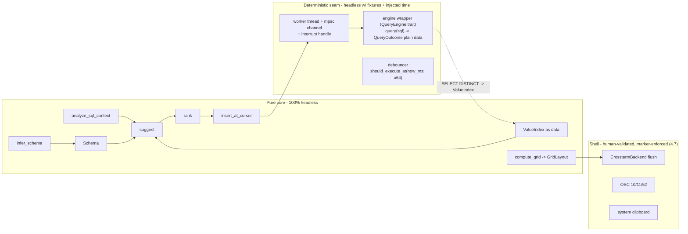

> **Cross-section note (engine trait + cancellation).** Per [§0/D1](#0-canonical-decisions-single-source-of-truth): the engine trait is **`QueryEngine`** with **`query(&self, sql: &str) -> QueryOutcome`** (`QueryOutcome = Rows(Table) | Error{message,sql} | Cancelled`). Per [§0/D4](#0-canonical-decisions-single-source-of-truth): a `Clone`-able **`InterruptHandle`** (newtype over `Arc<duckdb::InterruptHandle>`; obtained from `Connection::interrupt_handle()` — note there is no `Connection::interrupt()` method) is held by the dispatcher/App thread, which calls `.interrupt()` *from that thread* to abort the query the worker is blocked inside. The worker never interrupts itself (it cannot — `query()` blocks it). Testability consequence below in §4.4.

### 4.2 The headless harness

A single harness type, `ciq::test_utils::Harness`, lets an agent simulate a *complete interactive session* without a terminal. It is **a composition of two jiq helper families**, which today live in two different places:

- the session/state helpers in jiq's `pub mod test_utils` (`src/lib.rs:33`): `test_app`, `app_with_query`, `wait_for_query_completion`, `execute_query_and_wait`, `key`, `key_with_mods`, `create_test_loader` (all verified in `src/test_utils.rs`); and
- the render helpers in `src/app/app_render_tests.rs`: `create_test_terminal` and `render_to_string` (§4.1).

jiq keeps these separate (rendering helpers live with the render tests). ciq deliberately **unifies them into one `test_utils::Harness`** so an agent has a single entry point for "open a file, type, advance time, read the screen, assert on state." This is the one intentional consolidation relative to jiq's layout, and it is pure-plus-`TestBackend` — no terminal.

```rust
// ciq::test_utils  (composes jiq's test_utils session helpers + app_render_tests render helpers)
pub struct Harness {
    app: App,                  // real App state (cf. test_app / app_with_query)
    terminal: Terminal<TestBackend>, // ratatui in-memory grid, no TTY (cf. create_test_terminal)
    now_ms: u64,               // monotonic test time fed to the debouncer (see 4.4)
    engine: DuckdbEngine,      // real embedded DuckDB over a fixture CSV (impl QueryEngine)
}

impl Harness {
    pub fn open(csv: &Path, w: u16, h: u16) -> Self { /* parse-once, build App */ }
    pub fn type_str(&mut self, s: &str) { /* feed Key events char by char */ }
    pub fn key(&mut self, k: KeyEvent) { self.app.handle_event(Event::Key(k)); }
    /// Advance test time, then deliver it to the debouncer and pump the worker.
    pub fn advance(&mut self, ms: u64) { self.now_ms += ms; self.pump(); }
    pub fn pump(&mut self) { /* feed now_ms to debouncer.should_execute_at; drain worker until idle */ }
    pub fn screen(&mut self) -> String {        // serialized render buffer (cf. render_to_string)
        self.terminal.draw(|f| self.app.render(f)).unwrap();
        self.terminal.backend().to_string()
    }
    pub fn state(&self) -> &App { &self.app }   // assert on structured state too
}
```

A full scripted session an agent can assert on, end to end:

```rust
let mut h = Harness::open(fixture("sales_5k.csv"), 120, 40);
h.type_str("SELECT region, SUM(amount) FROM t GROUP BY region");
h.advance(150);                       // crosses the 150ms debounce deterministically (4.4)
h.pump();                             // worker runs real DuckDB via QueryEngine::query, returns rows
assert_eq!(h.state().result_row_count(), 4);
insta::assert_snapshot!(h.screen()); // golden grid render
```

Two assertion surfaces, deliberately: **the serialized render buffer** (`backend().to_string()` — what the user would see) *and* **structured app state** (`result_row_count`, selected cell, autocomplete menu contents). Render snapshots catch layout regressions; state assertions give precise, debuggable failures an agent can act on without diffing ASCII art.

### 4.3 Test strategy matrix

| Layer | Tool | What it asserts | Example targets | jiq precedent |
|---|---|---|---|---|
| **Unit (pure logic)** | plain `#[test]` in `{name}_tests.rs` | exact return values | `analyze_sql_context("SELECT a, |")` -> `SelectList`; `infer_schema` types `created_at` -> `Date` | every `*_tests.rs` |
| **Golden / snapshot** | `insta::assert_snapshot!` | render buffers, autocomplete menus, aligned grids, error overlays | grid for a 7-col CSV at width 80 vs 200; suggestion popup with typed-column hints | `app_render_tests`, `insta = "1.40"` |
| **Property** | `proptest` | invariants over *arbitrary* input | see §4.3.1 | `app_events_tests.rs` paste props, `proptest-regressions/` |
| **Engine integration** | `#[test]` over real DuckDB + fixture CSVs | SQL semantics, type sniffing, cancel | `WHERE`+`LIMIT` returns expected rows; cross-thread `InterruptHandle::interrupt()` aborts a slow query | `tests/integration_tests.rs` + `tests/fixtures/` |
| **E2E headless session** | `Harness` (§4.2) | full keystroke -> debounce -> engine -> render flow | the scripted session above | jiq drives `App` via events in render tests |
| **Binary smoke** | `assert_cmd` | CLI arg handling, exit codes, stdout for non-TTY pipe mode | `ciq --version`, `ciq bad.csv` error path | `tests/integration_tests.rs` uses `assert_cmd` |

#### 4.3.1 Property invariants (the never-panic / always-consistent contract)

These are the load-bearing invariants. An agent that breaks one gets an immediate, shrunk counterexample.

| Invariant | Statement |
|---|---|
| **1 row = 1 grid line** | For any `rows`, any viewport, `compute_grid` produces exactly `min(rows.len(), visible_capacity)` body lines. (The CSV analog of jiq's 1-line-per-record rule — see the rejected line-wrap note in jiq memory.) |
| **Never panic on arbitrary CSV** | `infer_schema` and the parse-once loader never panic on any byte sequence: ragged rows, embedded quotes/newlines, BOM, non-UTF-8, zero columns, 10⁶ columns, duplicate headers. Returns `Result`, never unwinds. |
| **Never panic on arbitrary query text** | `analyze_sql_context` returns a valid `SqlContext` for *any* `&str` before the cursor (incl. unbalanced quotes/parens, unicode, empty). |
| **Widths fit** | Sum of `compute_grid` column widths + separators ≤ viewport width; no column width is negative; truncation marker only when content exceeds cell. |
| **Insertion round-trip** | `insert_at_cursor` never produces a cursor index outside `0..=buf.len()` and never corrupts UTF-8 boundaries (jiq's `prop_paste_text_insertion_integrity` is the direct precedent). |
| **Ranking total order** | `rank` is a deterministic total order for a fixed `(candidates, partial)` — no dependence on hashmap iteration order. |
| **Stale-discard decision is pure** | `is_stale(incoming_id, latest_id) == (incoming_id < latest_id)` for all `u64` pairs — the cancellation *decision* is a pure function, unit-tested exhaustively (see §4.4 / §4.8). |

`proptest-regressions/` is committed (as jiq does) so a shrunk counterexample becomes a permanent regression test the moment it is found.

### 4.4 Determinism rules (MUST be enforced)

Nondeterminism is the one thing that breaks the agent loop: a flaky test gives a false fix signal. jiq enforces this two ways, and ciq adopts **both** plus one net-new gate.

| Rule | Mechanism (and whether inherited or net-new) | Enforcement |
|---|---|---|
| **Time is a `u64` parameter, never ambient in logic** | **Inherited verbatim from jiq.** jiq's debouncer is time-as-parameter, *not* a Clock trait: `Debouncer::should_execute_at(&self, current_time_ms: u64)` and `schedule_execution_at(&mut self, current_time_ms: u64)`, with a thin `system_time_ms()` wrapper used only by the non-`_at` convenience methods (`src/query/debouncer.rs`). ciq reuses this model **verbatim** — the harness feeds its own `now_ms` (§4.2) to `should_execute_at`. There is **no `Clock` trait and no `FakeClock`**; an earlier draft invented those and it was wrong. | `debouncer_tests.rs` exercises `should_execute_at` at exact boundaries; the harness drives `now_ms` explicitly. |
| **Single-threaded test execution** | **Inherited from jiq's CI.** This is the *real* mechanism preventing cross-test races: `cargo test --all-features -- --test-threads=1`. The worker thread + mpsc channel + `TestBackend` tests depend on it; running tests multi-threaded would interleave worker responses across tests. | The §4.5 loop and §7 gate both pin `--test-threads=1`. Not optional. |
| **No ambient `Instant::now()` / `SystemTime::now()` / `rand` in logic** | **NET-NEW ciq tooling — does not exist in jiq.** A `clippy.toml` `disallowed-methods` list bans `std::time::Instant::now`, `std::time::SystemTime::now`, `rand::random`, and `rand::thread_rng` everywhere except the seam wrappers (the debouncer's `system_time_ms` and any explicit-seed sampler). Built in Phase 1. Per [§0/D5](#0-canonical-decisions-single-source-of-truth) this is **not** a separate CI gate — it **rides inside the existing clippy gate** (one of the 4 jobs: test / tarpaulin / fmt / clippy; there is no build job, no binary gate, and no "7th gate"). | `cargo clippy ... -D warnings` fails on any disallowed call; a CI grep gate is the belt-and-suspenders backstop. |
| **Stable ordering everywhere** | `BTreeMap`/sorted `Vec` for anything user-visible (column order, distinct values, suggestions). `SELECT DISTINCT` for a `ValueIndex` carries an explicit `ORDER BY` so DuckDB output is row-order-stable. | property test 4.3.1 "Ranking total order"; snapshots fail loudly on reorder. |
| **Fixed fixtures, no network, no `$HOME`** | Engine tests read only `tests/fixtures/*.csv`; config tests read in-memory strings; clipboard/OSC are faked. | tests never touch real FS outside `fixtures/` or env. |
| **Snapshotable output, timing redacted** | Every render and menu has a stable text serialization (`TestBackend::to_string`, `Debug` for menus). Execution-time fields (the analog of jiq's `ProcessedResult.execution_time_ms`) are **excluded from snapshots** (redacted) so timing never flips a golden. | `insta` redaction settings. |

### 4.5 The build -> test -> self-correct loop

This is the exact loop an AI agent runs unattended. It is a strict subset of jiq's `CLAUDE.md` pre-commit sequence, reordered so the **fastest, most localized failures surface first** (tight feedback) and the human gate (jiq's "TUI validation" pre-commit step) is *removed* from the inner loop — it only applies to the frozen shell surface in §4.7.

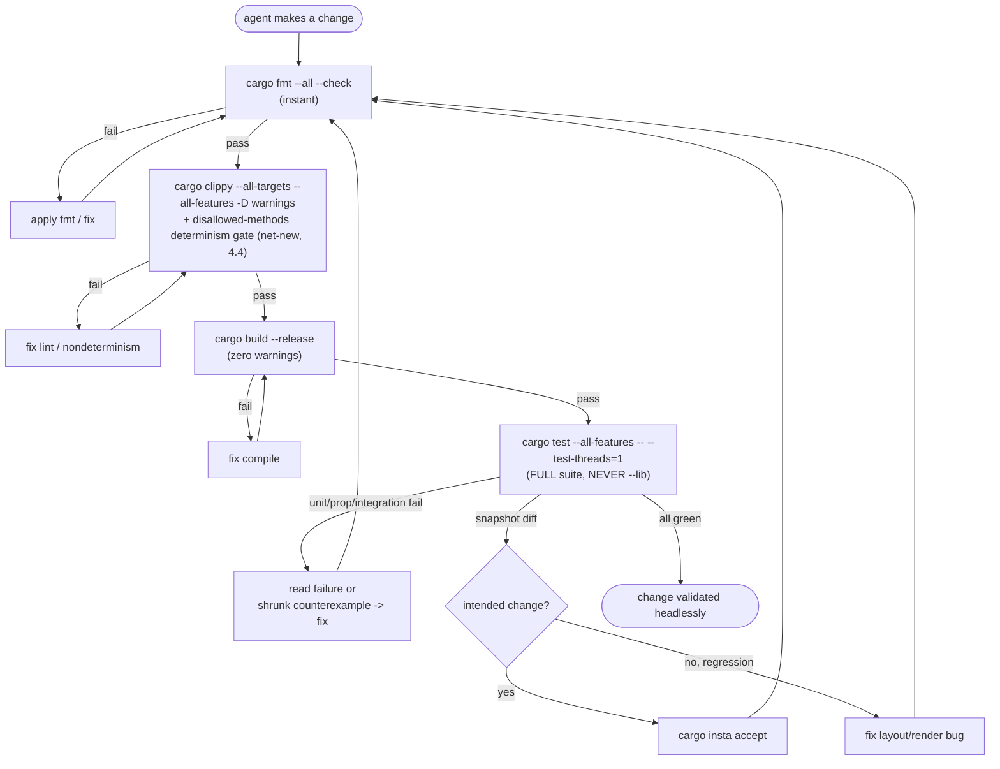

Why each step earns its place in the loop:

- **`cargo fmt --all --check` first** — near-instant, removes noise before anything expensive runs.
- **`clippy -D warnings` + determinism gate** — catches both lint and any newly-introduced `now()`/`rand` (the net-new gate in §4.4) before tests can flake.
- **`cargo build --release` (zero warnings)** — matches jiq's pre-commit ordering.
- **`cargo test --all-features -- --test-threads=1`, never `--lib`** — this is jiq's *actual* CI invocation (verified `.github/workflows/ci.yml:40`), not a bare `cargo test`. The `--test-threads=1` flag is load-bearing (§4.4) — dropping it lets the worker/channel and `TestBackend` tests race. The `--lib` ban is jiq's standing rule: `--lib` skips the `tests/` integration + E2E layer, which is exactly where engine semantics and the headless `Harness` sessions live. An agent that runs `--lib` gets a false green.
- **`cargo insta accept`/`reject`** — snapshot diffs are *expected* on intentional UI changes. The agent decides accept-vs-fix using the structured-state assertions (§4.2) as the tiebreaker: if state assertions still pass and only the rendered grid moved as intended, accept; otherwise it is a regression to fix. `*.snap.new` files left over = a hard CI failure (jiq pattern).

Every edge in this loop is a **deterministic, machine-readable pass/fail** (exit code + structured diff). No edge requires a human, a real terminal, or a network call. That is the whole point.

### 4.6 Coverage policy

> **Canonical gate shape is [§0/D5](#0-canonical-decisions-single-source-of-truth)** (tiered: **hard** branch-coverage floor on a pure-core allowlist; **warn-only** project-wide **95%**; **hard** shell-marker containment). The original "we deliberately do not assert a fixed percentage" stance in §4.0/§4.6 is **superseded** by D5 — there *is* a maintained 95% (warn-level) and a hard core floor. The tier descriptions below are otherwise correct and stand.

Following the jiq memory policy (critical-path coverage, not a blunt 100% gate). **Coverage tool is `cargo tarpaulin`, matching jiq's inherited CI toolchain** — `.github/workflows/ci.yml` installs `cargo-tarpaulin` and runs `cargo tarpaulin --out xml --out html --output-dir coverage -- --test-threads=1`, uploading `coverage/cobertura.xml` to Codecov. ciq stays on tarpaulin (no switch to `llvm-cov`; an earlier draft named llvm-cov in error). Note tarpaulin also runs with `--test-threads=1` for the same race reason as §4.4. **Verify tarpaulin's branch-coverage support actually works** for the core floor — it is historically weak; if it can't enforce branch %, the floor is softer than intended ([`ASSUMPTIONS.md`](ASSUMPTIONS.md), D5 risks).

- **Core tier (§4.0) — high bar.** SQL-context grammar, candidate generation, ranking, insertion, grid layout, schema/type inference, scroll/search math: aim for ~100% line + branch coverage, because these are pure and every branch is a cheap test. New logic here ships with its tests (jiq's "100% test coverage for all new logic" rule).
- **Seam tier — behavior-covered.** The DuckDB `QueryEngine` wrapper, worker, debouncer are covered by integration + E2E session tests over fixtures rather than by chasing line %.
- **Shell tier — EXEMPT, and the exemption *is* the containment mechanism.** The enumerated shell files (§4.7) carry a `// ciq:shell-exempt` marker and are listed in tarpaulin's `--exclude-files` config. This is the concrete realization of the §4.0 containment rule: covering those files would require a real TTY and prove nothing a human spot-check doesn't, so the gate skips them — **but the same marker list is what CI checks to prove the shell did not grow** (a `// ciq:shell-exempt` marker on any file *not* in the §4.7 list is a hard CI failure). The cap is therefore an enforced invariant on a named file set, not a percentage.

Coverage is reported with `cargo tarpaulin` over the full suite; the gate asserts the **core** threshold and excludes exactly the enumerated shell files — it never blocks on the parts a human owns, and it never lets the human-owned set silently expand.

### 4.7 The small human-test surface (canonical, frozen)

**This table is the single canonical list of behaviors an AI agent cannot self-validate** — the whole North-Star-2 argument rests on it being singular and minimal, so any other "complete human-test surface" enumeration in this plan (e.g. the risk register in §8) **defers to this table** rather than restating it.

Everything below requires a real terminal, real hardware events, or human perception. `TestBackend` writes to an in-memory cell grid; it issues no escape sequences, has no real keyboard/mouse, no clipboard, no resize signals, and renders no glyphs or colors a human can see. These items are therefore **the only** things an agent cannot self-validate. Each shell file carries the `// ciq:shell-exempt` marker (§4.6) and the set is frozen — a new feature does not get to add to it without extracting its logic into the testable core first.

| # | Behavior | Headless companion (what the agent *does* test) | Why the residue is human-only | How a human validates |
|---|---|---|---|---|
| 1 | **Glyph + color rendering, light/dark polarity (OSC 10/11)** | Theme constants, contrast pairs, and `compute_grid` style assignment are unit/snapshot tested. | `TestBackend` stores style enums but emits no real ANSI; it cannot tell if a terminal's actual background makes text legible or if polarity detection picked the right theme. | Open a real CSV in a light and a dark terminal; confirm grid/header/selection colors are legible in both. |
| 2 | **True raw-mode keyboard/mouse, scroll, focus** | Event-handling logic is driven via synthetic `KeyEvent`/`MouseEvent` in the harness; scroll/select *math* is pure-tested. | Synthetic events bypass the OS terminal's raw-mode decoding, key repeat, modifier reporting, and SGR mouse protocol. | Drive the real TUI: arrows/PgUp/PgDn, mouse cell-select, wheel scroll, drag. |
| 3 | **Bracketed-paste *framing only*** | **Paste recovery + multiline insertion are headless** — directly modeled on jiq's `src/app/paste_recovery_render.rs` (+ `paste_recovery_render_tests.rs`) and the `prop_paste_*` property tests in `app_events_tests.rs`. The agent injects the decoded paste string and asserts insertion, recovery, and no spurious mode switches. | Only the terminal's bracketed-paste *framing* (`\e[200~ ... \e[201~`) and chunking are produced by the real terminal, not crossterm-in-memory. That framing layer — and *only* that layer — is human-checked; the recovery logic is in the testable core. | Paste a multi-line SQL fragment and a huge value into the query bar; confirm the real terminal frames it correctly and no mode glitch occurs. |
| 4 | **System clipboard / OSC 52** | Copy *payload assembly* (which cell/row/columns become the clipboard string) is pure-tested. | The actual write to an OS clipboard or OSC-52-over-the-wire emission has no in-memory backend to receive it. | Copy a cell/row; paste into another app; confirm contents. Test over SSH for OSC 52. |
| 5 | **Terminal-resize reflow (live `SIGWINCH`)** | `compute_grid` is property-tested at every width including degenerate ones, so layout *math* at each size is fully covered. | `SIGWINCH` and live size changes come from the terminal emulator; `TestBackend` has a fixed size. Only the live reflow *event* is human-checked. | Resize the window while a result is shown; confirm grid reflows without tearing. |
| 6 | **Performance *feel* on a real large file** | Engine integration tests assert per-query latency bounds and cross-thread `interrupt` correctness over fixtures. | "Does live typing feel instant on a 368 MB / 5M-row CSV" is a perceptual judgment of the parse-once-then-1-20ms-per-keystroke path (North Star #1) on real hardware. | Type live against the 5M-row benchmark CSV; confirm sub-debounce responsiveness and that mid-query `interrupt` keeps it snappy. |

The human is confirming perception and real-hardware plumbing, never logic. Note item 3 specifically: because jiq already proves paste recovery is headless render/state logic, ciq does **not** cede all of bracketed paste to the human surface — only the terminal-produced framing. This is exactly the §4.0 extraction discipline keeping the human list minimal.

### 4.8 Honest limits — what `TestBackend` and the harness do *not* prove

To keep this section decision-grade rather than self-congratulatory:

- **It does not prove the bytes on the wire.** `TestBackend::to_string()` is a logical cell grid, not the actual ANSI stream crossterm emits. A bug purely in escape-sequence generation (cursor positioning, color codes, OSC framing) can pass every headless test. Mitigation: keep the shell that emits those sequences trivially thin (§4.0), marker-enforced, and on the canonical human list (§4.7 items 1, 3, 4).
- **It does not prove timing under real load.** Tests can assert "engine returned in < N ms over this fixture on CI hardware," but cannot prove the perceived fluidity of live typing on the user's box (§4.7 item 6). The engine benchmark spike (DuckDB 1-20 ms vs 150 ms debounce) is the evidence for the *design*; the human check confirms the *feel*.
- **It does not prove DuckDB's own correctness** — we treat the embedded engine as a trusted dependency and test *our* SQL generation and result handling against it, not its internals.
- **Async/threading races are only probabilistically covered.** The worker + mpsc channel + `request_id` stale-discard model (ported from jiq's `src/query/worker/`) is exercised by E2E sessions that interleave fast keystrokes, but a deterministic test cannot enumerate every thread interleaving — and the cross-thread cancellation path (§4.1 note: dispatcher-thread `InterruptHandle::interrupt()` aborting a worker blocked inside `QueryEngine::query`) is precisely the kind of timing-dependent plumbing a unit test can't pin down. Mitigation, applied twice: (a) the stale-discard *decision* is a pure function `is_stale(incoming_id, latest_id)` unit-tested exhaustively (§4.3.1), so only delivery *timing* is left to a race, never correctness of the decision; and (b) `--test-threads=1` (§4.4) removes cross-*test* races entirely, isolating the residual nondeterminism to the single intra-session worker handoff, which the E2E `Harness` sessions stress directly.

The throughline: wherever a behavior can't be proven headlessly, we extract the *decision* into a pure function the agent can test exhaustively, and leave only the irreducible *plumbing* to the frozen, marker-enforced human surface. That is what keeps the human list singular and minimal (§4.7) and the agent loop authoritative for everything else.


---

## 5. Schema-Aware Autocomplete

ciq's single biggest autocomplete advantage over jiq is structural: **the CSV schema is known up front from the header row** (and refined by DuckDB's type sniffer), so ciq never has to *guess* the shape of the data the way jiq does. jiq's entire `autocomplete/` subsystem is built around inferring a moving target — it samples the live result with `json_navigator::navigate_multi`, walks arrays with `array_sample_size`, falls back to an `all_field_names: Arc<HashSet<String>>` set scraped across the document, and constantly reconciles "is the cache ahead of or behind the cursor?" (the three-way branching on `is_cursor_at_logical_end` / `is_in_non_executing_context` in `context.rs::get_suggestions`, lines 636-691). All of that machinery exists because JSON has no declared schema.

In ciq the schema is a fixed `Vec<ColumnMeta>` (name + sniffed `SqlType`) computed **once** at load, exactly as the in-memory columnar table is parsed once (North Star #1). Field suggestions become a trivial, deterministic lookup against that vector instead of a probabilistic sample. This both simplifies the code and makes it dramatically easier to keep in the headless-testable majority (North Star #2): the candidate generator is a pure function of `(query_text, cursor_pos, &Schema, &OperatorTable, &ValueCache)` with no dependency on a live process or render state.

> **Canonical `Schema` location.** Per §3.3, `Schema`/`ColumnMeta`/`SqlType` live in the top-level **`src/schema/`** module (`schema.rs` + `types.rs`), produced by the engine at load and thereafter borrowed read-only. Autocomplete only ever holds a `&Schema`. §5.2, §6.3, and §7 must all reference `src/schema/` — the earlier "may live under engine" phrasing is dropped. Keeping `Schema` as a plain owned data structure (not a handle to the live connection) is precisely what lets the candidate generator be a pure function.

### 5.1 What we keep, replace, and drop from jiq's `autocomplete/`

| jiq module / concern | ciq disposition | Rationale |
|---|---|---|
| `autocomplete_state.rs` — `AutocompleteState`, `Suggestion` (with `Suggestion::new` @274, `new_with_type` @286 carrying `field_type: Option<JsonFieldType>` @269, `with_description` @301, `with_signature` @306 — all verified) | **Reuse, lightly renamed** | The popup state machine is engine-agnostic. `JsonFieldType` → `SqlType` (the `field_type` slot already exists and is already right-aligned by the renderer). |
| `SuggestionType` enum (autocomplete_state.rs:217-224) — verified variants are exactly `Function, Field, Operator, Pattern, Variable, Value` | **Reuse + extend** | ciq needs `Keyword` and `Aggregate` variants, which **do not exist today** and must be *added*. The draft's earlier claim that these "already exist" was wrong. `Field`, `Function`, `Operator`, `Value` are reused as-is; `Pattern`/`Variable` are dropped (no SQL analog). |
| `autocomplete_render.rs` — `render_popup` | **Reuse ~verbatim** | Pure ratatui draw over `AutocompleteState`. Only change is the right-aligned type-hint string (`String`/`Number`/… → `VARCHAR`/`BIGINT`/`DATE`/…). |
| `insertion.rs` / `value_insertion.rs` — insert-at-cursor | **Reuse, with SQL token rules** | Cursor-relative replace-the-partial-token logic is generic. SQL adds identifier-quoting on insert (§5.7) and drops jiq's `needs_leading_dot` (context.rs:166), which has no SQL analog. |
| fuzzy ranking via `fuzzy-matcher` (the crate is a jiq `Cargo.toml` dependency; ranking is applied in the `filter_*` helpers in `context.rs`) | **Reuse** | Same crate, same rank-then-truncate flow. |
| `value_collector.rs` (`collect_distinct_strings` @22, `MAX_VALUES_PER_PATH = 10_000` @14), `value_trigger.rs` (`classify` @79 → `Option<ValueTrigger>`, `TriggerKind` @24), `scan_state.rs` (`ScanState::is_in_string` @25), `ValueMemo` + `build_memo_key` (autocomplete_state.rs:18,127) | **Reuse the *contract*, replace the *source*** | jiq's `collect_distinct_strings` walks already-navigated `serde_json::Value`s. ciq replaces the source with a `SELECT DISTINCT col … LIMIT n` engine query (§5.5) but keeps the frequency-sort/cap/dedup contract and the `ValueMemo`-style cache. The per-column cap stays **`MAX_VALUES_PER_PATH` (10 000)** — see §5.5 reconciliation note. |
| `context.rs::analyze_context` (@761, returns `(SuggestionContext, String)`) + `get_suggestions` dispatch (@616) | **Replace** | jiq's grammar is jq path syntax. ciq replaces it with a SQL clause-context detector (§5.3). The *dispatch pattern* (classify → branch → generate → fuzzy-filter) is preserved. |
| `path_parser.rs`, `json_navigator.rs`, `result_analyzer.rs`, `jq_functions.rs`, `variable_extractor.rs`, `brace_tracker.rs` (`is_in_element_context`, `is_in_non_executing_context`) | **Drop / replace** | jq-path parsing, JSON tree navigation, the jq builtins list, jq `$var` extraction, and jq brace/pipe tracking have no SQL analog. `brace_tracker`'s *idea* (paren-depth tracking) is folded into the SQL tokenizer's paren counter. The static `jq_functions` list is replaced by `sql_keywords.rs` (keywords + functions + operator table). |

**Reuse boundary (no invented percentages).** Rather than the unsupported "40/60" figures the draft cited, the reuse split is stated qualitatively and made consistent with §3.2's reuse/replace map and §4.0's testability tiers: the **state / render / insert / rank / value-cache contract** ports almost unchanged; the **context grammar + candidate sources** are rewritten against a known schema. Because the schema is declared rather than inferred, the rewritten half is materially *less* code than jiq's inference engine — but the plan does not put a number on it.

### 5.2 Module layout (ciq `src/autocomplete/`)

Following the inherited jiq conventions (`{name}.rs`, tests in separate `{name}_tests.rs`, files <1000 lines, re-exported via `lib.rs`):

```
src/autocomplete/
  autocomplete_state.rs      # REUSED: AutocompleteState, Suggestion, SuggestionType(+Keyword,+Aggregate), ValueCache
  autocomplete_render.rs     # REUSED: render_popup (logical-cell TestBackend snapshots)
  insertion.rs               # REUSED+: insert-at-cursor, SQL identifier quoting
  sql_lexer.rs               # NEW: tokenize(&str) -> Vec<Token> (pure)
  clause_context.rs          # NEW: detect_context(&[Token], usize) -> CursorContext (pure)
  candidates.rs              # NEW: get_suggestions(query, cursor, &Schema, &OperatorTable, &ValueCache) (pure)
  sql_keywords.rs            # NEW: static keyword + function + OPERATOR tables
  value_source.rs            # NEW: build_distinct_sql (pure) + ValueCache (engine-backed, see §5.5)
  + matching {name}_tests.rs files and snapshots/ dir
```

`Schema`/`SqlType` are **imported from `src/schema/`** (§3.3), not defined here.

### 5.3 The clause-context detector (replaces `analyze_context`)

jiq's `analyze_context(before_cursor, brace_tracker) -> (SuggestionContext, String)` (context.rs:761) walks characters looking for `.`, `$`, and function-call parens, returning one of `FunctionContext | FieldContext | ObjectKeyContext | VariableContext` (context.rs:351-355). ciq's equivalent is a two-stage pipeline, both pure:

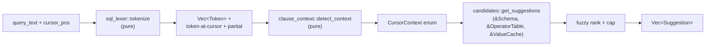

**Stage 1 — `sql_lexer::tokenize(query) -> Vec<Token>`.** A small, allocation-light SQL tokenizer (not a parser). Token kinds: `Keyword`, `Ident`, `QuotedIdent` (`"order"`), `Number`, `StringLit` (`'...'`, tracks whether closed — directly reusing the `ScanState::is_in_string` idea from `scan_state.rs:25`), `Operator` (`= != < <= > >= <>`), `Punct` (`, ( ) . *`), `Whitespace`. It tracks per-token byte spans and a running paren depth (the one useful idea retained from `brace_tracker`). It must be tolerant of half-typed input — the query is almost never valid SQL mid-keystroke — so an unterminated `'` or a trailing `WHERE col =` is a normal, expected state, not an error.

> **Tokenizer, not parser — and that bounds §6.2.** This lexer deliberately does *not* build an AST. §6.2's clause-level SQL rewriting (e.g. wrapping a user query with an outer `LIMIT` per §2.3) must therefore operate on the **restricted, read-only single-`SELECT` (+ optional CTE) grammar** fixed in §8/Q1 — the only grammar the LIMIT-wrapping rule needs. Specifically, §2.3's auto-`LIMIT` wraps the user query as `SELECT * FROM (<user query>) LIMIT <n>` and is **suppressed when the lexer already sees a top-level `LIMIT` token** (paren-depth 0), so a user-supplied `ORDER BY … LIMIT k` is never double-limited. That suppression check is a token scan, well within the lexer's reach; nothing in autocomplete requires a full parser.

**Stage 2 — `clause_context::detect_context(tokens, cursor) -> CursorContext`.** Find the token under/just-before the cursor, extract the `partial` (the in-progress token text — the analog of jiq's returned `partial` string), then walk *backward* over preceding non-whitespace tokens to find the nearest governing clause keyword and decide intent:

```rust
pub enum CursorContext {
    SelectList   { partial: String },                 // after SELECT / after a comma in the list
    FromTable    { partial: String },                 // after FROM / JOIN
    Predicate    { partial: String },                 // after WHERE/AND/OR/HAVING/ON -> expect a column
    ComparisonOp { lhs_col: Option<String> },          // after `col` -> expect = < > LIKE IN ...
    ColumnValue  { col: ColRef, kind: TriggerKind,     // after `col <op>` inside a value literal
                   partial: String },                  // -> distinct VALUES of that column
    GroupOrderList { partial: String },                // after GROUP BY / ORDER BY -> expect a column
    Keyword      { partial: String },                  // bare position -> SQL keywords
}
```

`TriggerKind` is reused from `value_trigger.rs:24` (it already distinguishes `=`/`!=`/`IN`/`LIKE`-style triggers). `ComparisonOp`'s `lhs_col` is informational (used only to title the popup); the operator candidates themselves come from the operator table (§5.4, §5.5), not from the column.

### 5.4 Cursor-context → suggestion-kind mapping

This is the contract the table-driven tests in `clause_context_tests.rs` + `candidates_tests.rs` assert against (one row ≈ one test-case family):

| Cursor position (what precedes the cursor) | `CursorContext` | Candidate source(s) | Type hint shown |
|---|---|---|---|
| `SELECT ` / `SELECT a, ` | `SelectList` | **Schema** columns + `*`; **`sql_keywords` function/aggregate table** (`COUNT`, `SUM`, `AVG`, `MIN`, `MAX`, scalar fns) | `SqlType` per column; `agg`/`fn` for functions |
| `SELECT COUNT(` (inside paren) | `SelectList` | **Schema** columns + `*` | `SqlType` |
| `FROM ` / `JOIN ` | `FromTable` | the loaded table name(s) (single relation in v1 → one candidate) | `table` |
| `WHERE ` / `… AND ` / `… OR ` / `HAVING ` / `ON ` | `Predicate` | **Schema** columns (+ aggregates after `HAVING`, from `sql_keywords`) | `SqlType` |
| `WHERE col ` (column then space) | `ComparisonOp` | **`sql_keywords` operator table**: `=`, `!=`, `<`, `<=`, `>`, `>=`, `LIKE`, `IN`, `BETWEEN`, `IS NULL`, `IS NOT NULL` | `op` |
| `WHERE col = '` / `WHERE col IN ('` | `ColumnValue` | **DISTINCT VALUES of `col`** via engine query, cached in `ValueCache`, capped (the CSV analog of jiq `value_collector`) | the column's `SqlType` |
| `GROUP BY ` / `ORDER BY ` / after a comma therein | `GroupOrderList` | **Schema** columns; after `ORDER BY col ` also `ASC`/`DESC` (`sql_keywords`) | `SqlType` / `kw` |
| start of query, or after a complete clause where a keyword is expected | `Keyword` | **`sql_keywords` keyword table** valid in that position (`SELECT`, `FROM`, `WHERE`, `GROUP BY`, `ORDER BY`, `LIMIT`, `JOIN`, …) | `kw` |

The crucial new row is `ColumnValue`: jiq learned values only by scanning JSON it happened to have parsed (`collect_distinct_strings`). ciq turns this into a precise, typed query — and because the engine benchmark showed `distinct` at ~10 ms on 5M rows (well under the 150 ms debounce), it is cheap enough to run on demand and cache.

### 5.5 Candidate sources

Four sources feed `candidates::get_suggestions`, generalizing jiq's three (live data, builtins list, string values). The fourth — the **operator table** — closes the gap the critic flagged in `ComparisonOp`: operators are not in `Schema` or `ValueCache`, so they live as a static table in `sql_keywords.rs` alongside keywords and functions, and are passed in as `&OperatorTable` (a borrow of the relevant slice of `sql_keywords`).

1. **Column names + sniffed types — from `&Schema`.** Replaces jiq's `all_field_names` / `ResultAnalyzer` / `navigate_multi` sampling. Each column becomes `Suggestion::new_with_type(name, SuggestionType::Field, Some(sql_type))` (the verified constructor at autocomplete_state.rs:286), so the popup shows the type inline exactly as jiq shows `JsonFieldType`. DuckDB's sniffer strengths (e.g. `created_at` → `DATE`, the benchmark's headline win) surface directly: the user sees `created_at  DATE` and knows to write a date predicate.

2. **SQL keywords / functions — static tables in `sql_keywords.rs`.** Replaces jiq's `jq_functions.rs` builtins list. Function entries carry an optional signature/description via the verified `Suggestion::with_signature` (autocomplete_state.rs:306) / `with_description` (@301), e.g. `COUNT(expr) → aggregate count`, `strftime(ts, fmt)`. Scoped to the DuckDB dialect (the chosen engine). This is data, not behavior, so it is trivially testable.

3. **Operators — the `OperatorTable` slice of `sql_keywords.rs`.** A static, position-filtered list feeding the `ComparisonOp` context (`=`, `!=`, `<`, `<=`, `>`, `>=`, `LIKE`, `IN`, `BETWEEN`, `IS NULL`, `IS NOT NULL`). Each becomes a `Suggestion` of the existing `SuggestionType::Operator` variant. Pure data; one test row per operator.

4. **Distinct column values — engine query, cached, capped — in `value_source.rs`.** When `CursorContext::ColumnValue { col, .. }` fires, `value_source::build_distinct_sql(col, cap)` produces `SELECT "<col>", count(*) AS n FROM t WHERE "<col>" IS NOT NULL GROUP BY 1 ORDER BY n DESC LIMIT <cap>` and runs it through the worker. Results are cached in a `ValueCache` keyed by column (the direct port of jiq's `ValueMemo` + `build_memo_key`, autocomplete_state.rs:18,127), so repeated keystrokes inside the same literal don't re-query. The *display* list is further fuzzy-filtered by `partial` and truncated to the popup size, identical to jiq.

> **Cap reconciliation (cross-section fix).** The per-column DISTINCT cap is **`MAX_VALUES_PER_PATH` (10 000)** — verified at `value_collector.rs:14`, and the correct constant for a *per-column* value set. §2.5 currently cites `MAX_GLOBAL_STRING_VALUES` for this same per-column query; that is the **global** cap and is wrong here. §2.5 must change to `MAX_VALUES_PER_PATH` so the two sections agree on a single cap for per-column DISTINCT.

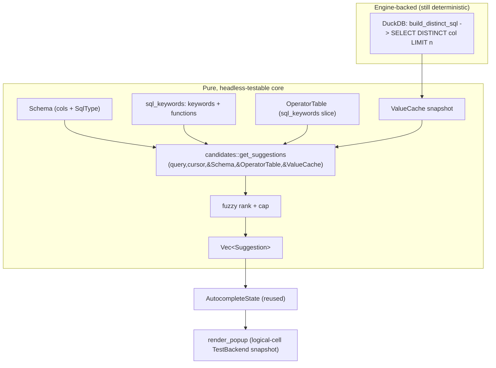

The value query is the *only* part of autocomplete that touches the engine, and it is gated behind the `ValueCache`: the candidate generator itself takes the cache as a plain immutable argument, so every unit/property test passes a hand-built cache and never spins up DuckDB. This is the same separation jiq enforces by passing `original_json: Option<Arc<Value>>` into `get_suggestions` (context.rs:621) rather than letting it reach into the executor. The engine call that *fills* the cache goes through the same worker channel and the same single-issuer/interrupt cancellation model adopted project-wide (§3.1/§3.4) — autocomplete never opens its own connection.

### 5.6 Headless-testability (North Star #2)

Every box in the diagram above except the DuckDB node is a pure function or pure data, so the entire autocomplete surface is exercisable by an AI agent in a build→test→fix loop with deterministic pass/fail. Concretely:

| Layer | Function signature | Test style | Determinism / what it proves |
|---|---|---|---|
| Lexer | `tokenize(&str) -> Vec<Token>` | table-driven + property (`concat(token.text) == input`; spans cover input) | total, no I/O |
| Context detector | `detect_context(&[Token], usize) -> CursorContext` | table-driven (one row per §5.4 line) + property (never panics for any byte offset `0..=len`) | total, no I/O |
| Candidate generator | `get_suggestions(query, cursor, &Schema, &OperatorTable, &ValueCache) -> Vec<Suggestion>` | table-driven golden cases over a fixed in-memory `Schema`, static operator table, and seeded `ValueCache` | total, no engine |
| Value SQL builder | `build_distinct_sql(col, cap) -> String` | unit (assert emitted SQL incl. identifier quoting) **without executing**; one integration test runs it on a tiny fixture CSV to confirm it is valid DuckDB | pure string-builder; mirrors jiq splitting `value_trigger::classify` (verified `pub(crate)` @ value_trigger.rs:79) from the executor call |
| Ranking / insert | reused; `insert_suggestion(...)` | jiq's existing insertion-test patterns, adapted (+ SQL quoting cases) | total |
| Popup render | `render_popup(app, frame, area)` | `insta` snapshot via ratatui `TestBackend` — asserting the **logical cell grid** (text + style attributes the buffer holds) | deterministic at the *logical-cell* level only |

**Scope of "deterministic raster."** The `render_popup` snapshot proves the *logical* cell contents — which glyphs and which style enums land in which `Buffer` cells. It does **not** prove true-terminal rendering. Per the canonical human-test surface (§4.7, which §8/R7 defers to), the items a human must still confirm are: real crossterm key events driving `Tab`/arrow selection-and-insertion; popup *placement/overflow* against a real `input_area` on a real screen; and the *color polarity* of the type-hint column on light vs. dark terminals. The headless snapshot and that human list are disjoint by construction — the snapshot owns logical cells, the human owns true glyphs/placement/polarity — so there is no overlap between this table's last row and the human-surface paragraph.

Property tests (jiq already depends on `proptest`) assert the invariants that catch the §5.7 cases: for any random `(query, cursor)` the pipeline returns without panic; `partial` is always actually present at the cursor; every returned `Suggestion.text`, once inserted via `insert_suggestion`, leaves the cursor inside the same `CursorContext` (no insertion that re-classifies the clause). All of this runs under the project-canonical CI command `cargo test --all-features -- --test-threads=1` (§4.5/§7), never bare `cargo test`.

### 5.7 Tricky cases (mirroring jiq's edge-case rigor)

jiq's autocomplete earns its reliability from obsessive edge-case handling — `value_trigger.rs`'s `partial_contains_interpolation` bail-out (the `\(` case), path-folding through `select`/`map` via `fold_to_absolute_path`, and the `is_cursor_at_logical_end` / `is_in_non_executing_context` branching in `get_suggestions`. ciq must match that rigor for SQL. Each case below reduces to `(tokens, cursor) -> CursorContext -> Vec<Suggestion>` with no I/O, so each is a deterministic test row an agent can add and verify in the build→test→fix loop:

| Case | Behavior | Notes |
|---|---|---|
| **Quoted identifiers** | `SELECT "ord` → match column `order`; on insert emit `"order"`. A bare partial colliding with a SQL keyword (`order`, `group`, `select` as a column name) is auto-quoted on insertion. | SQL-specific; lives in `insertion.rs`. The lexer must distinguish `QuotedIdent` from `Keyword`. jiq has no analog. |
| **Qualified names** | `WHERE t.cre` → strip the `t.` prefix, match column `created_at`, insert preserving the qualifier. v1 has one relation so the qualifier is cosmetic, but the detector must not split `t.cre` into two tokens or read it as a value literal. | Far simpler than jiq's `.foo.bar` path handling, since the schema is fixed. |
| **Partial vs. fresh position** | Distinguish `WHERE ` (empty partial → list all columns) from `WHERE st` (partial `st` → fuzzy-filtered). | Empty-partial policy is per-context and table-tested. ciq lists columns even on empty partial in clause positions, since the column set is small and known. |
| **Mid-query edits** | Cursor in the *middle* of `SELECT a, |b FROM t` classifies from the token under the cursor, not end-of-string. | This is the headache that forces jiq's `is_cursor_at_logical_end` branching. ciq dodges most of it: a static schema means no "cache ahead/behind cursor" problem, so the detector needs only the token at the cursor plus a backward scan. Major simplification vs. jiq. |
| **Unclosed string = value mode** | `WHERE city = 'New ` → `ColumnValue`, partial `New`, query distinct values of `city`. | Direct analog of `value_trigger::classify` (value_trigger.rs:79) returning a `ValueTrigger` for an unterminated quote; reuse `ScanState::is_in_string` (scan_state.rs:25) for quote tracking. |
| **`IN (...)` list** | `WHERE status IN ('a', '` → still `ColumnValue` for `status`; already-listed values can be de-prioritized. | Lexer paren depth + comma counting. |
| **`LIKE` predicates** | `WHERE name LIKE '` → offer distinct values, *not* operator suggestions; treat as value mode. | A deliberate, documented dialect choice — the inverse of jiq, which deliberately *suppresses* value autocomplete for regex functions (`test`/`match`). Documented in `clause_context.rs`. |
| **Functions wrapping columns** | `WHERE lower(ci` → suggest columns inside the call; `SELECT date_trunc('day', ` → suggest columns for the second arg. | Paren-depth aware via the lexer paren stack — analogous to jiq suppressing `.[].field` inside `map`/`select` via `brace_tracker::is_in_element_context`. |
| **Aggregates only where legal** | `COUNT`/`SUM`/etc. appear in `SelectList` and after `HAVING`, never in a bare `WHERE` column position. | Encoded in the §5.4 mapping; one test row each. Requires the new `SuggestionType::Aggregate` variant (§5.1). |

Relevant jiq reference paths (for the porting engineer — all line numbers grep-verified against `/local/home/chahcha/RustProjects/jiq`): `src/autocomplete/autocomplete_state.rs` (reuse `Suggestion`/`AutocompleteState`/`ValueMemo`/`build_memo_key` @18,127; `Suggestion::new_with_type` @286, `with_description` @301, `with_signature` @306; `SuggestionType` @217-224 — add `Keyword`/`Aggregate`), `autocomplete_render.rs::render_popup` (reuse), `insertion.rs` / `value_insertion.rs` (reuse + SQL quoting), `context.rs::analyze_context` @761 / `get_suggestions` @616 / `is_cursor_at_logical_end` @848 / `needs_leading_dot` @166 (replace), `value_collector.rs::collect_distinct_strings` @22 + `MAX_VALUES_PER_PATH` @14 (port the value-cache contract and per-column cap, replace the source), `value_trigger.rs::classify` @79 + `TriggerKind` @24 (port the trigger classification), `scan_state.rs::ScanState::is_in_string` @25 (reuse for quote tracking), `jq_functions.rs` (replace with `sql_keywords.rs`).


---

## 6. CSV-Native Features & Results Grid

This section specifies the CSV-specific UX that rides on top of the DuckDB SQL core (Sections 4-5): the features that make ciq feel like a *spreadsheet you can query*, not just "psql against a CSV". Everything here is designed so the **logic** is a pure, snapshot-testable function of in-memory state, and only the final glyph blit to a real terminal lives in the small, single, canonically-enumerated human-test surface (HTS) owned by §4.7. Where ciq reuses jiq machinery, the analogous path is cited (grep-verified against `/local/home/chahcha/RustProjects/jiq` unless explicitly marked *illustrative*); where it replaces jiq, the contrast is called out.

### 6.0 Design throughline: state -> layout -> styled lines -> frame

jiq's results renderer is the function `render_pane(app, frame, area)` in `src/results/results_render.rs` (the file is 1071 lines; `render_pane` itself spans roughly lines 288-800, with helpers like `render_scrollbar`, `render_loading_indicator`, and `render_cursor_indicator` factored out below it). Note that jiq's `CLAUDE.md` "max 1000 lines" rule is a **per-file** rule, not per-function; a single 1000-line function would violate jiq's own function-focus principles. `render_pane` still does too much for ciq's taste — it reads `App` state, computes title/budget chrome, *and* blits `ratatui` widgets to a live `Frame`. What makes jiq partially snapshot-testable today is that the styled lines arrive **precomputed** in `ProcessedResult` (`output`, the pre-rendered styled lines, `line_count`, `max_width`, `line_widths`) off the worker thread, so a `TestBackend` can exercise the blit.

ciq tightens this into an explicit, testable pipeline and applies it to **every** CSV-native feature, not just the grid:

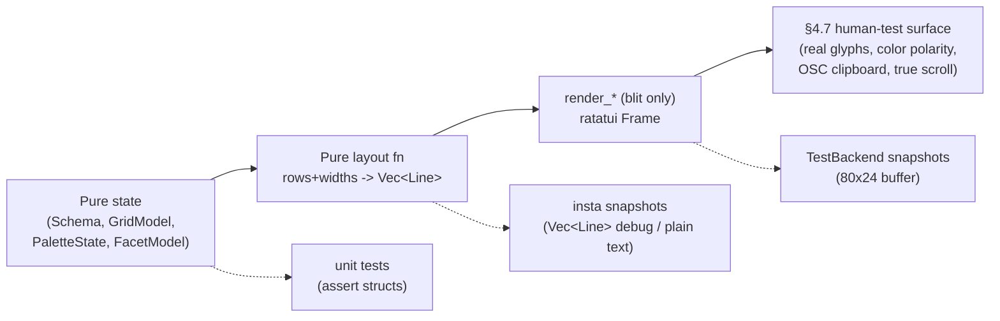

The hard rule: **`layout::*` functions take owned/borrowed data and return `Vec<Line<'static>>` plus geometry structs — they never touch `Frame`, `Terminal`, `Stdout`, or wall-clock time.** That makes them callable by an AI agent with zero terminal, with byte-for-byte deterministic output. `render_*` functions are a thin shim: call the pure layout fn, then `frame.render_widget`. The shim is the *only* part that touches `Frame`, and it is kept dumb enough that a `TestBackend` snapshot fully covers it; the irreducible residue (true glyphs, color polarity, real keys, OSC clipboard) is delegated to the single canonical HTS list in §4.7 — this section never defines its own competing list, it only points each feature's residue at §4.7.

### 6.1 Feature catalog (with headless-testability contract)

| # | Feature | Owning module(s) | Core logic = pure fn | What's snapshot/unit tested headlessly | HTS residue (-> §4.7) |
|---|---|---|---|---|---|
| 6.2 | **Column palette / picker** (fuzzy multi-select that *generates* the SELECT — [§0/D3](#0-canonical-decisions-single-source-of-truth)) | `palette/palette_state.rs`, `palette/query_emit.rs`, `palette/palette_render.rs` | `emit(state) -> String`, `filter(cols, needle) -> Vec<Ranked>` | toggle/reorder state machine; emitted SQL string (incl. identifier + facet-value quoting); fuzzy ranking order; ownership byte-compare; reorder ordering | popup glyphs, real key chords, Replace-transition |
| 6.3 | **Header / schema bar** (always-visible names + sniffed types + delimiter) | `schema_bar.rs` (layout) over the canonical `Schema` (top-level `src/schema/`, [§0/D2](#0-canonical-decisions-single-source-of-truth)) | `layout_schema_bar(&Schema, width, h_col_offset, active_col) -> Vec<Span>` | width-fit truncation, type-badge text, active-column underline, delimiter glyph choice | final colored row |
| 6.4 | **Tabular results grid** (the one new renderer) | `grid/grid_layout.rs` (pure), `grid/grid_render.rs` (blit), `grid/col_width.rs` | `layout_grid(rows, &Schema, &GridView) -> GridFrame{header, body, col_x, total_width}` | column widths, alignment per type, ellipsis, null glyph, h/v scroll windowing, sticky header line | cursor cell highlight blit, color |
| 6.5 | **Instant facets / column stats** (min/max/distinct/nulls on cursor column) | `facets/facet_query.rs`, `facets/facet_state.rs`, `facets/facet_render.rs` | `build_facet_sql(col, &Schema) -> String`, `format_facets(FacetResult, width) -> Vec<Line>` | SQL generated per type; number/date/string formatting; histogram bar widths | popup blit |
| 6.6 | **Delimiter / quote / header auto-detect** (+ override + config) | `ingest/sniff.rs`, `ingest/csv_opts.rs`, `config.rs` (`[csv]` section) | `to_read_csv_sql(&CsvOpts) -> String`, `merge(config, cli, sniffed) -> CsvOpts` | precedence resolution; emitted `read_csv(...)` SQL; override application | none beyond the grid re-render it triggers |
| 6.7 | **Output modes** (emit CSV/JSON/TSV/Markdown to stdout; copy selection) | `output/emit.rs` + reuse top-level `clipboard::osc52` | `render_output(rows, &Schema, OutputFormat) -> String` | exact bytes per format (CSV quoting, JSON shape, MD alignment) | OSC52 clipboard write |

The pattern is uniform: **selection/SQL-generation/formatting logic is pure and coverage-targeted (per §4.6, `cargo tarpaulin`, critical-path-first); the popup or row blit is a `TestBackend` snapshot; the actual terminal glyph + clipboard + color polarity is the only thing flagged for human validation, against §4.7's single list.** This is the concrete embodiment of North Star #2 (AI-testable by construction): an agent can drive a column toggle, assert the emitted SQL byte-string, run it through the engine harness, and snapshot the grid, all headlessly under `cargo test --all-features -- --test-threads=1` (the verified CI invocation), then self-correct on a diff.

### 6.2 Column palette / picker — *generates the SELECT for you*

> **Superseded design — read [§0/D3](#0-canonical-decisions-single-source-of-truth).** This subsection originally specified a `select_writer` that **parsed and spliced into the user's hand-typed SQL** (`parse_shape`/`apply_projection`/`parse_selected`/`ProjectionShape`). That design is **dropped** by D3: the deep-dive confirmed it secretly requires the SQL parser §5.3 declines to build, and it dies on real exploratory SQL (`CASE`, `GROUP BY`, window fns) anyway. The replacement below is the **generated-state** design.

The headline CSV convenience: the user presses a chord (proposed `Ctrl+K`, "columns"), gets a fuzzy-filterable list of every column with its sniffed type and a checkbox, multi-selects/reorders, and ciq **generates a fresh canonical `SELECT`** from the palette's own structured state — they never hand-type `SELECT a, b, c`.

```mermaid
flowchart TD
  Open["Open palette (Ctrl+K)"] --> Own{"is the bar text == the<br/>last string the palette emitted?"}
  Own -->|yes (palette owns it)| Filter["type to fuzzy-filter columns<br/>(fuzzy-matcher, reused ranking)"]
  Own -->|no (user hand-typed SQL)| Offer["palette DISABLED;<br/>offer 'Replace query with column selection?'"]
  Filter --> Toggle["Space toggles include/exclude<br/>arrow keys reorder"]
  Toggle --> Emit["query_emit::emit(state)<br/>-> fresh canonical SELECT ... FROM t ..."]
  Emit --> Engine["new SQL -> debouncer -> worker -> DuckDB"]
```

**Reuse vs. replace.** The popup chrome, scrolling, highlight, and **fuzzy ranking** are lifted from jiq's autocomplete framework (popup render + `fuzzy-matcher`). What's replaced is the *candidate source* — candidates are `Schema` columns, not JSON paths — and the *output*: instead of inserting a token, the palette **emits a whole query from structured state**. There is **no SQL parser/splicer** ([§0/D3](#0-canonical-decisions-single-source-of-truth)).

**The generated-state contract (no parsing of user text):**
- `PaletteState` (`palette/palette_state.rs`): `{ all_columns: Vec<ColumnRef>, checked: IndexSet<usize> (ordered — drives projection order), predicates: Vec<Predicate>, needle: String, cursor: usize }`. Toggle/reorder/filter are pure state transitions — unit-tested with plain asserts, no terminal.
- `palette/query_emit.rs::emit(state) -> String` (NOT `emit.rs` — that name collides with `output/emit.rs`): renders a canonical `SELECT <projection> FROM t [WHERE <conjunction>] [ORDER BY …]`, applying the existing display-`LIMIT min(k, N)` rule (§2.3). Identifiers needing quoting (spaces, reserved words, case) are double-quoted; empty selection → `SELECT *`. **Pure `state -> String`**, exhaustively golden-tested — including **two** quoting surfaces: (a) identifier quoting in the projection, and (b) **facet-predicate value quoting/escaping** (`region = 'O''Brien'`, NULL handling, numeric `5` vs string `'5'`, dates). Reorder ordering is its own exit-criterion. The emitted byte format is an **identity/compatibility surface** (see ownership check below), so its formatting is stable, not a free internal choice.
- **Ownership / "is the palette live?"** — decided by **byte-comparing the bar text against the last string `query_emit` produced**. Equal → the palette owns the query and edits stay live. Different → the user has hand-typed SQL; the palette is **disabled** and offers a soft "Replace query with column selection?". No parsing needed. Because opening a file pre-seeds `SELECT * FROM t LIMIT n` (the palette's own emission), the common path starts palette-owned and stays live.

**HTS residue (-> §4.7):** the popup's drawn glyphs, the checkbox character, real `Space`/arrow key delivery, and the **Replace-transition UX** (accepting Replace on a hand-typed `… WHERE region='EU'` discards the `WHERE` and snaps to `SELECT *` — correct-by-construction but a real UX cliff to validate). Pinned as far as possible by a `TestBackend` 80x24 snapshot of `palette_render`.

### 6.3 Header / schema bar

An always-visible single row (jiq has no equivalent — JSON has no fixed schema) pinned directly above the grid, inside the same bordered pane. It shows, per column, `name` + a compact type badge, plus a global indicator of the **active delimiter** and header mode. It horizontally scrolls in lockstep with the grid by sharing the grid's **column-granular** `h_col_offset` (6.4) — mirroring how `render_pane` keeps horizontal bounds in sync via `app.results_scroll.update_h_bounds(...)` (`results_render.rs:358`), but column-aware rather than char-aware.

```
+- data.csv  |  delim ,  |  header on -------------- L1-40/5,000,000 -+
| id #   name (txt)   created_at (date)   amount (num)   active (bool)|  <- schema bar
| -------------------------------------------------------------------- |
| 1      Ada          2021-03-04          12.50          true          |
```

(Type affordances are plain ASCII text, not emoji, per the theme note in §6.8; glyphs above are *illustrative*.)

**Pure-logic boundary:** `schema_bar::layout_schema_bar(&Schema, total_width, h_col_offset, active_col) -> Vec<Span<'static>>` is a pure function of the **same** `Schema` and `col_x` map the grid computes (6.4) — it reuses the grid's `col_x` offsets so names align dead-on with their data columns. Truncation reuses jiq's verified `str_utils::head_truncate_to_width` (`src/str_utils.rs:34`). Type badges map `SniffedType -> &'static str` (`#` int, `.#` float, `txt` text, `date` date, `bool` bool) — a pure lookup, unit-tested. The active-column underline and the delimiter/header summary string are pure.

**Headless tests:** assert the `Vec<Span>` (text + which span carries the "active" style) via `insta`; assert alignment by checking each column-name span starts at its `col_x`. **HTS residue (-> §4.7):** the drawn underline/color and the delimiter glyph's terminal rendering.

### 6.4 Tabular results grid renderer — the one genuinely new renderer

This replaces jiq's JSON pretty-printer wholesale. jiq's worker hands back already-styled lines of *pretty-printed JSON text* (one logical line == one row, the invariant the whole scroll/search/cursor/clipboard stack depends on, and the invariant jiq's memory record [jiq line-wrap deferred] confirms must not be broken). ciq keeps the **1-line-per-row invariant** (so scroll/search/cursor/clipboard reuse unchanged) but produces those lines from a **columnar table with computed widths**, not from JSON text.

#### Contrast with jiq

| Concern | jiq (JSON pretty-printer) | ciq (tabular grid) |
|---|---|---|
| Source | pre-styled JSON text from worker | columnar rows + `Schema` from worker |
| Line model | indentation-based, syntax-highlighted | fixed-width cells, separators |
| Width | `max_width` of pretty text (in `ProcessedResult`) | **per-column** widths from `col_width.rs` |
| Alignment | none (left, structural) | right for numerics/dates, left for text |
| Horizontal scroll | char offset (`h_offset`) into long JSON lines | **column-aware** offset (`h_col_offset`, whole cols) |
| Header | n/a | **sticky** header row, rendered outside the scrolled body (see below) |
| Null | JSON `null` token | dedicated dim null glyph, distinct from empty string (**semantics cross-ref §8/Q12**) |

#### The pure core: `layout_grid`

```
grid/grid_layout.rs   (PURE — no Frame, no Terminal, no clock)
  layout_grid(
      rows: &[Row],            // viewport slice already chosen by caller
      schema: &Schema,
      view: &GridView,         // h_col_offset, focused cell, viewport w/h
  ) -> GridFrame {
      header: Line<'static>,         // the sticky header line, returned SEPARATELY
      body:   Vec<Line<'static>>,    // one Line per data row (invariant preserved)
      col_x:  Vec<u16>,              // start column of each visible column
      total_width: u16,              // feeds h-scroll bounds
  }
```

Supporting pure pieces:

- `col_width::compute_widths(sampled_rows, &Schema, budget) -> Vec<u16>`: width = `max(header_len, sampled_max_cell_len)` clamped to a per-column cap, then distributed to fit the viewport budget. Sampling is over the **returned page**, not the whole 5M-row table, so it stays O(viewport) and inside the 1-20ms interactive budget (Section 3). Pure -> exhaustively unit-tested with hand-built row fixtures.
- Alignment: `align_for(SniffedType)` -> `Right` for INT/FLOAT/DATE/TIMESTAMP, `Left` otherwise. Pure lookup.
- Truncation/ellipsis: cell text wider than its column is truncated to width with a `…`. Head-truncation reuses jiq's `str_utils::head_truncate_to_width`; tail-truncation (the common case for cells) is a **new sibling helper** added to `str_utils.rs` (jiq today only has the head variant — verified), unit-tested the same way as the existing one.
- **Null rendering vs. semantics — bounded claim.** `layout_grid` renders a `Cell::Null` variant as a themed null glyph distinct from `Cell::Text("")`. This is purely a *rendering* distinction and is asserted in tests. **It does not assert that the empty-vs-NULL ingest semantics are decided** — whether an empty CSV field becomes SQL `NULL` or `''` (and the `null_string` knob in 6.6) is a genuinely open, correctness-weighted question tracked in **§8/Q12**. The renderer is written to faithfully display *whichever* the engine produces; §6.4 deliberately does not lock the SQL semantics.
- Horizontal scroll is **column-granular**: `view.h_col_offset` drops whole leading columns rather than slicing mid-cell, so a scrolled grid never shows half a number. (jiq scrolls by raw char `h_offset` via `Paragraph::scroll((0, h_offset))` at `results_render.rs:715`; ciq overrides this one behavior to be column-aware.) Vertical scroll is unchanged from jiq.

#### How the sticky header coexists with jiq's reused vertical-slice scroll

A critic correctly flagged the tension: 6.4 reuses jiq's `rendered.lines[scroll_offset..end_line]` viewport-slice model (the block in `render_pane`, `results_render.rs:670-677` — `scroll_offset = app.results_scroll.offset`, `end_line = (scroll_offset + viewport_lines).min(total_lines)`, `&rendered.lines[scroll_offset..end_line]`; *line numbers verified at time of writing but treated as illustrative — grep for the slice expression, not the line number*), yet a sticky header that stays put while the body scrolls would seem to break that simple slice.

The resolution is that the header is **not part of the scrolled body at all** and the slice model is reused **unchanged**:

- `layout_grid` returns `header` and `body` as **separate** fields. `body` is the `Vec<Line>` that the existing `scroll_offset..end_line` slice operates on, byte-for-byte the same shape jiq already slices — so `scroll.rs`, search, and cursor offsets all keep working without modification.
- `grid_render::render_grid` reserves the **top inner row** of the results pane for `header` and renders it with its own `frame.render_widget` call (a one-line `Paragraph`, no scroll). The body `Paragraph` is rendered into the area **below** that reserved row, with exactly jiq's vertical-slice + `Paragraph::scroll` logic. Because the header occupies a separate `Rect` outside the scrolled body area, scrolling the body never moves it, and the slice model never has to know the header exists.
- The only arithmetic delta vs. jiq: the body's viewport height is `inner_height - 1` (one row given to the sticky header). That single subtraction is a pure value threaded into the existing `viewport_lines` computation and is unit-tested.

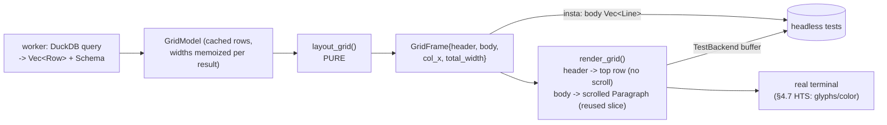

**Reuse:** scroll state (`scroll.rs`), search, cursor (`results/cursor_state.rs`), clipboard, position indicator, timing badge, spinner, scrollbar (`render_scrollbar`, `results_render.rs:269`) — all operate on the `body` `Vec<Line>` + offsets and are agnostic to whether the lines are JSON or grid rows, so they port unchanged. **Replace:** only the line-*production* (`layout_grid`) and the addition of the separately-rendered sticky `header` line.

#### The blit shim: `grid_render.rs`

`render_grid(frame, area, &GridFrame, &theme)` does only: reserve the top inner row and render `header` there, render `body` as a `Paragraph` with the existing vertical-slice + scrollbar logic, overlay the focused-cell highlight. This is the only grid code that sees a `Frame`. It is covered by `TestBackend` 80x24 (plus a couple of pathological widths) `insta` buffer snapshots — an AI agent runs the suite, sees the rendered buffer diff, and self-corrects. The irreducible residue (cursor-cell highlight color polarity, true glyphs) goes to §4.7.

### 6.5 Instant facets / column stats

Pressing a chord on the focused grid column (proposed `f`, "facet") fires a cheap aggregate against the **already-loaded** table and shows min / max / distinct-count / null-count (+ a tiny top-K value histogram for low-cardinality columns). DuckDB's measured `distinct` at ~10ms and `group-by` at ~15ms on 5M rows (Section 3 benchmark) keep this well under the 150ms debounce — this is exactly why DuckDB was chosen over Polars (250ms distinct disqualifies live facets).

**Pure-logic boundary:**

- `facets/facet_query.rs::build_facet_sql(col: &ColumnRef, &Schema) -> String`: type-aware SQL — numerics/dates get `MIN/MAX`, `COUNT(DISTINCT)`, and a null count via `COUNT(*) FILTER (WHERE col IS NULL)`; strings get `COUNT(DISTINCT)` + `GROUP BY col ORDER BY count DESC LIMIT k`. Pure -> table-driven `insta` test of the emitted SQL per type. An agent verifies the exact string, then runs it through the engine harness.
- `facets/facet_render.rs::format_facets(FacetResult, width) -> Vec<Line>`: number/date/string formatting + histogram bar widths (`bar_len = (count * inner_width) / max_count`) are pure and snapshot-tested. **HTS residue (-> §4.7):** the popup blit and bar color only.

**Worker-channel multiplexing — consistency note with the single-connection / interrupt model.** Facet queries reuse the **same** `QueryRequest`/`QueryResponse` worker channel as the main query, each carrying its own `request_id` so a stale facet result is discarded exactly like a stale main query (jiq's verified `request_id` staleness model). This is a deliberate design choice, and it has a constraint that must be stated rather than glossed: the worker owns **one** long-lived DuckDB connection (per §2.4/§3.1), and that connection processes requests from the channel **serially**. Therefore a facet request and a main-query request **do not run concurrently** — they queue on the one worker, and the newer request's arrival drives a cancel of the in-flight one via `Connection::interrupt()`. This means:
  1. There is no concurrent-on-one-connection hazard, because there is never more than one in-flight query on that connection by construction.
  2. Whether a *just-superseded* main query is interrupted so the facet can run promptly, vs. allowed to finish first, depends on the cross-thread interrupt mechanism that the **global threading/cancellation decision (§2.4 / §3.1 / §8/R4) must settle once**: `Connection::interrupt()` is called from a thread *other* than the worker (a retained interrupt handle), targeting the blocked worker. §6.5 inherits whatever that section decides — it does not introduce a second cancellation path. Until §8/R4 is closed, facet preemption latency is "bounded by the in-flight main query's completion in the worst case," which at 1-20ms per the benchmark is still imperceptible.

### 6.6 Delimiter / quote / header auto-detect (+ override + config)

On load, ciq leans on **DuckDB's CSV sniffer** (the reason DuckDB won on "CSV type sniffing: best — `created_at -> DATE`"). The sniffed `delimiter`, `quote`, `escape`, `header` bool, and per-column types populate the canonical `Schema` (top-level `src/schema/`, [§0/D2](#0-canonical-decisions-single-source-of-truth)) shown in the schema bar (6.3). Users override via CLI flags, the config file, or an in-TUI override chord.

**Precedence (pure, fully testable):** `csv_opts::merge(config_opts, cli_opts, sniffed_opts) -> CsvOpts` with order **CLI > config > sniffed**. A pure function over three plain structs -> exhaustively unit-tested with no I/O. `csv_opts::to_read_csv_sql(&CsvOpts) -> String` emits the `read_csv('...', delim='..', header=.., quote='..', auto_detect=..)` call — snapshot-tested byte-for-byte so an agent can verify the engine invocation without spawning DuckDB.

**Config surface** extends jiq's `config.rs` with a `[csv]` section (`delimiter`, `quote`, `escape`, `header`, `null_string`, `sample_size`). Reuses jiq's existing TOML config load/validate path and its `config_tests.rs` style. The `null_string` knob is the user-facing lever for the empty-vs-NULL question and is therefore **gated on the §8/Q12 decision** — its default is left to that resolution, not asserted here. The only non-headless part is that re-sniffing triggers a grid re-render — which is just 6.4 again.

### 6.7 Output modes

ciq emits the **current result set** (post-query, what's on screen) to stdout or clipboard in a chosen format. This generalizes jiq's `save/` subsystem — verified to expose `SaveState`, `SaveMode`, and `WriteOutcome` (all in `src/save/save_state.rs`, lines 33/10/28 respectively) — from "write JSON to a file" to "render rows as CSV/JSON/TSV/Markdown". ciq reuses jiq's `OutputMode` enum (verified, re-exported from `app_state` via `lib.rs:39`) for the in-app output-mode selection.

| Format | Pure renderer | Headless test |
|---|---|---|
| CSV | `output/emit.rs::to_csv(rows, &Schema)` | exact bytes incl. RFC-4180 quoting/escaping of embedded commas, quotes, newlines |
| TSV | `to_tsv` | exact bytes |
| JSON (array of objects) | `to_json` | exact shape, null vs "" distinction (per §8/Q12), type fidelity |
| Markdown table | `to_markdown` | column alignment + separator row |

`render_output(rows, &Schema, OutputFormat) -> String` is pure and is the workhorse — every format is a snapshot-tested byte string.

**Clipboard reuse — no second module.** The clipboard write **reuses jiq's existing top-level `clipboard` module** (`src/clipboard.rs`, which declares `clipboard::osc52` and `clipboard::clipboard_events`); the OSC52 copy path is the verified `clipboard::osc52::copy(text)` at `src/clipboard/osc52.rs:8`. ciq does **not** create a second `output/clipboard.rs` — `output/emit.rs` produces the string, then hands it to the shared `clipboard::osc52::copy`. (This corrects the earlier draft's contradictory module tree.)

**HTS residue (-> §4.7):** the OSC52 clipboard write only. The `--output csv` path doubles as a non-TUI integration test — run ciq with a query and `--output`, assert stdout bytes — pure CLI, fully scriptable by an agent and entirely headless.

### 6.8 Module layout summary (all under jiq conventions)

Per the inherited jiq conventions (Rust 2024, `{name}.rs` never `mod.rs`, tests in separate `{name}_tests.rs`, files <1000 lines, colors only in `theme.rs`, re-export via `lib.rs`):

```
src/
  palette/   palette_state.rs  query_emit.rs  palette_render.rs   (+ _tests.rs each)   # query_emit, NOT select_writer (§0/D3)
  schema_bar.rs                                                      (+ _tests.rs)   # layout over the canonical Schema (top-level src/schema/, §0/D2)
  grid/      grid_layout.rs    col_width.rs       grid_render.rs     (+ _tests.rs)
  facets/    facet_query.rs    facet_state.rs     facet_render.rs    (+ _tests.rs)
  ingest/    sniff.rs          csv_opts.rs                           (+ _tests.rs)
  output/    emit.rs                                                 (+ _tests.rs)   # clipboard write reuses top-level clipboard::osc52 (NO output/clipboard.rs)
  clipboard.rs  + clipboard/osc52.rs ...                                             # reused from jiq verbatim
  str_utils.rs  // add tail-truncation sibling to existing head_truncate_to_width
  theme.rs      // add `grid`, `schema`, `palette`, `facet` color modules
```

The `Schema` *model* lives in top-level `src/schema/` ([§0/D2](#0-canonical-decisions-single-source-of-truth) — the engine *produces* it but does not *own its module*; this section only consumes a `&Schema`); `schema_bar.rs` here is the *layout* over it. The split keeps each `*_layout.rs` / `*_state.rs` / `*_query.rs` / `query_emit.rs` / `emit.rs` file purely logical (the headless-testable majority) and isolates the thin blit shims (`grid_render.rs`, `palette_render.rs`, `facet_render.rs`, and the `schema_bar` blit) as the only `Frame`-touching code in this section. Even those are largely pinned by `TestBackend` snapshots, leaving only the residue (true glyphs, color polarity, real keys, OSC clipboard) for human validation — and that residue is delegated entirely to the single canonical HTS list in §4.7, never re-enumerated here.


---

## 7. Phased Roadmap

The roadmap is sequenced around the two North Stars. The **AI-testability harness is built FIRST (Phase 1) and is a hard prerequisite, not parallel work** — every later phase's exit criteria are phrased as deterministic assertions the harness can run in an agent's build->test->fix loop. The **parse-once columnar engine** (North Star 1) appears as early as Phase 1 (the engine wrapper) and is load-bearing from Phase 2 onward. Each phase has a single headline **deliverable**, machine-checkable **exit criteria**, and an explicitly enumerated, minimal **human-validation** carve-out.

Two cross-cutting decisions govern this roadmap; both are settled canonically in [§0](#0-canonical-decisions-single-source-of-truth) and only summarized here:

1. **Engine abstraction — `trait QueryEngine`, method `query(&self, sql: &str) -> QueryOutcome`** ([§0/D1](#0-canonical-decisions-single-source-of-truth)). No cancel arg on `query()` (cancellation is out-of-band); not `run`/`execute`; not `CsvEngine`. Plus `load(&mut, path, opts) -> Result<Schema, EngineError>`, `distinct(col, limit) -> QueryOutcome`, `schema() -> &Schema`, `interrupt_handle() -> InterruptHandle`. `QueryOutcome = Rows(Table) | Error{message,sql} | Cancelled`; `Table` is columnar. DuckDB implementor is `DuckdbEngine`. *(Earlier drafts of this list said `run(sql, cancel)` — stale, superseded by D1.)*
2. **Cancellation is out-of-band, dispatcher-issued** ([§0/D4](#0-canonical-decisions-single-source-of-truth)). The worker blocks in `engine.query(...)` and cannot interrupt itself (in-process DuckDB call). A cheaply-cloneable **`InterruptHandle`** (newtype over `Arc<duckdb::InterruptHandle>` from `Connection::interrupt_handle()` — there is no `Connection::interrupt()` method) is held by the **dispatcher thread**, which calls `.interrupt()` from there when a newer `request_id` arrives. **No worker-side watcher thread.** Correctness rests on `request_id` stale-discard, not on the interrupt landing — so the interrupt is a latency optimization, and the dispatcher only fires it while a request is known in-flight.

### 7.0 Dependency / ordering overview

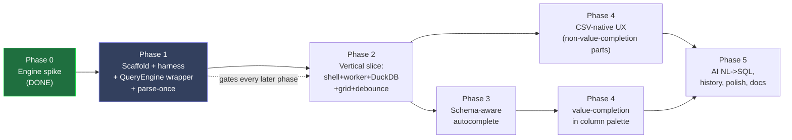

| Phase | Depends on | Can start when | Headless-testable share (target) | Human gate |
|---|---|---|---|---|
| 0 Spike | — | DONE | n/a (benchmark) | none |
| 1 Scaffold + harness + `QueryEngine` wrapper + parse-once | 0 | now | 100% (no TUI yet) | none |
| 2 Vertical slice | 1 (harness MUST be green) | P1 exit | ~90% (renderer logic headless; only real-terminal paint is human) | 1 scripted smoke |
| 3 Schema-aware autocomplete | 2 | P2 exit | ~98% (pure logic) | 1 incremental popup touch (folds into the P4/P5 batched gate) |
| 4 CSV-native UX | 2 (non-value-completion parts); **3 for value-completion in the column palette only** | non-value parts at P2 exit (parallel with P3); value-completion parts gated on P3 exit | ~92% | batched gate covering 4+5 |
| 5 AI NL->SQL + history + polish + docs | 4 | P4 exit | ~90% (AI behind a mockable trait; deterministic fixtures) | final batched gate |

**Parallelism note (resolves the prior P3/P4 contradiction):** P4 splits into two tracks. The **non-value-completion** parts (delimiter sniffing, output modes, header bar, the column-*projection* palette) depend only on P2 and may run in parallel with P3. The **value-completion** parts (facet sidebar and the palette's value-suggestion affordance, which both call `engine.distinct(...)` through the autocomplete value pathway) have a hard dependency on P3 and cannot start until P3 exits. The mermaid above shows this split explicitly.

**Hard rule (carried from jiq CLAUDE.md + North Star 2):** the human-validation surface is a single, closed, enumerated list, defined canonically in the testability section (section 4.7) and re-used verbatim here — it is **(1)** real-terminal rendering and color polarity, **(2)** true keyboard input, **(3)** true mouse input, **(4)** clipboard / OSC52, **(5)** terminal resize behavior. There is exactly one such list in this plan; this roadmap defers to section 4.7 rather than re-enumerating a competing one. Anything outside that list MUST be covered by an automated assertion before a phase is allowed to exit. If a feature cannot be reduced to a headless assertion, the design is wrong and the module boundary is refactored until it can — e.g., split a render function into a pure "compute styled grid lines" half (testable against `ratatui` `TestBackend` + `insta` snapshots, exactly as jiq does in `src/app/app_render_tests/` and `src/app/snapshots/`) and a thin "blit to terminal" half (the only human bit).

---

### 7.1 Phase 0 — Engine spike (DONE)

**Deliverable:** a defensible engine choice backed by a real benchmark, not a guess.

**Status: COMPLETE.** DuckDB chosen over DataFusion and Polars on a 5,000,000-row / 368 MB / 8-column CSV (incl. a sniffed `created_at DATE`), medians of 5-7 runs, stable across 3 rounds, on a 96-core box. Artifacts at `/local/home/chahcha/RustProjects/ciq-spike/` (`RESULTS.md` + `duckdb-bench` / `datafusion-bench` / `polars-bench` crates).

**Result cited (the numbers that decided it):**

| metric | DuckDB (CHOSEN) | DataFusion | Polars |
|---|---|---|---|
| load (parse-once) | 0.8-1.4 s | 0.15-0.19 s | 0.30 s |
| filter (WHERE+LIMIT) | ~1.0 ms | 2.2 ms | 27 ms |
| distinct (low-card -> autocomplete values) | 10 ms | 10 ms | 250 ms |
| sort top-1000 | 3.5 ms | 38 ms | 195 ms |
| mid-query cancel | yes (`Connection::interrupt`) | yes (abort) | **NO** |
| stripped binary | 31 MB | 49 MB | 34 MB |
| SQL dialect | exact DuckDB | ANSI-ish | own subset |

Every interactive query lands 1-20 ms — an order of magnitude under the planned 150 ms debounce — so live-as-you-type is trivially met. Polars is **disqualified**: it cannot cancel an in-flight query, breaking jiq's cancel-stale-query model. DataFusion is recorded as the **pure-Rust fallback** (faster load, cancels) if the C++ DuckDB dependency ever becomes untenable; the `QueryEngine` trait in Phase 1 is designed to make that swap a single-impl change.

**Exit criteria (met):** `RESULTS.md` exists with reproducible per-engine medians; verdict recorded; fallback identified.

---

### 7.2 Phase 1 — Repo scaffold + headless harness + `QueryEngine` wrapper + parse-once  *(testability prerequisite)*

**Deliverable:** a buildable, CI-gated `ciq` crate that can, with **no terminal at all**, load a CSV once into an in-memory DuckDB table and answer SQL queries through the canonical `QueryEngine` trait — plus the full headless test harness and CI gates that every subsequent phase depends on. **This phase exists primarily to stand up testability before any UX is written.**

This is the phase that operationalizes North Star 2. Until the harness and gates are green, no Phase 2+ work begins.

#### Modules delivered

> Module signatures below are corrected to [§0/D1](#0-canonical-decisions-single-source-of-truth)/[D2](#0-canonical-decisions-single-source-of-truth). The earlier draft of this table said `run(sql, cancel)`, `distinct -> Vec<String>`, and put the schema type "under `engine/` … the single decided path" — all three are **stale and wrong**: the method is `query(sql)` (no cancel arg), `distinct` returns `QueryOutcome`, and the schema type lives in top-level **`src/schema/`** (D2), not `engine/`.

| Module (file) | Purpose | Testable how |
|---|---|---|
| `src/engine/engine.rs` | The canonical `trait QueryEngine` ([§0/D1](#0-canonical-decisions-single-source-of-truth)): `load(&mut, path, opts) -> Result<Schema, EngineError>`, `query(sql) -> QueryOutcome`, `distinct(col, limit) -> QueryOutcome`, `schema() -> &Schema`, `interrupt_handle() -> InterruptHandle` | Trait is the swap-point for the DataFusion fallback; mocked in all upper layers via `FakeEngine` |
| `src/engine/duckdb_engine.rs` | `DuckdbEngine`: parse CSV once via `read_csv_auto` into a registered in-memory table; per-query `SELECT` against that table; `interrupt_handle()` returns a newtype over `Arc<duckdb::InterruptHandle>` (from `Connection::interrupt_handle()`) that the dispatcher calls `.interrupt()` on from another thread | Unit tests over fixture CSVs; assert row counts, typed columns, error strings. **Gated on the A1 reuse-after-interrupt spike** ([`ASSUMPTIONS.md`](ASSUMPTIONS.md)). |
| `src/schema/schema.rs` + `src/schema/types.rs` | **Schema type lives in top-level `src/schema/`** ([§0/D2](#0-canonical-decisions-single-source-of-truth), NOT under `engine/`): `Schema { columns: Vec<ColumnMeta { name, ty: ColumnType, .. }> }`, produced by the engine at load. `ColumnType` (not `SqlType`). | Golden-schema assertions (e.g., `created_at` -> `DATE`, mirroring the spike) |
| `src/engine/types.rs` | `QueryOutcome::{ Rows(Table), Error { message, sql }, Cancelled }`; columnar `Table`; `InterruptHandle` | Exhaustive match tests |
| `src/harness/` | The headless test harness (below) | Self-tested |

This replaces jiq's `src/query/executor.rs` `run_jq` model entirely: jiq spawns an external `jq` process and re-pipes the **entire** document on every keystroke (a writer thread does `stdin.write_all(json)`); ciq parses **once** at load and re-queries an in-memory table — directly serving North Star 1.

**Debouncer reuse — exact terms (resolves the "reused verbatim + injected clock" tension).** ciq **reuses jiq's `src/query/debouncer.rs` as-is, with no Clock trait.** jiq's debouncer is *time-as-parameter*, not clock-injectable: the production calls are `schedule_execution()` / `should_execute()` (which read a private `system_time_ms()` derived from a process-start `Instant`), and the deterministic test seam is the sibling pair `schedule_execution_at(current_time_ms: u64)` / `should_execute_at(current_time_ms: u64)` plus the `TEST_DEBOUNCE_MS` constant. The harness drives debounce determinism by **passing synthetic millisecond values to `*_at(u64)`** — there is no `FakeClock`, no `trait Clock`, and nothing in this plan should describe one. Where earlier drafts said "inject a clock," read it as "pass a synthetic `current_time_ms: u64` to `should_execute_at`." This is the model jiq actually ships and it is reused verbatim.

#### The headless harness (the core Phase-1 artifact)

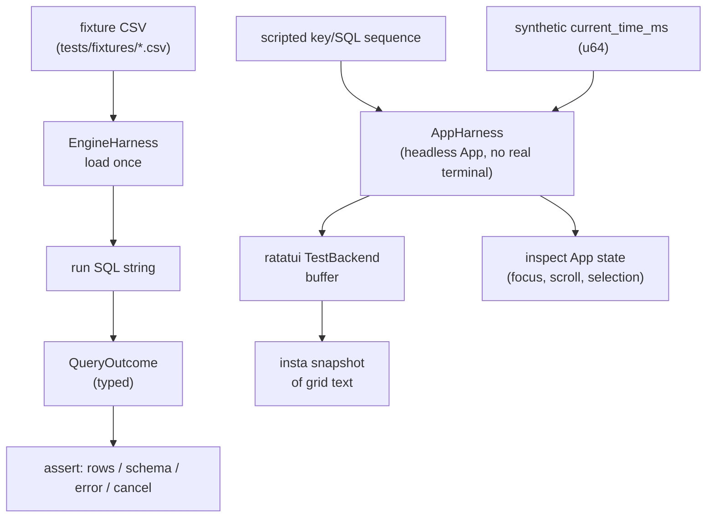

- **`EngineHarness`** — load a fixture once, fire arbitrary SQL through `QueryEngine::query` ([§0/D1](#0-canonical-decisions-single-source-of-truth)), assert on `QueryOutcome`. Deterministic; no terminal.
- **`AppHarness`** (lands minimally here, fleshed out Phase 2) — drives the `App` against `ratatui::backend::TestBackend` (the same primitive jiq uses in `src/app/app_render_tests/`), so an agent can feed a keystroke script and snapshot the rendered buffer with `insta` (reusing jiq's `snapshots/` convention).
- **Determinism rails:** the debounce gate is driven by feeding synthetic `current_time_ms: u64` to `should_execute_at` (per the reuse terms above) — never wall-clock; fixed terminal dimensions; seeded data; `execution_time_ms` excluded from snapshots. No real I/O in assertions.

#### CI gates stood up now (the **exact** commands from jiq's `.github/workflows/ci.yml`)

These are the agent's deterministic pass/fail signals for **all** later phases. ciq mirrors jiq's three-job layout (`test`, `coverage`, `lint`). The commands below are the verbatim ones in jiq's `ci.yml` — not a paraphrase:

| # | Gate | Exact command (jiq `ci.yml`) | Job |
|---|---|---|---|
| 1 | Full test suite, single-threaded | `cargo test --all-features -- --test-threads=1` | `test` |
| 2 | Coverage via tarpaulin | `cargo tarpaulin --out xml --out html --output-dir coverage -- --test-threads=1` | `coverage` |
| 3 | Format check | `cargo fmt --all -- --check` | `lint` |
| 4 | Clippy, warnings-as-errors | `cargo clippy --all-targets --all-features -- -D warnings` | `lint` |

Notes that correct prior inaccuracies:

- The coverage tool is **`cargo tarpaulin`** (emitting `cobertura.xml` to Codecov), **not** `cargo llvm-cov`. The coverage gate is interpreted per the user's coverage policy: a failure means **inspect critical-path coverage** (engine wrapper, worker, autocomplete logic, render-*compute*), not chase blanket 100%.
- The test command is **`cargo test --all-features -- --test-threads=1`** (single-threaded is load-bearing — several jiq tests touch process-global state such as the panic hook installed in `src/query/worker/thread.rs`), **never** a bare `cargo test`, and **never** `--lib` (per jiq MEMORY: `--lib` skips the `tests/` integration suite).
- jiq does **not** split debug vs `--release` build steps in CI, and there is **no separate "build" job** — the builds happen implicitly inside `cargo test` / `clippy`. The earlier "6 gates including build (debug) + build (--release)" list was inaccurate; the real gate set is the four above across three jobs. (The local pre-commit checklist in jiq's CLAUDE.md *does* run `cargo build` and `cargo build --release` for zero-warning verification; those remain a pre-commit step, not CI jobs.)
- **There is no `disallowed-methods` clippy lint in jiq's CI today.** The testability section's determinism guard (forbidding wall-clock / real-I/O calls in library code) is therefore a **deliberate ciq addition**: Phase 1 adds a `clippy.toml` `disallowed-methods` entry and the `lint` job's existing `cargo clippy ... -D warnings` invocation enforces it (no new CI job needed — it rides gate #4). This reconciles the testability section's claim that the guard is CI-enforced: it is, but only because ciq introduces it here. It is not inherited from jiq.

**Exit criteria (agent-checkable):**

- `cargo test --all-features -- --test-threads=1` green, including: `engine::duckdb_engine` loads each fixture once and returns correct typed rows; the `src/schema/` golden test asserts `created_at -> DATE` (matching `RESULTS.md`); a `QueryEngine::query` against the registered table returns `QueryOutcome::Rows` with the expected count; firing the `InterruptHandle` from a second thread while `query` blocks yields `QueryOutcome::Cancelled` (this directly exercises the out-of-band cancellation model, [§0/D4](#0-canonical-decisions-single-source-of-truth), not a worker self-interrupt) **and a subsequent `query` on the same connection still returns correct rows (the A1 reuse-after-interrupt assertion)**; a malformed SQL string yields `QueryOutcome::Error` with a stable message.
- All four CI gates pass in a clean checkout, and the `clippy.toml` `disallowed-methods` guard rejects a planted wall-clock call in a library module.
- `EngineHarness` and `AppHarness` each have at least one self-test proving they run with no TTY attached (assert by running under `TERM` unset in the test).

**Human-validation step:** **none.** Phase 1 ships zero interactive surface.

---

### 7.3 Phase 2 — Vertical slice: shell + worker + DuckDB + grid renderer + run-on-debounce

**Deliverable:** the end-to-end loop a user feels — type DuckDB SQL in a query bar, see matching rows render live as an aligned tabular grid, with stale results discarded and in-flight queries cancellable. This is "fzf for CSV" minimally working.

#### What is reused ~verbatim from jiq vs replaced

| Subsystem | Source in jiq | ciq action |
|---|---|---|
| Worker thread + channel | `src/query/worker/thread.rs` `spawn_worker` -> `worker_loop` -> `handle_request`, `src/query/worker/types.rs` | **Reuse the channel/loop interface verbatim.** Worker owns a `QueryEngine` instead of a `JqExecutor`; loops on `mpsc Receiver<QueryRequest>`, replies on `mpsc Sender<QueryResponse>`; `QueryRequest { query, request_id: u64, cancel_token }`; `QueryResponse::{ ProcessedSuccess { processed, request_id }, Error { message, query, request_id }, Cancelled { request_id } }`; stale results discarded by `request_id`; panics caught (the `catch_unwind` + panic-hook pattern) so the TUI never corrupts. **Cancellation diverges per the out-of-band model ([§0/D4](#0-canonical-decisions-single-source-of-truth)):** unlike jiq, where `handle_request` calls `execute_with_cancel` and the *executor* kills an external child, ciq's `handle_request` calls the blocking in-process `QueryEngine::query`, and the **dispatcher** thread calls `.interrupt()` on its `InterruptHandle` clone when a newer request supersedes the in-flight one. Note `QueryRequest` no longer carries a `cancel_token` (out-of-band model) — it is just `{ query, request_id }`. |
| Debouncer | `src/query/debouncer.rs` (fixed 150 ms, time-as-`u64`-parameter) | **Reuse verbatim** (see Phase 1 reuse terms — no Clock trait). Spike proves 1-20 ms queries fit comfortably under 150 ms. |
| App state / event loop / focus | `src/app/` (`App`, crossterm event loop, Focus/mode model) | **Reuse the shell skeleton**; retarget content to the grid |
| Results renderer | jiq's JSON pretty-printer / tree renderer | **Replace** with an aligned columnar grid (column-width compute, header row, type-aware alignment) |
| `ProcessedResult` | `src/query/worker/types.rs` (`output: Arc<String>`, `line_count: u32`, `max_width: u16`, `line_widths: Arc<Vec<u16>>`, `result_type: ResultType`, `execution_time_ms: Option<u64>`) + `src/query/worker/preprocess.rs` | **Adapt:** carries pre-rendered styled grid lines, `line_count`, `max_width`, `line_widths`, a new `column_widths`, `result_type`, `execution_time_ms` |

#### Testability-shaping note (North Star 2)

The grid renderer is split so the majority stays headless:

- **`grid_layout.rs`** — pure function: `(rows, &Schema, term_width) -> (Vec<StyledLine>, column_widths)`. Fully unit-testable; alignment/truncation/ellipsis asserted on exact strings; `insta` snapshots via `TestBackend`. No terminal needed.
- **`grid_paint.rs`** — thin blit of styled lines to the real backend. The *only* human-relevant bit (covered by surface item (1) real-terminal rendering in section 4.7).

#### Cancellation correctness test (the model from the section preamble, asserted)

Because cancellation is the part most likely to be subtly wrong, Phase 2 proves the out-of-band model end-to-end with a stubbed engine whose `run` blocks on a barrier until its `InterruptHandle` is fired:

- enqueue `request_id=1`, then enqueue `request_id=2` before `1` completes;
- assert the dispatcher fires `1`'s `InterruptHandle` from the dispatcher thread (not the worker), the worker observes the interrupt and emits `QueryResponse::Cancelled { request_id: 1 }`, and only `2`'s `ProcessedSuccess` is surfaced to the UI.

This is a headless test; it requires no real DuckDB (the stub engine models the blocking call and the interrupt), so an agent can run it in the build->test->fix loop.

**Exit criteria (agent-checkable):**

- `AppHarness` test: feed keystrokes `SELECT * FROM t WHERE region='EU' LIMIT 5`, advance the debounce gate by passing a synthetic `current_time_ms` past the 150 ms window to `should_execute_at`, assert the snapshot shows exactly 5 aligned data rows + header, columns left/right-aligned by inferred `ColumnType`.
- Out-of-band cancellation test (above) passes: stale request is `Cancelled`, interrupt issued from the dispatcher thread, only the latest result surfaced — proving stale-discard + cancel parity with jiq under the in-process engine.
- Debounce test: N rapid keystrokes within 150 ms (synthetic `current_time_ms`) produce exactly one `QueryEngine::query` call (assert via a counting `FakeEngine`).
- Error path: invalid SQL renders an error line in the status area, not a crash; snapshot asserts the message.
- `load` happens exactly once per session: counting mock asserts `QueryEngine::load()` called once across many `run` calls (North Star 1 guard).
- All Phase-1 CI gates remain green (including the `disallowed-methods` guard).

**Human-validation step (first one):** a single scripted smoke per jiq CLAUDE.md step 4 — launch `ciq fixture.csv` in a real terminal, type a `WHERE`, confirm rows update live and colors render. Explicit steps handed to the user; STOP and wait. Scope is strictly the enumerated surface from section 4.7 (real paint + color polarity, real keypress), since every logic path above is already covered headlessly.

---

### 7.4 Phase 3 — Schema-aware autocomplete (context + column + value completion)

**Deliverable:** type-as-you-go SQL completion driven by the live table — complete keywords, column names, and **actual column values** (e.g., after `WHERE region = `, suggest `'EU' | 'NA' | ...` from a `SELECT DISTINCT`).

#### Reuse map (framework reused, sources replaced)

| Piece | jiq source | ciq action |
|---|---|---|
| Popup render / fuzzy ranking / cursor insertion | `src/app/app_render.rs` autocomplete popup, `src/autocomplete/autocomplete_state.rs` (`Suggestion`, `SuggestionType`), insertion logic, `fuzzy-matcher` | **Reuse ~verbatim** — engine-agnostic |
| Context grammar | `src/autocomplete/context.rs` `analyze_context(before_cursor) -> Option<(SuggestionContext, partial)>` | **Replace** the JSON-path classifier with the SQL-clause classifier defined canonically in §5.3: **`CursorContext { SelectList, FromTable, Predicate, ComparisonOp, ColumnValue, GroupOrderList, Keyword }`**. *(The `ColumnContext`/`TableContext`/`ValueContext`/`FunctionContext` names this row originally used are an earlier sketch — superseded by §5.3's `CursorContext`; the exit criteria below are renamed to match.)* |
| Candidate sources | `src/autocomplete/json_navigator.rs`, `value_collector.rs`, `result_analyzer.rs`, the all-field-names fallback, `jq_functions.rs` | **Replace:** columns from `Schema`; values via `engine.distinct(col, limit)` (spike: ~10 ms low-card); keywords **and** DuckDB functions **and** the operator table all live in **`src/autocomplete/sql_keywords.rs`** (one combined static-table file — *not* a separate `duckdb_functions.rs`; see §5.2/§5.5) |
| Typed hints in popup | `JsonFieldType` (in `autocomplete_state.rs`) | **Replace** with `ColumnType` (BIGINT/DOUBLE/VARCHAR/DATE) shown beside each column suggestion |
| **Dropped** | jq path autocomplete, the `jq_functions` builtins list, the JSON tree renderer | removed |

#### Testability note

The SQL clause classifier is a **pure function over `before_cursor`** -> exhaustively table-tested exactly like jiq's `context` tests. Value completion is tested with a mock `QueryEngine` whose `distinct()` returns fixed sets, so ranking/insertion is deterministic — no live DuckDB needed in those tests (a few integration tests do hit real DuckDB over a fixture to guard the wiring).

**Exit criteria (agent-checkable):**

- `detect_context` truth table (using §5.3's canonical `CursorContext`): cursor after `SELECT ` -> `SelectList`; after `FROM ` -> `FromTable`; after `WHERE region = ` -> `ColumnValue { col: "region", .. }`; after `ORDER BY a` with partial `a` -> `GroupOrderList` partial `a`; after `WHERE x ` -> `ComparisonOp`; `coun` in select position -> `SelectList` partial `coun` (function candidates from `sql_keywords`). Each asserted as a unit test.
- Column completion: against a fixture schema, typing `SELECT u` ranks `user_id` first; assert ordering.
- Value completion: mock `distinct("status")` = `{active, closed}`; typing `WHERE status = ` then `a` suggests `'active'`; assert inserted text including quoting.
- Insertion: applying a suggestion mutates the query buffer at the cursor to the exact expected string (snapshot of buffer + cursor offset).
- Function popup shows DuckDB builtins, never jq builtins (negative assertion: jq-only names like `to_entries`/`gsub` absent).
- CI gates green.

**Human-validation step (one incremental touch — corrects the prior "zero").** Phase 2's slice rendered a grid only; Phase 3 introduces a **genuinely new interactive popup** (typed column hints + value completion driven by real keypresses for select/insert). Per section 4.7's human surface, *live popup navigation by real keyboard* is a human item — so claiming zero incremental validation here was optimistic. Phase 3 therefore contributes **one popup-navigation check** (real arrow/Tab keys driving selection, real Enter inserting the completion, value popup appearing after `=`), but it is **not** a separate STOP: it **folds into the single batched gate at Phases 4-5** (section 7.6). All popup *logic* (classification, ranking, insertion-string computation) remains fully headless; only the real-keys-driving-the-popup feel is deferred to the batched human session.

---

### 7.5 Phase 4 — CSV-native UX

**Deliverable:** the conveniences that make ciq feel CSV-native rather than "a SQL prompt" — a column palette (select/filter columns without writing SQL), value facets, a header bar showing the inferred schema, delimiter auto-detect, and output modes (CSV / TSV / JSON / aligned).

**Query-rewriting scope (resolves the parser contradiction).** The column palette and facet sidebar do **not** parse arbitrary user SQL. The plan elsewhere deliberately declines to build a full SQL parser ("a tokenizer, not a parser"), and the read-only single-`SELECT`-plus-CTE constraint is fixed there. So ciq's rewriting operates on a **restricted, ciq-generated query grammar**, not on free-form user input:

- When the user is in "palette mode," ciq **owns** the query string: the palette emits a canonical `SELECT <projection> FROM t [WHERE <conjunction>] [ORDER BY ...] [LIMIT ...]` from structured state (a selected-column set + a list of facet predicates), so column projection and facet predicates are *appended to ciq's own AST-like state*, never spliced into hand-typed SQL.
- If the user has hand-typed SQL in the bar, palette/facet actions are **disabled** (or offered as "replace with generated query?") rather than attempting to rewrite text ciq cannot safely parse. This keeps the feature inside the tokenizer-not-parser boundary.
- **LIMIT interaction:** the implicit display `LIMIT` (the cap the renderer applies for live preview) is applied by ciq only when the generated/handed query has **no user-supplied `LIMIT`**; a user `LIMIT` or `ORDER BY ... LIMIT` is respected as-is and never wrapped or doubled. This is the single decided rule for how the display cap composes with user-supplied ordering/limits.

| Feature | Implementation | Headless test |
|---|---|---|
| Column palette (projection) | fuzzy picker over `Schema.columns`; selecting toggles the projection in ciq's generated-query state; reuses jiq's source-picker render pattern (`src/app/source_picker_render.rs`) | Pure: assert the generated SQL projection from a selection set (no parsing of user text) |
| Value facets (P3-gated) | sidebar of `engine.distinct(col, n)` for the focused column; enter appends a `WHERE col = 'v'` predicate to the generated-query state | Mock `distinct`; assert the predicate is added to state and the regenerated SQL string is exact |
| Header bar | render `name: TYPE` per column from `Schema` | Snapshot via `TestBackend` |
| Delimiter detect | sniff `, ; \t |` at load; expose an override flag/key | **Pure** sniffer over fixture bytes -> assert detected delimiter for comma/semicolon/tab/pipe fixtures; ambiguous -> documented default |
| Output modes | `--output csv\|tsv\|json\|table` and an in-TUI export key; serialize the current result set | Pure serializer: golden-string assertions per mode over a fixed result set |

**Testability-shaping note:** every feature is authored as **pure data transform -> string/SQL**, with rendering split (compute vs paint) as in Phase 2. Delimiter sniffing and output serialization are entirely pure and are the easiest fully-headless wins. Because the palette/facets operate on ciq-generated query *state* rather than parsing user text, their correctness is a pure state-to-string assertion — no parser, no nondeterminism.

**Exit criteria (agent-checkable):**

- Palette projection: given a fixture schema + selection `{id, amount}`, assert generated SQL = `SELECT id, amount FROM t ...`.
- Facet enter -> assert `WHERE region = 'EU'` is added to the generated-query state at the correct clause position and the regenerated string is exact (state round-trip, not text re-parse).
- LIMIT composition: a generated query with no user `LIMIT` gets the display cap; a query that already carries `ORDER BY x LIMIT 50` is emitted unchanged (assert no wrapping/doubling).
- Delimiter detect: 4 fixtures (comma/semicolon/tab/pipe) each detected correctly; one ambiguous fixture resolves to the documented default.
- Output modes: `table`/`csv`/`tsv`/`json` each produce a byte-exact golden for a fixed 3-row result; round-trip CSV re-parses to identical rows.
- Header bar snapshot matches golden including types.
- CI gates green.

**Human-validation step:** **one batched gate, shared with Phase 5** (see 7.6) — covers palette navigation feel, facet selection (real keyboard, and real mouse for click-to-facet), color polarity of the header bar, clipboard/OSC52 on export, and the Phase-3 popup-navigation check folded in. Batching avoids a separate STOP per phase while still honoring the single enumerated human surface from section 4.7.

---

### 7.6 Phase 5 — AI NL->SQL (deferred port) + history + polish + docs site

**Deliverable:** the deferred-from-day-one AI layer ported from jiq (natural language -> DuckDB SQL), query history, final polish, and the published docs site — the 1.0-shippable build.

| Feature | Source / approach | Headless test |
|---|---|---|
| AI NL->SQL | Port jiq's AI layer (its provider abstraction + worker channel pattern carry over cleanly); prompt asks for DuckDB SQL grounded on the live `Schema`; result feeds the same `QueryRequest` path | **AI behind a `trait Provider`** mocked with deterministic fixtures; assert the request payload includes the schema, and that a canned model response is parsed into valid SQL and dispatched. **No network in tests.** Mirrors how jiq isolates its AI worker |
| Query history | Port jiq's history subsystem; persist + recall prior SQL | Pure: add/recall/dedupe/navigate asserted over an in-memory store |
| Polish | error-message enhancement (port jiq `src/query/error_enhance.rs` -> a DuckDB error-string mapping), empty-state, large-result truncation banners | Pure: map known DuckDB error -> friendly string (golden table) |
| Docs site | Jekyll + just-the-docs site (jiq's `docs/` convention): features pages, quick-reference, configuration | Link-check + build-the-site CI step; content review |

**Testability-shaping note + honest limit (mirrors the testability section's candor about what tests do *not* prove).** The AI layer is the riskiest for North Star 2, so it is designed as a mockable `trait Provider` with fixture transcripts. The NL->SQL **plumbing** — prompt construction, schema grounding, response parsing, validation against the live engine, dispatch — is 100% headless and gated. But jiq's real AI layer (`ai/`, `ai.rs`) issues **real HTTP**, and the mock boundary deliberately stops there. So one meaningful slice of the feature's value — *does a real model return good SQL for a given CSV* — is **invisible to the agent's build->test->fix loop**: **prompt-quality regressions cannot be caught by CI.** That is an accepted, explicitly-flagged limit, not an oversight. A manual "spot-check NL->SQL on a few real CSVs" is recommended each release but is **not** a blocking automated gate.

**Exit criteria (agent-checkable):**

- Mock provider returns canned SQL for a fixed NL prompt -> assert it is parsed, validated against the live engine over a fixture, and produces `QueryOutcome::Rows`.
- Prompt-construction test: assert the outbound request embeds the inferred schema (column names + `ColumnType`s).
- History: add 3 queries incl. a duplicate -> assert dedupe + recall order.
- Error mapping: a representative DuckDB error string maps to the documented friendly message (golden).
- Docs CI step builds the site with zero broken internal links; quick-reference includes every new shortcut/flag from Phases 3-5 (assert presence of key tokens).
- All four CI gates green on the release build.

**Human-validation step (final batched gate, shared with Phase 4):** one STOP-and-wait session covering the section-4.7 surface only — real-terminal AI popup progress/cancel UX, history navigation by keyboard, clipboard/OSC52 copy of results and generated SQL, color polarity across light/dark terminals, and terminal-resize reflow of the grid. The "does the AI produce sensible SQL" spot-check above is recommended but explicitly **not** a blocking automated gate.

---

### 7.7 Cross-phase invariants the agent re-checks every phase

| Invariant | North Star | How asserted headlessly |
|---|---|---|
| CSV parsed exactly once per session | 1 (performance) | counting mock on `QueryEngine::load()` |
| Every interactive query under the debounce budget | 1 | `execution_time_ms` recorded; perf test asserts fixture queries < 150 ms (value excluded from snapshots) |
| Stale queries discarded by `request_id`; in-flight query cancelled **out-of-band** (dispatcher fires `InterruptHandle`; worker never self-interrupts) | 1 | worker stale-discard + out-of-band-interrupt test (Phase 2), against a blocking stub engine |
| Logic majority is headless-testable; human surface stays the single section-4.7 list | 2 | tarpaulin coverage on critical-path modules; render split (compute vs paint) enforced by module layout; tests run with no TTY |
| Determinism guard: no wall-clock / real-I/O calls in library code | 2 | `clippy.toml` `disallowed-methods` (ciq addition), enforced by the existing `cargo clippy ... -D warnings` lint gate |
| jiq conventions inherited | both | `{name}.rs` / `{name}_tests.rs` separation, files < 1000 lines, colors only in `theme.rs`, lib.rs re-exports for testing |

**On the conventions row — what is and isn't an automated gate (corrects the prior "structure lint" overclaim).** jiq has **no** automated lint enforcing files-under-1000-lines or theme-only-colors; those are CLAUDE.md *conventions*, checked in review, not CI. ciq inherits them the same way: as conventions, plus whatever `clippy`/`fmt` already catch. The only *new automated* structural check ciq commits to is the `disallowed-methods` determinism guard (above); the file-size and theme-color rules remain manual conventions unless a future phase explicitly builds a custom lint for them. This plan does not claim a "structure lint" that does not exist.

**Bottom line on ordering:** Phase 1's harness + the four CI gates (test / tarpaulin coverage / fmt / clippy, the last carrying the determinism guard) are the spine. Nothing in Phases 2-5 is "done" until its named test suite is green *and* the four standing gates pass. The only human touchpoints are two scripted sessions — one minimal smoke at Phase 2, and one combined gate spanning Phases 3-5 — each confined to the single enumerated real-terminal surface defined in section 4.7.


---

## 8. Risks, Open Questions & Deferred Decisions

This section is deliberately honest about where ciq is exposed. Each risk carries an owner-facing mitigation and an explicit note on which side of the headless/human test boundary it falls (North Star #2). Open questions are scoped decisions we are consciously *not* making at launch, with a recommended default for each so the plan stays decision-grade.

Two cross-cutting conventions this section depends on; both are settled canonically in [§0](#0-canonical-decisions-single-source-of-truth) (this preamble previously declared itself canonical with `CsvEngine`/`query(sql, cancel)`/`Result<QueryOutput, EngineError>` — that was **wrong on every axis** and is superseded by §0/D1; corrected here):

- **Engine trait** ([§0/D1](#0-canonical-decisions-single-source-of-truth)). The trait is **`QueryEngine`** (not `CsvEngine`); the hot-path method is **`query(&self, sql: &str) -> QueryOutcome`** (no cancel arg — cancellation is out-of-band; not `run`/`execute`). `QueryOutcome = Rows(Table) | Error{message,sql} | Cancelled`. Plus `load(&mut, …) -> Result<Schema, EngineError>` (the *only* `Result<…, EngineError>` surface — `load` failure is exceptional, a query error is not). `DuckdbEngine` is the launch impl; `DataFusionEngine` the documented fallback.
- **Cancellation model** ([§0/D4](#0-canonical-decisions-single-source-of-truth)). The **dispatcher (App) thread** owns request-id allocation and holds a clone of the engine's `InterruptHandle`. The **worker thread only runs queries** — it blocks inside `query()` and never cancels itself. The dispatcher calls **`.interrupt()` on its handle** (a newtype over `Arc<duckdb::InterruptHandle>` from `Connection::interrupt_handle()` — **there is no `Connection::interrupt()` method**, contrary to the spike's loose wording) when a newer `request_id` arrives. No worker-side watcher thread.

### 8.1 Risk register

| # | Risk | Severity | Likelihood | Falls in headless-testable majority? |
|---|---|---|---|---|
| R1 | DuckDB C++ dependency inflates build time, binary size, and breaks static/musl cross-compile | High | High | Build-time, not runtime — provable in CI |
| R2 | ~1s one-time parse-once load on large files degrades first-paint UX | Med | High | Mostly headless (load state machine); UX feel is human |
| R3 | ~1.2 GB RSS at 5M rows; growth on files approaching/exceeding RAM | Med | Med | Headless (RSS assertable in tests) |
| R4 | DuckDB internal multi-threading vs the single-query cancel-stale model | High | Med | Headless (concurrency invariants) |
| R5 | Type-sniff misfires (ambiguous/mixed-type columns, locale dates) | Med | High | Fully headless |
| R6 | SQL verbosity vs jq terseness hurts type-as-you-go ergonomics | Med | High | Logic headless; ergonomics human |
| R7 | What headless testing genuinely cannot prove (the irreducible human surface) | Low | Certain | By definition human (canonical list lives in §4.7) |
| R8 | DuckDB version/API churn and distribution of the bundled C++ engine | Med | Med | Headless (pinned version, build gate) |

---

#### R1 — DuckDB C++ dependency: build time, binary size, cross-compile / musl static-link

**Exposure.** The chosen engine is the only non-Rust dependency in the tree and it is large. From the spike: clean build 65 s, stripped binary 31 MB (jiq ships stripped, so users will notice the jump from a jq-piping few-MB binary). The `duckdb` crate bundles a C++ amalgamation built via `cc`/`cmake` — this is what drives the 65 s and what threatens cross-compilation.

The acute concern is **musl static linking for the portable Linux binary**. jiq already solved the analogous problem for its TLS dependency, and this is **verified, not assumed**: jiq's `Cargo.toml` forces rustls over native OpenSSL precisely so the musl target links cleanly with no system C library surprises — `reqwest = { version = "0.12", default-features = false, features = ["rustls-tls", "stream", "json"] }` (Cargo.toml:73), with the comment `# Use rustls-tls for musl compatibility (avoids OpenSSL linking issues)` (Cargo.toml:72), and the AWS Bedrock SDK deps similarly pinned to the `rustls` feature (Cargo.toml:82-83). DuckDB's bundled C++ is a *harder* version of the same problem: it needs a C++ standard library statically linked against musl, which is the classic libstdc++-vs-musl friction point.

**Mitigations.**

| Mitigation | Mechanism | Test boundary |
|---|---|---|
| Pin DuckDB crate + bundled engine version exactly in `Cargo.toml`; no version range | Reproducible builds; controlled upgrades (see R8) | Headless: `cargo build` in CI is the gate |
| Default `glibc` release target; treat fully-static musl as a **separate, explicitly-tested target**, not the default | Avoids shipping a binary that silently mis-links | Headless: per-target CI matrix job |
| For musl, link C++ runtime statically (`-C target-feature=+crt-static` plus a libstdc++/libc++ static toolchain), mirroring jiq's verified "force the portable backend" rustls decision | Self-contained musl binary | Headless: CI musl job must produce a binary that runs `--version` and a one-shot query on a scratch CSV under `ldd`-clean conditions |
| Provide a `--features bundled` (default) vs system-DuckDB feature flag | Distro packagers can link the system lib; default stays self-contained | Headless: build both feature permutations in CI |
| Document binary-size delta up front in README (set expectations vs jq-piping tools) | Honesty; not a code change | n/a |

**Residual risk.** If a static-musl C++ toolchain proves intractable on the release runner, the documented fallback is a **glibc-only portable release plus a musl build that dynamically links libstdc++** (still distributable, just not single-file static). DataFusion remains the pure-Rust escape hatch (Engine decision) if musl static is later judged a hard launch requirement — but per the benchmark it costs the DuckDB SQL dialect, so we do not pre-emptively take it.

> Headless coverage note: every part of R1 is a *build* property. It is fully inside the AI-testable majority — an agent can add a CI target, run `cargo build --target ...`, and read pass/fail deterministically. No human needed.

---

#### R2 — One-time load latency on large files

**Exposure.** Parse-once is the whole point (North Star #1): we pay 0.8-1.4 s once to ingest 368 MB / 5M rows, then every keystroke query is 1-20 ms. But that 0.8-1.4 s is *before the first frame can show real data*. jiq has no equivalent — it pipes the doc per keystroke and shows results on the first query. ciq must not look frozen during ingest, and must not block the event loop.

**Mitigations.**

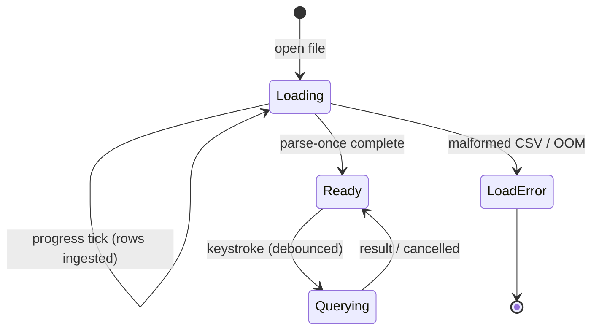

- **Async load off the UI thread.** Ingest runs on the worker thread (the same thread that already owns the engine in jiq's `spawn_worker` model, `src/query/worker/thread.rs:28`). The event loop stays responsive; a `Loading` app state renders a spinner + row counter while the worker streams the CSV into the columnar table. This reuses jiq's exact request/response channel shape — the load is just a distinguished response variant on the same `mpsc` the worker already uses (jiq's `QueryResponse` enum in `src/query/worker/types.rs` gains a `Loaded` / `LoadProgress` sibling).
- **Progress signal.** DuckDB ingest can report rows processed; surface it as `LoadProgress{rows, bytes}` so the UI shows forward motion rather than an indeterminate spinner on multi-GB files.
- **Query bar is editable during load.** The user can type their first query while ingest finishes; the first query fires the instant the table is `Ready`. This hides perceived latency the way jiq's debounce hides keystroke latency.
- **Empty/stdin fast path.** Small files and piped stdin load sub-100 ms; the `Loading` state is effectively invisible and must not flash.

**Test boundary.** The load **state machine** — `Loading → Ready`, `Loading → LoadError`, progress monotonicity, "query typed during load fires on Ready", "event loop processes input events while loading" — is fully headless. We assert it with a fake/slow `QueryEngine` impl ([§0/D1](#0-canonical-decisions-single-source-of-truth)) feeding the worker channel and `ratatui` `TestBackend` snapshots of the Loading frame, exactly as jiq snapshots its popups. **Human-only residue:** whether the spinner *feels* smooth and the first paint isn't jarring on a real terminal — covered by the canonical human-surface list in §4.7 (the "perceived latency / feel" row), not duplicated here.

---

#### R3 — Memory footprint and files approaching or exceeding RAM

**Exposure.** Parse-once trades RAM for query speed. The spike measured ~1.2 GB RSS for the 5M-row / 368 MB file (columnar in-memory representation is several times the CSV-on-disk size). A user who opens a file approaching system RAM could exhaust memory and get OOM-killed — a strictly worse failure than jiq, which streams and never holds the whole doc in our process.

**Scope clarification (resolves the §1.5 tension).** This risk is about a **single file larger than available RAM**, which is a *different concern* from the live-reload / `tail -f` streaming that §1.5 lists as a flat non-goal. §1.5's non-goal is about *continuously re-reading changing input* (rejected per the jiq watch/reload and live-tail decisions). R3/Q11 here is about *one static file that won't fit in memory*. The firm stance is: **no out-of-core/streaming engine at launch** (that contradicts North Star #1's parse-once-in-memory model), but DuckDB's own disk-spill is a real, supported pressure valve — not a future feature we have to build. §1.5 should be updated to say "no live-reload / tail-follow" specifically, and to point file-larger-than-RAM handling here, so the two sections stop appearing to contradict each other.

**Mitigations.**

| Lever | Behavior | Default |
|---|---|---|
| `--max-memory <N>` → DuckDB `memory_limit` + `temp_directory` spill | DuckDB spills to disk past the cap instead of OOM-killing | Set a sane default (e.g. a fraction of detected system RAM) |
| Pre-ingest size guard | If file size × estimated expansion factor exceeds available RAM, warn before load and offer to proceed with spill enabled | On by default |
| `--sample <N>` / preview mode (deferred, see 8.2) | Ingest first N rows for instant interaction on huge files | Off at launch |
| Document the in-memory tradeoff | README states ciq is an *in-memory* tool; multi-GB files want the memory cap | n/a |

**Test boundary.** Fully headless. RSS after ingesting a fixture is assertable; the size-guard threshold logic and the "spill enabled past cap" path are deterministic unit tests. The memory-limit plumbing into DuckDB is a config assertion, not a UI concern.

---

#### R4 — DuckDB multi-threading vs the single-query cancel-stale model (the resolved threading design)

**Exposure.** jiq's correctness rests on a clean invariant: one in-flight query, identified by a `u64 request_id`, with stale results discarded by id. DuckDB, unlike jq, is *internally* multi-threaded — a single query fans out across cores — and `QueryEngine::query()` ([§0/D1](#0-canonical-decisions-single-source-of-truth)) is a **blocking synchronous call** on the worker thread. (ciq's `QueryRequest` is `{ query, request_id }` — no `cancel_token`, since cancellation is out-of-band per §0/D4.)

**The architecture decision** (settled canonically in [§0/D4](#0-canonical-decisions-single-source-of-truth); this section is its detailed rationale). The model below is correct and feeds D4 — one refinement D4 adds: `interrupt()` is *not* request-scoped (it cancels whatever query is running), so the dispatcher only fires it while a request is known in-flight and the worker drains a `Cancelled` before the next dequeue.

The naive phrasing "the worker interrupts the previous query when a newer request arrives" is **physically impossible** and must not appear anywhere in the plan: while the worker thread is blocked inside the C++ `query()` call, it *cannot* simultaneously be in its `recv()` loop noticing a newer `request_id`. Something on **another thread** must do the interrupting. The correct model mirrors how jiq *actually* cancels (verified against the source, not assumed):

- jiq's worker does **not** decide to cancel. Its `run_jq` (`src/query/executor.rs:209`) polls `cancel_token.is_cancelled()` in a loop and calls `child.kill()` when it sees the flip (`executor.rs:279-281`).
- The token is flipped by **another thread** — the producer/App side. The verified analogue is the AI path: `current_cancel_token` is held on the App-side state and `cancel_in_flight_request()` calls `token.cancel()` (`src/ai/ai_state/response.rs:119-122`) when a new request supersedes the old one. The worker only ever *observes* the token it was handed.

ciq adopts the same producer-cancels / worker-runs split, adapted for a blocking C++ call instead of a pollable child process:

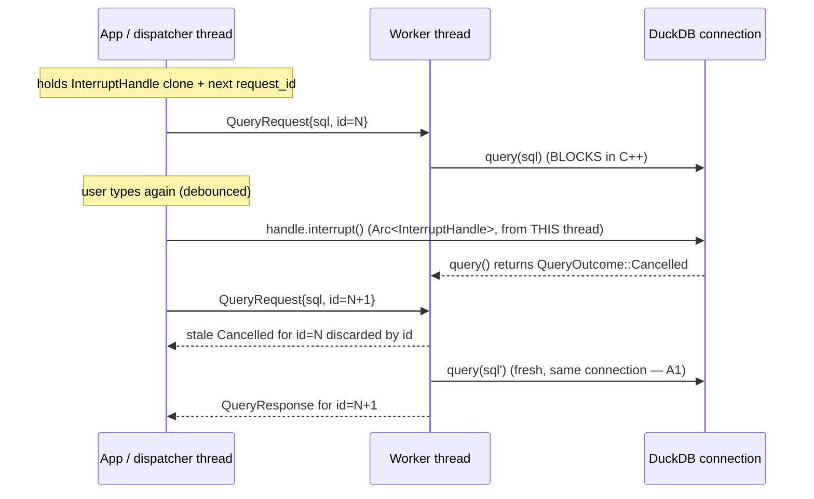

Concretely: the **dispatcher (App thread) holds a clone of the engine's `InterruptHandle`** — a newtype over `Arc<duckdb::InterruptHandle>`, obtained from `Connection::interrupt_handle()` (verified `Send + Sync`). **There is no `Connection::interrupt()` method**; you call `.interrupt()` on that handle, which is documented thread-safe precisely to be called from a thread other than the one running the query — so calling it from the dispatcher is the *supported* usage, not a hack. The worker holds the **single long-lived connection** and only runs queries on it.

**Open verification items (must be closed in `ciq-spike/` before the engine is declared done).** These were previously phrased ambiguously; they are *engine behaviors to confirm*, not contradictions in the design — the design (above) already assumes cross-thread interrupt is required and supported:

1. How fast does `interrupt()` abort a long aggregate/sort fanned out across cores? (Must beat the 150 ms debounce comfortably; the spike already recorded "YES (Connection::interrupt)" for cancel-capability — this item quantifies the latency.)
2. After `interrupt()`, is the same `Connection` immediately reusable for the next query, or must it be re-established? (Determines whether the long-lived-connection assumption holds or the worker must rebuild on interrupt.)
3. Does DuckDB's thread-pool sizing interact badly with the host (a 96-core box spawning 96 threads per query under rapid keystrokes)? Needs an explicit `SET threads = <bounded>` cap.

**Mitigations.**

- **Producer-cancels / worker-runs split** as diagrammed — the single most important correctness decision, stated once here and inherited by §2.4/§3.1/§3.4/§6.5/§7.2.
- **Keep jiq's `request_id` discard logic verbatim.** Even if `interrupt()` is slower than ideal, a late result is dropped by id — the cancel is a *performance optimization, not a correctness requirement*. The worst case of a sluggish `interrupt()` is wasted CPU, never a wrong result on screen.
- **Cap DuckDB threads** via `SET threads = <bounded>` so rapid keystrokes don't oversubscribe cores.

**Test boundary.** Strongly headless. The concurrency invariants — "newer request_id supersedes older", "result with stale id is discarded", "interrupt() then immediately re-query returns correct fresh result", "N rapid queries leave exactly the last result on screen" — are exactly the kind of deterministic property jiq already tests around its worker (`src/query/worker/thread_tests.rs`), reproducible with a real `DuckdbEngine` connection in an integration test plus `proptest` over interleavings. The *wall-clock speed* of `interrupt()` under load is measured (benchmark, deterministic threshold) rather than felt. Nothing here requires a human.

---

#### R5 — Type-sniff misfires

**Exposure.** DuckDB's CSV sniffer is the best of the three benchmarked (it correctly typed `created_at → DATE`), and good sniffing is a selling point. But sniffing is heuristic and *will* be wrong sometimes: a ZIP-code column that looks numeric but must stay text (leading zeros), a column that is 99% integers with one stray `"N/A"`, locale dates (`DD/MM/YYYY` vs `MM/DD/YYYY`), thousands separators, mixed booleans (`Y/N` vs `true/false`), and ID columns that overflow int64. A misfire silently changes query semantics (string compare vs numeric compare) — a correctness footgun, not just cosmetic.

**Mitigations — an explicit override surface.**

| Surface | Mechanism |
|---|---|
| `--types 'col=VARCHAR,zip=VARCHAR,amount=DECIMAL(12,2)'` CLI override | Force specific column types, bypassing the sniffer per column |
| `--all-varchar` escape hatch | Ingest everything as text; user casts in SQL where needed — guarantees no semantic surprise |
| `--date-format` / locale hint | Resolve `DD/MM` vs `MM/DD` ambiguity explicitly |
| Schema panel shows inferred types | The detected type per column is visible (in the column palette / schema view), so a misfire is *discoverable* rather than silent |
| `--sniff-rows <N>` | Widen the sniffer's sample so a late stray value doesn't flip a type |

> **Inventory reconciliation (must be closed with §6.6).** These five flags (`--types`, `--all-varchar`, `--date-format`, `--sniff-rows`) are part of the override surface but are **not yet present** in §6.6's `CsvOpts` struct (which currently lists `delimiter`, `quote`, `escape`, `header`, `null_string`, `sample_size`) or its `[csv]` config section. `--sniff-rows` overlaps with §6.6's existing `sample_size` and should be unified under one name; the other three are net-new fields that §6.6 must add (with matching `[csv]` config keys). The single source of truth for the parsing/override option set is `CsvOpts` in §6.6 — this table is a feature requirement *on* that struct, and §6.6 must be updated so the CLI-flag inventory and the struct/config inventory are identical. Until reconciled, treat §6.6's struct as authoritative for *shape* and this table as authoritative for *required coverage*.

Design principle: the sniffer is a convenience with a **visible result and a per-column override**, never an opaque decision. The inferred schema is data the user can see and correct, echoing how jiq surfaces the live data shape to drive autocomplete.

**Test boundary.** Fully headless and high-value to test exhaustively. Each pathological CSV (leading-zero ZIPs, mixed-type column, ambiguous locale date, int64 overflow) is a fixture; the assertion is "inferred schema == expected" and "override produces expected type". This is precisely the deterministic build→test→fix loop North Star #2 demands, and it is where an AI agent can catch a sniffer regression with zero human input — exercised under the verified CI command `cargo test --all-features -- --test-threads=1`.

---

#### R6 — SQL verbosity vs jq terseness

**Exposure.** `SELECT * FROM t WHERE region = 'EU' ORDER BY amount DESC LIMIT 20` is a lot more keystrokes than jq's `.[] | select(.region=="EU")`. For a *type-as-you-go* tool, verbosity directly attacks the core feel. If every query is a paragraph, the live-update magic is buried under typing.

**Mitigations — the ergonomics layer is a first-class feature, not an afterthought.**

- **Schema-aware autocomplete.** We keep jiq's popup/ranking/insertion *framework* verbatim (`src/autocomplete/` — `analyze_context` classifies into a `SuggestionContext` (variants `FieldContext` / `FunctionContext` / `ObjectKeyContext` / `VariableContext`, `src/autocomplete/context.rs:351`), then `get_suggestions` fuzzy-ranks and inserts at cursor) and swap only the **context grammar + candidate sources**: instead of JSON paths and jq builtins, we suggest column names, SQL keywords, the table name, SQL functions, and — crucially — **live column VALUES** for the right-hand side of a `WHERE col = …`. This is the direct analogue of jiq's `value_collector` (`src/autocomplete/value_collector.rs`, capped per path at `MAX_VALUES_PER_PATH = 10_000`; the global string cap `MAX_GLOBAL_STRING_VALUES` lives in `src/query/executor.rs:38`), now backed by a `SELECT DISTINCT col` which the spike measured at ~10 ms. Completing `region = ` should pop the actual regions in the data. (ciq replaces ciq's own context variants with SQL-appropriate ones; it does not reuse jiq's JSON-path variant names verbatim — only the framework around them.)
- **Column palette / quick-filter.** A CSV-native convenience with no jq analogue: a togglable panel listing columns; selecting columns builds the `SELECT` list, and a quick-filter affordance scaffolds a `WHERE`. This lets a user select their way to a query skeleton, then refine in SQL.
- **Query scaffolding defaults.** Opening a file pre-fills a sensible `SELECT * FROM t LIMIT <n>` so the user is editing a working query, not staring at a blank bar. (Mirrors jiq starting from a valid identity-ish state.)
- **`t` as the implicit table name.** A short, fixed alias for the loaded file removes per-query boilerplate.
- **Bare-word fast paths (candidate, see 8.2).** Consider letting a bare token expand to a column filter/select shortcut, recovering some jq-like terseness for the common case. Note the constraint from §5.3: ciq builds **a tokenizer, not a full SQL parser**, so any such rewrite is restricted to the read-only single-`SELECT`+CTE grammar of Q1 — see the LIMIT-interaction note below.

**LIMIT / ORDER BY interaction.** §2.3's auto-`LIMIT` wrapping operates on the **tokenized** user query within the Q1 restricted grammar (single read-only `SELECT`/CTE), not a parse tree (§5.3 ships a tokenizer, not a parser). The rule: ciq appends a default `LIMIT` **only when the user supplied no top-level `LIMIT`**; an existing trailing `LIMIT` (or `ORDER BY ... LIMIT`) is respected verbatim. Detection is a trailing-clause token scan. *(Note: the column palette no longer "rewrites" anything — per [§0/D3](#0-canonical-decisions-single-source-of-truth) it emits a fresh query from its own state via `query_emit`, so there is no `select_writer` and the LIMIT rule only concerns the §2.3 display-wrap of whatever query — typed or palette-emitted — reaches the engine.)*

**Test boundary.** The *logic* is fully headless: "given this schema and cursor position, the suggestion list is X", "completing `region = ` yields the distinct values", "selecting columns C1,C3 in the palette produces `SELECT C1, C3 FROM t`", "a user-supplied trailing `LIMIT` is preserved, absent one a default is appended". These are deterministic and tested exactly like jiq's autocomplete tests. **Human-only residue:** whether the resulting flow actually *feels* as fast as jq in practice — the "perceived latency / feel" row of the §4.7 canonical list.

---

#### R7 — What headless testing genuinely cannot prove (the irreducible human surface)

North Star #2 says the *vast majority* of code is headless-testable and only a *small, explicitly-enumerated* surface needs a human. **There is exactly one canonical enumeration of that surface, and it lives in §4.7.** To avoid two competing "complete" lists (the inconsistency the critic flagged), R7 does **not** restate its own list — it *defers to §4.7 as the single source of truth* and only summarizes its shape here:

§4.7's canonical human-validation surface is its **exact six table rows** — R7 mirrors them verbatim (it must not enumerate a *different* six): (1) **glyph + color rendering, light/dark polarity (OSC 10/11)** — color polarity is folded into this row, it is **not** a separate item; (2) **true raw-mode keyboard/mouse, scroll, focus**; (3) **bracketed-paste framing only**; (4) **system clipboard / OSC 52**; (5) **terminal-resize reflow (SIGWINCH)**; (6) **performance feel on a real large file**. *(An earlier draft of R7 dropped row 3 "paste framing" and invented a standalone "color polarity" item — that produced a different six and is corrected here to match §4.7 exactly.)* R2's first-paint smoothness and R6's ergonomic flow both map onto row 6 (perceived feel), not new items.

The load-feel of R2 and the ergonomic-flow of R6 both resolve into §4.7 item (6) ("perceived latency / feel"); nothing in §8 introduces a human-test concern that is not already one of §4.7's six rows. Everything else — query execution, cancel/stale logic, schema inference, autocomplete candidate generation & ranking, insertion, results layout/alignment math, scroll/search, history, config parsing, the load state machine, error formatting — renders into the `TestBackend` cell buffer or returns plain data, and is therefore in the headless majority.

> This boundary is itself an assertable contract: a CI check can enforce that the human-only surface stays confined to the enumerated IO-shell modules and does not creep into engine/autocomplete/results logic. If a feature can't be tested without a human and isn't one of §4.7's six rows, that is a design smell to be refactored, not accepted.

---

#### R8 — DuckDB version churn, API stability, and distribution

**Exposure.** We are pinning to a fast-moving embedded engine with its own release cadence and a bundled C++ payload. A minor `duckdb` crate bump can change SQL behavior, sniffer heuristics (directly affecting R5 fixtures), or the cancel/interrupt semantics (R4).

**Mitigations.**

- **Exact version pin** (reinforces R1); upgrades are deliberate, gated by the full headless suite — especially the R5 sniffer fixtures and R4 cancel invariants, which will catch behavioral drift.
- **Engine isolated behind the `QueryEngine` trait** ([§0/D1](#0-canonical-decisions-single-source-of-truth) — the "engine box" from the reuse map). DuckDB sits behind the trait so a version bump — or a swap to the `DataFusionEngine` fallback — touches one module, not the whole app. This *is* the architectural insurance for R1/R4/R8 collectively.
- **License: stated fact, no open confirmation needed.** DuckDB is **MIT-licensed**, which permits bundled redistribution inside the ciq binary. The only remaining action is documentation hygiene, not a legal question: record the MIT terms in a `THIRD-PARTY` notice / about screen, the same hygiene jiq applies to its deps. (This replaces the earlier draft's contradictory "confirm DuckDB's MIT license" — the license *is* MIT; the task is to *document* it.)

**Test boundary.** Headless. Version-pin correctness is a build property; behavioral drift across an upgrade is caught by the existing fixture suites (R5) and concurrency invariants (R4). The MIT notice is a repo-hygiene check (file present, contents correct), not a runtime concern.

---

### 8.2 Open questions / decisions deferred

Each item below is consciously **out of scope for launch** with a **recommended default** so the plan is decision-grade. None blocks the engine/TUI core; all are additive later.

| # | Open question | Recommended launch default | Why deferred / what would reopen it |
|---|---|---|---|
| Q1 | **Query scope: multi-statement vs single `SELECT`** | **Single read-only `SELECT` (plus CTEs) only.** No `INSERT`/`UPDATE`/`CREATE`/`PRAGMA` from the bar. | Live type-as-you-go semantics only make sense for idempotent reads; mutations per keystroke are dangerous. This restricted grammar is also what makes the §6.2 tokenizer-based LIMIT rewriter sound (see R6) and simplifies the R4 cancel model. Reopen if users want a scratch-table workflow. |
| Q2 | **JOINs / multiple input files** | **Single file → single implicit table `t`.** No multi-file JOIN at launch. | Multi-file means a naming/aliasing scheme and a much richer autocomplete schema model. High value, but orthogonal to proving the core loop. Reopen once single-table ergonomics are solid. |
| Q3 | **Identifier quoting & column-name rules** *(genuinely undecided — must be decided + fixture-tested in impl)* | Auto-`"quote"` columns with spaces/special chars; expose raw header names in autocomplete; document DuckDB's quoting rules. | CSV headers are arbitrary strings (`"Total ($)"`, duplicates, empties); DuckDB needs `"…"` quoting. The *policy* (dedupe? slugify? keep raw?) is open; default to raw-but-quoted, then lock it with R5-style fixtures. |
| Q4 | **Query history persistence** | Reuse jiq's history subsystem **in-session**; on-disk persistence decided with the config schema (Q5). | jiq already has history; whether ciq writes a history file (and where) ties to Q5. In-memory history works day one. |
| Q5 | **Config schema & location** | Port jiq's config module shape; ciq-specific keys (default `LIMIT`, theme, memory cap, threads, **and the R5 `[csv]` override keys**) under a `ciq` config path. Schema finalized post-core. | Config keys depend on which features ship; locking the schema before features stabilize invites churn. The *mechanism* is reused from jiq; only the *keys* are open — and the §6.6/R5 reconciliation must land before the schema is frozen. |
| Q6 | **Other input formats (NDJSON, TSV, Parquet, gzip)** | **CSV + TSV at launch** (TSV is a trivial delimiter change). DuckDB *can* read NDJSON/Parquet/compressed, but out of scope. | Each format expands the sniffer/override matrix (R5) and the "what is `t`" story. DuckDB makes them cheap to add later — an argument *for* deferring. NDJSON would also blur the line with jiq. |
| Q7 | **Delimiter / dialect detection** (custom separators, quote chars, embedded newlines, BOM, ragged rows) *(ragged-row policy genuinely undecided)* | Lean on DuckDB's auto-dialect detection; expose `--delim`, `--quote`, `--header/--no-header` overrides (these align with §6.6's `CsvOpts`). Decide ragged-row policy (error vs pad vs skip) during impl. | Real-world CSVs are messy; full dialect handling is its own project. DuckDB's detector covers common cases; the override flags are the safety valve. The ragged-row default is a real open decision and must be fixture-tested. |
| Q8 | **AI natural-language → SQL** | **Deferred to a later phase** (already decided in project parameters). jiq's provider/worker AI layer (`src/ai/`) ports cleanly onto the same worker channel. | Explicitly out of the initial scope; the architecture (worker channel, engine-behind-trait) is built to accept it without rework. |
| Q9 | **Naming / branding** | Working name **`ciq`** (CSV-analogue of jiq); binary `ciq`. Final name/crate-name/Homebrew-tap decided before first publish. | A crates.io / Homebrew name collision check is a pre-publish task, not a design blocker. The `jiq-release` skill pattern is the template for whatever the final name is. |
| Q10 | **Result export / output piping** | Inherit jiq's "Output" feature shape; decide CSV-vs-table-vs-JSON export formats during impl. | Users will want to pipe the current result out; the mechanism mirrors jiq, but the *formats* (and whether to honor the live query vs a one-shot) are open. |
| Q11 | **Streaming / out-of-core for files larger than RAM** | **Not at launch** — rely on DuckDB disk-spill + memory cap (R3). | Building a streaming engine contradicts North Star #1 (parse-once in-memory); disk-spill is the supported fallback. Distinct from §1.5's live-reload/tail non-goal (see R3 scope clarification). Reopen only if real users routinely exceed RAM and spill proves insufficient. |
| Q12 | **NULL / empty-cell rendering & SQL semantics** *(genuinely undecided — must be decided + fixture-tested in impl)* | Render SQL `NULL` distinctly from empty string; document that an empty CSV cell ingests per DuckDB's default. | CSV's empty-string-vs-NULL ambiguity has real query-semantics consequences (`WHERE col IS NULL` vs `= ''`). Needs a stated, tested policy — defer the *exact* rule, but it must be decided (and fixture-tested under R5) before launch. |

**Honest summary of what is genuinely undecided (not just deferred):** Q3 (column-name normalization policy), Q7 (ragged-row behavior), and Q12 (empty-vs-NULL semantics) are the three that carry real correctness weight and must be *decided and fixture-tested* during implementation, not hand-waved. Everything else is feature scope with a safe default and a clean reuse path from jiq.

The three cross-section reconciliations that were load-bearing are now **CLOSED** (see [§0](#0-canonical-decisions-single-source-of-truth) and [`DECISIONS.md`](DECISIONS.md)): the **threading model** → D4 (dispatcher-issued `interrupt()`, no watcher); the **engine trait name/signature** → D1 (`QueryEngine::query(sql) -> QueryOutcome`, not `CsvEngine`/`run`); and the **R5 flag ↔ §6.6 `CsvOpts` inventory** → deferred-to-ingest with a defined default set (add `--types`/`--all-varchar`/`--date-format`, unify `--sniff-rows` with `sample_size`). The one remaining *engine-behavior* gate is the A1 reuse-after-interrupt spike ([`ASSUMPTIONS.md`](ASSUMPTIONS.md)), which does not change any trait or topology.

